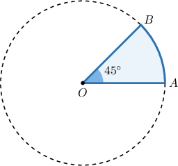
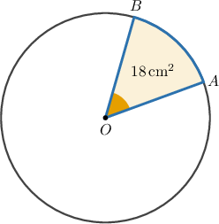
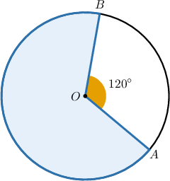
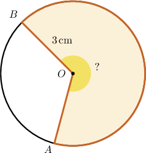

# Calculating Areas of Circular Sectors

Source: https://www.mathacademy.com/topics/596?courseId=126
Topic ID: 596

## Prerequisites

- [Central Angles and Arcs](./550-central-angles-and-arcs.md)
- [Solving Rational Equations Using Cross-Multiplication](../algebra-i/698-solving-rational-equations-using-cross-multiplication.md)
- [Areas of Circles](./1745-areas-of-circles.md)

## Lesson

### Introduction

Suppose that we are given a circular sector with a central angle $45^\circ$ in a circle with radius $r= 2 \mathrm{\, cm},$ as shown below. How can we find its area?

We know that the area of the full circle is

$$

\pi r^2 = \pi \cdot 2^2 = 4\pi.

$$

So, to get the area of the sector, we need to multiply the area above by the ratio of the central angle to $360^\circ.$ For the ratio, we get

$$

\dfrac{m\angle AOB}{360^\circ} = \dfrac{45^\circ}{360^\circ} = \dfrac{1}8.

$$

This number represents the portion of the sector that resides in the full circle.

So, the area of the sector is

$$

\begin{aligned}A & =\frac{1}{8}⋅4𝜋 \\ & =\frac{𝜋}{2} \\ & ≈1.571\,cm^{2}\end{aligned}

$$

rounded to three decimal places.

### Example: Finding an Unknown Sector Area or Angle Given the Total Area of a Circle

#### Question

The area of the full circle depicted above is $\mathcal A = 120 \,\mathrm{cm}^2$ and the area of the shaded sector is $\mathcal{A}_S=18\,\mathrm{cm}^2.$ What is the measure of the angle $\angle{AOB}?$

#### Explanation

The ratio of the area of the sector to the area of the entire circle is

$$

\dfrac{\mathcal{A_S}}{\mathcal{A}} = \dfrac{18}{120} = \dfrac{3}{20}.

$$

Therefore, $\angle{AOB}$ covers $\dfrac{3}{20}$ of the full circle. So, its measure is

$$

m\angle{AOB} = 360^\circ \cdot \dfrac{3}{20} = 54^\circ.

$$

### Example: Finding the Total Area of a Circle Given the Area of a Sector

#### Question

Find the total area of the circle given that the area of the shaded sector is $20\,\mathrm{cm}^2.$

#### Explanation

Here, $\angle{AOB}$ is the central angle that intercepts the minor arc $\overset{\frown}{AB}.$ So the measure of the major arc (that corresponds to our sector) is

$$

360^\circ - m\angle{AOB} = 360^\circ - 120^\circ = 240^\circ.

$$

Note that the ratio of the measure of the major arc to a full circle turn is

$$

\dfrac{240^\circ}{360^\circ} = \dfrac{2}{3}.

$$

Therefore, if the area of the circle is $\mathcal{A},$ then we obtain

$$

\begin{aligned}\frac{A_{𝑆}}{A} & =\frac{2}{3} \\ \frac{20}{A} & =\frac{2}{3} \\ A & =\frac{20⋅3}{2} \\ A & =30\,cm^{2}.\end{aligned}

$$

### Example: Finding an Unknown Central Angle Given the Area of a Circular Sector

#### Question

The area of the circular sector $AOB$ is $\mathcal{A_S} = 6\pi\,\mathrm{cm}^2.$ The radius of the circle is $3\,\mathrm{cm}.$ What is the measure of the central angle $\angle{AOB}?$

#### Explanation

The area of the entire circle is

$$

\mathcal{A} = \pi\cdot r^2 = \pi\cdot 3^2 = 9\pi.

$$

The ratio of the area of the sector to the area of the entire circle is

$$

\dfrac{\mathcal{A_S}}{\mathcal{A}} = \dfrac{6\pi}{9\pi} = \dfrac{2}{3}.

$$

Therefore, the sector is $\dfrac{2}{3}$ of the whole circle, and we obtain

$$

\angle{AOB} = 360^\circ \cdot\dfrac{2}{3} = 240^\circ.

$$
