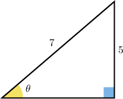
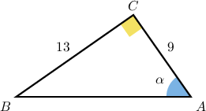

# Calculating Angles in Right Triangles Using Trigonometry

Source: https://www.mathacademy.com/topics/610?courseId=126
Topic ID: 610

## Prerequisites

- [The Trigonometric Ratios](./609-the-trigonometric-ratios.md)
- [Introduction to Inverse Functions](../algebra-i/753-introduction-to-inverse-functions.md)

## Lesson

### Introduction

Using a calculator, we can evaluate sine for the angle of $20^\circ,$ and get

$$

\sin(20^{\circ}) \approx 0.342.

$$

But what if we are given the value $0.342,$ and we want to find the angle whose sine is this value? To do this, we can use the **inverse trigonometric functions**.

In the case of the sine, its inverse is **arcsine** (written as $\arcsin$ or $\sin^{-1}$). If applied to the sine, it gives the value of the angle:

$$

\arcsin (0.342) \approx 20^{\circ}

$$

The inverses of the other trigonometric functions work in the same way.

- The inverse of sine is $\arcsin.$

- The inverse of cosine is $\arccos.$

- The inverse of tangent is $\arctan.$

Try it for yourself. But make sure that your calculator is in "degrees" mode!

**Note:** In this topic, we only deal with acute angles. Things get a little more complicated for non-acute angles, but you'll learn about that later!

### Example: Finding the Value of an Inverse Trigonometric Ratio

#### Question

Find the value of $\arcsin (0.2)$ in degrees to the nearest degree.

#### Explanation

Using a calculator, we find

$$

\begin{aligned}arcsin⁡(0.2) & =(11.536...)^{∘} \\ & ≈12^{∘}\end{aligned}

$$

rounded to the nearest integer.

### Applying an Inverse Trigonometric Function to Both Sides of an Equation

If we have a trigonometric equation like

$$

\cos \theta = \dfrac{1}{2}

$$

and we want to solve for $\theta,$ we can apply the corresponding inverse trigonometric function to both sides of the equation to "cancel" out the trigonometric function.

Here, the trigonometric function is $\cos,$ so the inverse trigonometric function is $\arccos,$ and we have

$$

\begin{aligned}arccos⁡(cos⁡𝜃) & =arccos⁡(\frac{1}{2}) \\ 𝜃 & =60^{∘}.\end{aligned}

$$

### Example: Calculating Unknown Angles Using Inverse Trigonometric Functions

#### Question

If $\cos\theta=0.64$ and $\tan\alpha=1.25$, where $\theta$ and $\alpha$ are acute angles measured in degrees, find $\theta+\alpha$ in degrees to the nearest integer.

#### Explanation

To find $\theta$ and $\alpha$ we use $\arccos$ and $\arctan$ respectively. We get

$$

\begin{aligned} \cos\theta & = 0.64\\\arccos(\cos\theta) & = \arccos(0.64) \\\theta&=\arccos(0.64) \end{aligned}

$$

and

$$

\begin{aligned} \tan\alpha & = 1.25 \\\arctan(\tan\alpha) & =\arctan(1.25) \\\alpha&=\arctan(1.25). \end{aligned}

$$

Then, using a calculator, we find

$$

\begin{aligned} \theta + \alpha & =\arccos(0.64)+\arctan(1.25)\\&=(50.208...)^{\circ} + (51.340...)^{\circ} \\& = (101.548...)^{\circ} \\& \approx 102^{\circ} \end{aligned}

$$

rounded to the nearest integer.

**** If we round $\theta$ and $\alpha$ to the nearest integer, we get $\theta \approx 50^\circ$ and $\alpha \approx 51^\circ.$ After we sum up the angles we get an incorrect result:

$$

\begin{aligned}𝜃+𝛼 & ≈50^{∘}+51^{∘}=101^{∘}\end{aligned}

$$

The correct answer is $102^\circ,$ not $101^\circ.$ This is a rounding error! To avoid this kind of error we have to round ** we take the sum, not before.

### Finding the Measure of an Angle in a Right Triangle Using Trigonometry

The inverse trigonometric functions are particularly useful when we need to find the measure of an angle in a right triangle.

To demonstrate, let's find the measure of the angle $\theta$ indicated in the triangle below.

Since we are given the length of the hypotenuse and opposite sides to $\theta,$ we can use sine to find the angle measurement. We have

$$

\begin{aligned} \sin (\theta) = \dfrac{\text{opposite}}{\text{hypotenuse}} &= \dfrac{5}{7}. \end{aligned}

$$

We now calculate $\theta$ using the inverse sine:

$$

\begin{aligned} \sin (\theta) &= \dfrac{5}{7}\\[5pt] \arcsin( \sin (\theta)) &= \arcsin\left(\dfrac{5}{7} \right)\\[5pt] \theta &= \arcsin\left(\dfrac{5}{7} \right)\\[5pt] &=(45.584\,6...)^\circ \\[5pt] &\approx 46^\circ \end{aligned}

$$

rounded to the nearest integer.

### Example: Finding the Measure of an Angle Given the Lengths of Two Sides of a Right Triangle

#### Question

In a right triangle $\triangle ABC,$ we have $AC = 9,$ $BC=13,$ and $m\angle A = \alpha.$ Given that $\overline{AB}$ is the hypotenuse of the triangle, find the value of $\alpha$ (rounded to one decimal place).

#### Explanation

Let's sketch the triangle that's described.

Since we are given the lengths of the adjacent and opposite sides, we can use tangent to find the angle measurement. We have

$$

\tan \alpha= \dfrac{\text{opposite}}{\text{adjacent}} = \dfrac{13}{9}.

$$

We now calculate $\alpha$ using the inverse tangent:

$$

\begin{aligned} \tan \alpha &= \dfrac{13}{9}\\[5pt] \arctan( \tan \alpha) &= \arctan\left(\dfrac{13}{9} \right)\\[5pt] \alpha &= \arctan\left(\dfrac{13}{9} \right)\\[5pt] &=(55.304\,8...)^\circ\\[5pt] &\approx 55.3^\circ \end{aligned}

$$

rounded to one decimal place.
