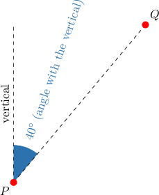
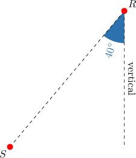
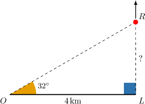
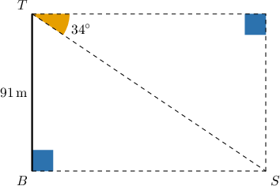
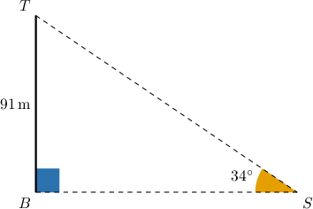
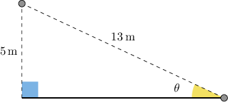

# Modeling With Trigonometry

Source: https://www.mathacademy.com/topics/641?courseId=126
Topic ID: 641

## Prerequisites

- [Calculating Angles in Right Triangles Using Trigonometry](./610-calculating-angles-in-right-triangles-using-trigonometry.md)
- [Calculating Side Lengths of Right Triangles Using Trigonometry](./629-calculating-side-lengths-of-right-triangles-using-trigonometry.md)

## Lesson

### Introduction

Trigonometry problems often occur in the natural world and everyday circumstances. To effectively model problems using trigonometry, it's helpful to introduce some terminology.

Suppose that an observer is standing at some distance from an object they wish to observe.

- An **angle of elevation** is the angle formed by the observer between their horizontal line of sight and the line of sight with the object when the object lies *above* the horizontal line of sight. In the example below, the angle of elevation from the observer to the object is $30^\circ.$

- An **angle of depression** is the angle formed by the observer between their horizontal line of sight and the line of sight with the object when the object lies *below* the horizontal line of sight. In the example below, the angle of depression from the observer to the object is $30^\circ.$

In both of the above examples, we also say that the observer and the object **make an angle of $\mathbf{30^\circ}$ with the horizontal.** Whether the object is above or below the horizontal line of sight is usually determined by the context.

### Angles With the Vertical

One final case is when two objects (or points) make an angle with the vertical.

For example, consider the points $P$ and $Q$ below.

The points $P$ and $Q$ **make an angle of $\mathbf{40^\circ}$ with the vertical** because the "line of sight" from $P$ to $Q$ forms an angle of $40^\circ$ with the vertical line of sight from $P.$

Similarly, the points $R$ and $S$ below also make an angle of $40^\circ$ with the vertical.

Now that we're familiar with these ideas, let's put them into practice.

### Example: Calculating the Length of a Leg of a Right Triangle

#### Question

An observer is standing $4\,\text{km}$ from a launchpad and observes a rocket ascending vertically from the launchpad. At a particular moment, the angle of elevation between the observer and the rocket is $32^\circ.$ What is the altitude of the rocket at that moment? Assume that the ground between the observer and the launch pad is horizontal.

#### Explanation

Let $L$ be the position of the launchpad, $R$ be the position of the rocket, and $O$ be the observer's position. Since the rocket is ascending vertically and the ground is horizontal, $\angle OLR$ is a right angle. Also, we are given that $m\angle LOR=32^\circ$ and $OL=4 \,\mathrm{km}.$

The rocket's altitude is its vertical distance from the ground and is given by the length of $LR$ in our diagram.

To find the distance $LR,$ we use the tangent ratio:

$$

\begin{aligned}\frac{𝐿𝑅}{𝐿𝑂} & =tan⁡𝑂 \\ \frac{𝐿𝑅}{4} & =tan⁡32^{∘} \\ 𝐿𝑅 & =4tan⁡32^{∘} \\ 𝐿𝑅 & =2.499... \\ 𝐿𝑅 & ≈2.5\end{aligned}

$$

Therefore, the altitude of the rocket is $2.5\,\text{km},$ rounded to the nearest tenth.

### Example: Calculating the Length of the Hypotenuse of a Right Triangle

#### Question

The angle of depression from the top of a vertical cliff to a ship below is $34^\circ.$ If the cliff is $91\,\textrm m$ above the sea, what is the distance between the top of the cliff and the ship?

#### Explanation

Let $T$ be the top of the cliff, $B$ be the base of the cliff, and $S$ be the ship's location. We are given that $BT = 91\,\text{m},$ and that the angle of depression is $34^\circ.$

Since $\angle TSB$ and the angle of depression are alternate interior angles, their measures must be equal. This gives the following triangle:

To find the distance $ST,$ we use the sine ratio:

$$

\begin{aligned}sin⁡𝑆 & =\frac{𝐵𝑇}{𝑆𝑇} \\ sin⁡34^{∘} & =\frac{91}{𝑆𝑇} \\ 𝑆𝑇 & =\frac{91}{sin⁡34^{∘}} \\ 𝑆𝑇 & =\frac{91}{0.559\,19…} \\ 𝑆𝑇 & =162.73… \\ 𝑆𝑇 & ≈163\end{aligned}

$$

Therefore, the distance from the top of the cliff to the ship is approximately $163\,\text{m}.$

### Example: Calculating the Measure of an Angle in a Right Triangle

#### Question

A cat spots a bird perching on a vertical tree, $5\,\textrm m$ from the ground. If the distance between the cat and the bird is $13\,\textrm m,$ what is the angle of elevation of the cat's gaze, rounded to the nearest degree?

#### Explanation

We model this situation using the diagram below:

To find the angle $\theta,$ we use the sine ratio:

$$

\begin{aligned} \sin \theta &= \dfrac{5}{13}\\\arcsin(\sin \theta) &= \arcsin\left( \dfrac{5}{13} \right)\\\theta &= (22.62\ldots)^\circ \\\theta &\approx 23^\circ \end{aligned}

$$

Therefore, the angle of elevation is $23^\circ,$ rounded to the nearest degree.
