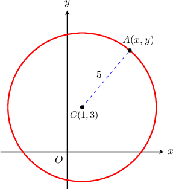
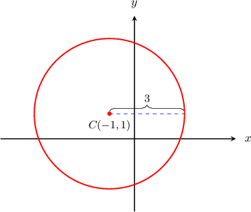
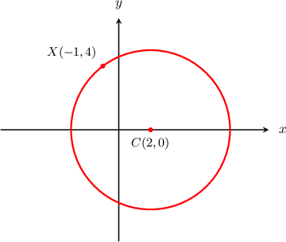
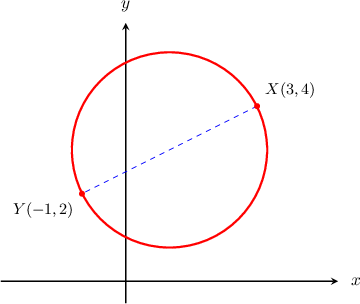

# Equations of Circles

Source: https://www.mathacademy.com/topics/843?courseId=126
Topic ID: 843

## Prerequisites

- [Equations of Circles Centered at the Origin](./842-equations-of-circles-centered-at-the-origin.md)

## Lesson

### Introduction

What equation represents a circle of radius $5$ centered at $C$ with coordinates $(1,3)?$

Let's refer to the following figure.

Let's take a generic point $A$ with coordinates $(x,y)$ on the circumference. Now, we can use the distance formula to write down the length of the radius $CA\mathbin{:}$

$$

CA = \sqrt{(x-1)^2+(y-3)^2}.

$$

On the other hand, we know that the radius of the circle is $CA=5.$ Therefore,

$$

\sqrt{(x-1)^2 + (y-3)^2} = 5.

$$

Squaring both sides gives us the **equation of the circle** of radius $5$ centered at $C(1,3)\mathbin{:}$

$$

(x-1)^2 + (y-3)^2 = 25.

$$

Similarly, given a circle of radius $r$ centered at point $C$ with coordinates $(a,b),$ the general equation will be

$$

(x-a)^2 + (y-b)^2 = r^2.

$$

### Example: Finding the Equation of a Circle Given the Center and the Radius

#### Question

What is the equation of the circle given below?

#### Explanation

The general equation of a circle with radius $r$ centered at the point $(a,b)$ is

$$

(x-a)^2 + (y-b)^2 = r^2.

$$

From the picture, we see that our circle is centered at $C(-1,1)$ and the radius of the circle is $r = 3.$ Therefore, the equation of the circle is

$$

\begin{aligned}(𝑥−𝑎)^{2}+(𝑦−𝑏)^{2} & =𝑟^{2} \\ (𝑥−(−1))^{2}+(𝑦−1)^{2} & =3^{2} \\ (𝑥+1)^{2}+(𝑦−1)^{2} & =9.\end{aligned}

$$

### Example: Finding the Center and Radius of a Circle Given Its Equation

#### Question

What is the center and radius of the circle with equation $(x-2)^2 + (y+4)^2 = 9?$

#### Explanation

The general equation of a circle with radius $r$ centered at the point $(a,b)$ is

$$

(x-a)^2 + (y-b)^2 = r^2.

$$

Let's compare the general equation to our equation side-by-side as follows:

$$

\begin{aligned}(𝑥−𝑎)^{2}+(𝑦−𝑏)^{2} & =𝑟^{2} \\ (𝑥−2)^{2}+(𝑦+4)^{2} & =9 \\ (𝑥−2)^{2}+(𝑦−(−4))^{2} & =3^{2}.\end{aligned}

$$

We see that $a = 2,$ $b = - 4,$ and $r = 3.$

Therefore, the circle is centered at $(2,-4)$ and its radius is $3.$

### Example: Finding the Equation of a Circle Given the Center and a Point on the Circle

#### Question

The circle below is centered at $C(2, 0)$ and the point $X(-1, 4)$ lies on the circumference. Find the equation of the circle.

#### Explanation

The general equation of a circle with radius $r$ centered at the point $(a,b)$ is

$$

(x-a)^2 + (y-b)^2 = r^2.

$$

The length of the radius is

$$

\begin{aligned}𝐶𝑋 & =\sqrt{(2−(−1))^{2}+(0−4)^{2}} \\ & =\sqrt{3^{2}+4^{2}} \\ & =\sqrt{25} \\ & =5.\end{aligned}

$$

So, our circle is generated by the following equation:

$$

\begin{aligned}(𝑥−𝑎)^{2}+(𝑦−𝑏)^{2} & =𝑟^{2} \\ (𝑥−2)^{2}+(𝑦−0)^{2} & =5^{2} \\ (𝑥−2)^{2}+𝑦^{2} & =25\end{aligned}

$$

### Example: Finding the Equation of a Circle Given the Endpoints of a Diameter

#### Question

The line segment $\overline{XY}$ is a diameter of a circle. Given that $X$ and $Y$ have coordinates $(3,4)$ and $(-1,2)$, respectively, what is the equation of the circle?

#### Explanation

The general equation of a circle with radius $r$ centered at the point $(a,b)$ is

$$

(x-a)^2 + (y-b)^2 = r^2.

$$

Using the distance formula to compute the distance between the points $X(3,4)$ and $Y(-1,2),$ we find that the length the diameter is

$$

\begin{aligned}𝑋𝑌 & =\sqrt{(−1−3)^{2}+(2−4)^{2}} \\ & =\sqrt{4^{2}+2^{2}} \\ & =\sqrt{20} \\ & =2\sqrt{5}.\end{aligned}

$$

So the radius of the circle is

$$

r = \dfrac{XY}{2} = \dfrac{2\sqrt{5}}{2}=\sqrt{5}.

$$

Since the center of a circle is the midpoint of the diameter, we can find the center using the midpoint formula as follows:

$$

\left( \dfrac{x_1+x_2}{2}, \dfrac {y_1+y_2}{2}\right) = \left( \dfrac{3+(-1)}{2}, \dfrac {4+2}{2}\right)=(1,3)

$$

So our circle has radius $r=\sqrt{5}$ and center $(a,b)=(1,3),$ and therefore it is represented by the following equation:

$$

\begin{aligned}(𝑥−𝑎)^{2}+(𝑦−𝑏)^{2} & =𝑟^{2} \\ (𝑥−1)^{2}+(𝑦−3)^{2} & =(\sqrt{5})^{2} \\ (𝑥−1)^{2}+(𝑦−3)^{2} & =5\end{aligned}

$$
