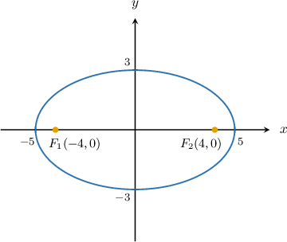
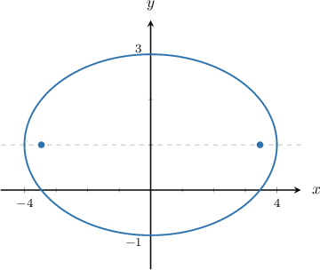
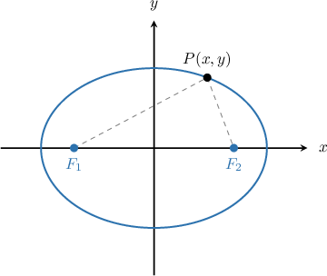
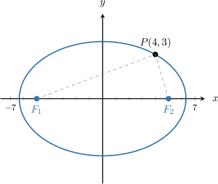

# Foci of Ellipses

Source: https://www.mathacademy.com/topics/1026?courseId=43
Topic ID: 1026

## Prerequisites

- [Finding the Center and Axes of Ellipses by Completing the Square](./852-finding-the-center-and-axes-of-ellipses-by-completing-the-square.md)

## Lesson

### Introduction

Consider the horizontal ellipse centered at $O$ with horizontal radius $a=5$ and vertical radius $b=3,$ as shown below.

The points $F_1(-4,0)$ and $F_2(4,0)$ are two special points, called the **foci** of the ellipse. For a wide ellipse, like the one above, the foci must lie on the horizontal axis of the ellipse.

The distance between the center of the ellipse and each focus is called the **focal length,** and is usually denoted $c.$ The formula for the focal length is

$$

c = \sqrt{\left|a^2-b^2\right|},

$$

where $a$ is the horizontal radius, and $b$ is the vertical radius. This formula works for both horizontal *and* vertical ellipses.

For our ellipse, we already know that the focal length is $4.$ But let's check to see that the formula gives the same result:

$$

\begin{aligned}𝑐 & =\sqrt{|𝑎^{2}−𝑏^{2}|} \\ & =\sqrt{|(5)^{2}−(3)^{2}|} \\ & =\sqrt{|25−9|} \\ & =\sqrt{16} \\ & =4\,✓\end{aligned}

$$

**Note:** The foci of an ellipse are important because they have a special property, called the **point-foci** property:

For *any* point on the ellipse, the sum of distances from the point to the foci is always equal to the length of the major axis.

But for now, let's focus on learning how to calculate the foci of an ellipse.

### Calculating the Foci of an Ellipse

We need to remember that the focal length $c$ of an ellipse is given by the formula

$$

c = \sqrt{\left|a^2 - b^2\right|},

$$

where $a$ is the horizontal radius, and $b$ is the vertical radius.

To find the coordinates of the foci of an ellipse centered at $(h,k),$ there are two possible cases:

- For a *wide* ellipse, the foci lie along the *horizontal* axis at a distance $c$ from the center, as shown below. Therefore, the coordinates of the foci are $(h\pm c, k).$

- For a *tall* ellipse, the foci lie along the *vertical* axis at a distance $c$ from the center, as shown below. Therefore, the coordinates of the foci are $(h, k\pm c).$

### Example: Calculating the Foci of an Ellipse From a Diagram

#### Question

Calculate the coordinates of the foci of the ellipse given above. (**)

#### Explanation

For a horizontal (i.e., "wide") ellipse centered at $(h, k),$ the coordinates of the foci are $(h \pm c, k).$ Recall that the focal length $c$ is given by

$$

c = \sqrt{|a^2-b^2|},

$$

where $a$ and $b$ are the horizontal and vertical radii of the ellipse, respectively.

From the diagram we see that $(h,k) = (0,1),$ $a = 4,$ and $b = 2.$ Therefore, we have

$$

\begin{aligned}𝑐 & =\sqrt{|𝑎^{2}−𝑏^{2}|} \\ & =\sqrt{|4^{2}−2^{2}|} \\ & =\sqrt{|16−4|} \\ & =\sqrt{|12|} \\ & =\sqrt{12} \\ & =2\sqrt{3}.\end{aligned}

$$

Finally, then, the coordinates of the foci are $(\pm2\sqrt{3},1).$

### Example: Calculating the Foci of an Ellipse Given Its Equation in Standard Form

#### Question

Calculate the coordinates of the foci of the ellipse $\dfrac{(x - 1)^2}{25} + \dfrac{(y - 1)^2}{9} = 1.$

#### Explanation

Remember that the general equation of an ellipse centered at $(h,k)$ with a horizontal radius of length $a$ and a vertical radius of length $b$ is given by

$$

\dfrac{(x-h)^2}{{a}^2}+\dfrac{(y-k)^2}{{b}^2}=1.

$$

By comparing the given equation of the ellipse with the standard form above, we find that $(h,k)=(1,1),$ $a^2=25,$ and $b^2=9.$ Also, since $25 > 9,$ this is a horizontal (i.e., "wide") ellipse.

The coordinates of the foci of a horizontal ellipse are $(h\pm c,k).$ Recall that the focal length $c$ is given by

$$

c = \sqrt{|a^2-b^2|}.

$$

Therefore, we have

$$

\begin{aligned}𝑐 & =\sqrt{|𝑎^{2}−𝑏^{2}|} \\ & =\sqrt{|25−9|} \\ & =\sqrt{|16|} \\ & =\sqrt{16} \\ & =4.\end{aligned}

$$

Finally, then, the coordinates of the foci are $(1 - 4, 1) = (-3,1)$ and $(1 + 4,1) = (5,1).$

### Example: Calculating the Foci of an Ellipse Given Its Equation in General Form

#### Question

Determine the coordinates of the foci of the ellipse $2x^2 + y^2 + 4x = 30.$

#### Explanation

Remember that the general equation of an ellipse centered at $(h,k)$ with a horizontal radius of length $a$ and a vertical radius of length $b$ is given by

$$

\dfrac{(x-h)^2}{{a}^2}+\dfrac{(y-k)^2}{{b}^2}=1.

$$

To rewrite the equation of the ellipse in standard form, we need to group $x$ and $y$ terms and complete the squares, as follows:

$$

\begin{aligned}2𝑥^{2}+𝑦^{2}+4𝑥 & =30 \\ 2(𝑥^{2}+2𝑥)+𝑦^{2} & =30 \\ 2(𝑥^{2}+2𝑥+1)−2+𝑦^{2} & =30 \\ 2(𝑥+1)^{2}+𝑦^{2} & =32 \\ \frac{(𝑥+1)^{2}}{16}+\frac{𝑦^{2}}{32} & =1 \\ \frac{(𝑥+1)^{2}}{16}+\frac{(𝑦−0)^{2}}{32} & =1\end{aligned}

$$

By comparing the above equation of the ellipse with the general standard form, we find that $(h,k)=(-1,0),$ $a^2=16,$ and $b^2=32.$ Also, since $16 < 32,$ this is a vertical (i.e., "tall") ellipse.

The coordinates of the foci of a vertical ellipse are $(h, k\pm c).$ Recall that the focal length $c$ is given by

$$

c = \sqrt{|a^2-b^2|}.

$$

Therefore, we have

$$

\begin{aligned}𝑐 & =\sqrt{|𝑎^{2}−𝑏^{2}|} \\ & =\sqrt{|16−32|} \\ & =\sqrt{|−16|} \\ & =\sqrt{16} \\ & =4.\end{aligned}

$$

Finally then, the coordinates of the foci are $(-1,\pm4).$

### The Role of the Foci in Determining the Equation of an Ellipse

Remember that the foci of an ellipse are important because they have a special property, called the **point-foci** property:

For *any* point on the ellipse, the sum of distances from the point to the foci is always equal to the length of the major axis.

Consequently, the foci can be used to define an ellipse uniquely. Consider the diagram below.

For a horizontal ellipse, the point-foci property states that for *any* point $P(x,y)$ on the ellipse, we have

$$

|PF_1| + |PF_2| = 2a,

$$

where $|PF_1|$ and $|PF_2|$ is the distance of each focus to a general point $P(x,y)$ on the ellipse, and $a$ is the horizontal radius.

It's possible to use the point-foci property to find the equation of an ellipse. But the algebra is a little cumbersome, so we won't cover that here.

### Example: Finding the Length of the Semi-Major Axis of an Ellipse Given the Foci

#### Question

A horizontal ellipse has foci $F_1(-5,0)$ and $F_2(5,0),$ and the point $P \left(4, 3 \right)$ lies on the ellipse. What is the length of the semi-major axis of this ellipse?

#### Explanation

The point-foci property states that for ** point on the ellipse, the sum of distances from the point to the foci is always equal to the length of the major axis.

Here, the length of the semi-major axis is equal to the horizontal radius, $a.$ If the length of the major axis is $2a,$ then by the point-foci property, we have

$$

|P F_1| + |P F_2| = 2a.

$$

Now, let's compute the distance from the point $P$ to each focus:

$$

\begin{aligned}|𝑃𝐹_{1}| & =\sqrt{(4−(−5))^{2}+(3−0)^{2}} \\ & =\sqrt{9^{2}+3^{2}} \\ & =\sqrt{81+9} \\ & =\sqrt{90} \\ & =3\sqrt{10} \\ & \\ |𝑃𝐹_{2}| & =\sqrt{(4−5)^{2}+(3−0)^{2}} \\ & =\sqrt{(−1)^{2}+3^{2}} \\ & =\sqrt{1+9} \\ & =\sqrt{10}\end{aligned}

$$

Finally, we have

$$

\begin{aligned}|𝑃𝐹_{1}|+|𝑃𝐹_{2}|=2𝑎 \\ 3\sqrt{10}+\sqrt{10}=2𝑎 \\ 4\sqrt{10}=2𝑎 \\ 2\sqrt{10}=𝑎.\end{aligned}

$$

Therefore, we conclude that the length of the semi-major axis is $2 \sqrt {10}.$
