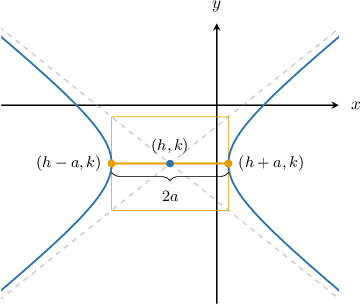
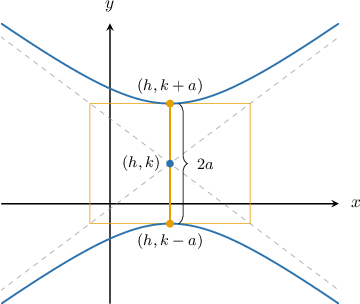
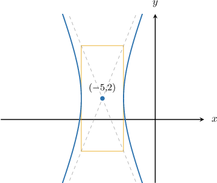
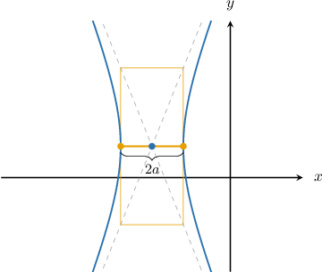

# Transverse Axes of Hyperbolas

Source: https://www.mathacademy.com/topics/1032?courseId=43
Topic ID: 1032

## Prerequisites

- [Equations of Hyperbolas Centered at a General Point](./733-equations-of-hyperbolas-centered-at-a-general-point.md)
- [Properties of Rectangles and Squares](../../../../middle-school/lessons/grade-7/1461-properties-of-rectangles-and-squares.md)
- [The Product Rule for Radicals](../../../../middle-school/lessons/grade-8/1927-the-product-rule-for-radicals.md)

## Lesson

### Introduction

Let's consider the *horizontal* hyperbola

$$

\dfrac{(x-h)^2}{a^2} - \dfrac{(y-k)^2}{b^2} = 1,

$$

whose graph is shown below.

The **auxiliary rectangle** of the hyperbola (shown in the picture) is the rectangle with the following properties:

- the rectangle's *center* coincides with the *center* of the hyperbola (the point $(h,k)$ in the picture)

- the midpoints of two opposite sides of this rectangle each lie on a **vertex** of the hyperbola (the points $(h\pm a,k)$ in the picture)

- the rectangle's *vertices* all lie on the asymptotes of the hyperbola

The line segment joining the hyperbola's vertices is called the **transverse axis** (or the **major axis**) of the hyperbola. The length of the transverse axis equals $2a.$

Half the length of the transverse axis, $a,$ is called the **semi-transverse axis** (or the **semi-major axis**) of the hyperbola.

### Transverse Axes of Vertical Hyperbolas

Now consider the *vertical* hyperbola

$$

\dfrac{(y-k)^2}{a^2} - \dfrac{(x-h)^2}{b^2} = 1,

$$

whose graph is shown below.

In the case of a vertical hyperbola:

- the *center* of the hyperbola is at $(h,k)$

- the *vertices* of the hyperbola have the coordinates $(h, k \pm a)$

- the length of the *transverse axis* equals $2a$

### Example: Finding the Length of a Transverse Axis from a Graph

#### Question

Given that the auxiliary rectangle is $4$ units long and $10$ units high, what are the endpoints of the transverse axis of the hyperbola shown above?

#### Explanation

For the ** hyperbola

$$

\dfrac{(x-h)^2}{a^2} - \dfrac{(y-k)^2}{b^2} = 1

$$

the length of the transverse axis is $2a,$ and its endpoints (i.e., the vertices of the hyperbola) are $(h \pm a, k).$

From our diagram, we see that the center of the hyperbola is at

$$

(h,k) = (-5,2),

$$

and the transverse axis is $2a=4.$ So,

$$

a = \dfrac{4}{2}=2.

$$

Therefore, the endpoints of the transverse axis are

$$

(h - a, k) = (-5 - 2, 2) = (-7,2)

$$

and

$$

(h + a, k) = (-5 + 2, 2) = (-3,2).

$$

### Example: Finding the Length of a Transverse Axis from an Equation

#### Question

What are the endpoints of the transverse axis of the hyperbola $\dfrac{(y - 3)^2}{27} - \dfrac{(x - 11)^2}{16} =1?$

#### Explanation

For the ** hyperbola

$$

\dfrac{(y-k)^2}{a^2} - \dfrac{(x-h)^2}{b^2} = 1

$$

the length of the transverse axis is $2a,$ and its endpoints (i.e., the vertices of the hyperbola) are $(h, k \pm a).$

In our case, we have

$$

(h,k) = (11,3),

$$

and $a^2=27.$ So,

$$

a = \sqrt{27}=3\sqrt{3}.

$$

Therefore, the endpoints of the transverse axis are

$$

(h, k \pm a) = (11, 3 \pm 3\sqrt{3}).

$$
