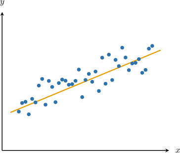

# Linear Regression

Source: https://www.mathacademy.com/topics/1057?courseId=43
Topic ID: 1057

## Prerequisites

- [Making Predictions Using Trend Lines](../algebra-i/3753-making-predictions-using-trend-lines.md)
- [Sums of Squares](./5204-sums-of-squares.md)

## Lesson

### Introduction

For a set of $n$ paired observations $x_i$ and $y_i,$ the trend line is the straight line that best fits the data.

Finding the equation of the trend line is called **linear regression**. The trend line is commonly called the **regression line** or **line of best fit.**

We can show that the equation of the trend line is given by

$$

y = mx+b,

$$

where:

- The slope $m$ is given by

- The $y$-intercept $b$ is given by

- $\overline{x}$ and $\overline{y}$ are the means of the data sets:

- The quantities $S_{xx}$ and $S_{xy}$ are given by

There's some nice intuition behind the formula for $b.$ The trend line *always* passes through the point $(\overline{x}, \overline{y}).$ Therefore, this point must satisfy the trend line equation $y = mx+b.$ We can then solve this equation for $b.$

Also, notice that $S_{xx}$ and $S_{xy}$ are the summation terms that feature in the formulas for the variance and covariance, respectively.

### Example: Calculating a Regression Line Equation

#### Question

Consider the data sets above. You are given that $\overline{x}=4$ and $\overline{y}=3.$ Find the equation of the corresponding linear regression line. Round the slope and the $y$-intercept to $1$ decimal place if necessary.

#### Explanation

The equation of the regression line is given by

$$

y = mx+b,

$$

where

$$

\begin{aligned}𝑚 & =\frac{𝑆_{𝑥𝑦}}{𝑆_{𝑥𝑥}},\,𝑏=\overset{𝑦}{–}−𝑚\overset{𝑥}{}.\end{aligned}

$$

Let's compute $m{:}$

- First, we compute the sum in the numerator:

- Second, we compute the sum in the denominator:

Now, substituting into the formula for $m,$ we obtain

$$

m = \dfrac{-26}{38} = -\dfrac{13}{19} \approx -0.7.

$$

Next, we substitute into the formula for $b{:}$

$$

\begin{aligned}𝑏 & =\overset{𝑦}{–}−𝑚\overset{𝑥}{} \\ & =3−(−\frac{13}{19})⋅4 \\ & =\frac{109}{19} \\ & ≈5.7\end{aligned}

$$

Therefore, the equation of the regression line is

$$

y = -0.7x + 5.7.

$$

### Example: Making Predictions by Calculating a Regression Line

#### Question

The table above gives the value of a car a few years after it was purchased (in thousands of dollars). You are given that $\overline{x}=2$ and $\overline{y}=24.$ Find the equation of the corresponding linear regression line and use this to predict how long it takes for the car's value to drop to $10\,000.$ Round your answer to the nearest year.

#### Explanation

The equation of the regression line is given by

$$

y = mx+b,

$$

where

$$

\begin{aligned}𝑚 & =\frac{𝑆_{𝑥𝑦}}{𝑆_{𝑥𝑥}},\,𝑏=\overset{𝑦}{–}−𝑚\overset{𝑥}{}.\end{aligned}

$$

Let's compute $m{:}$

- First, we compute the sum in the numerator:

- Second, we compute the sum in the denominator:

- Now, substituting into the formula for $m,$ we obtain

Next, we substitute into the formula for $b{:}$

$$

\begin{aligned}𝑏 & =\overset{𝑦}{–}−𝑚\overset{𝑥}{} \\ & =24−(−\frac{9}{2})⋅2 \\ & =33\end{aligned}

$$

Therefore, the equation of the regression line is

$$

y = -4.5x+33

$$

Finally, we can estimate the required value by substituting $y=10$ into the equation of the trend line and solving for $x{:}$

$$

\begin{aligned}𝑦 & =−4.5𝑥+33 \\ 10 & =−4.5𝑥+33 \\ −23 & =−4.5𝑥 \\ 𝑥 & ≈5\end{aligned}

$$

Therefore, according to this model, it takes approximately $5$ years for the car's value to drop to $10\,000.$

**** Since we're extrapolating (the point where $y=10$ is not within the original data range), our result ** be unreliable.
