# The Triangle Law for the Addition of Two Vectors

Source: https://www.mathacademy.com/topics/1100?courseId=43
Topic ID: 1100

## Prerequisites

- [Introduction to Vectors](./1107-introduction-to-vectors.md)

## Lesson

### Introduction

Given two vectors, we can compute the sum by placing the head of one vector at the tail of the other.

For example, let's consider the two vectors $\textbf{a}$ and $\textbf{b}$ below.

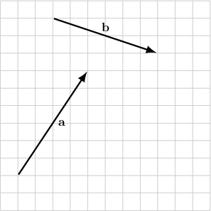

To find $\mathbf{a}+\mathbf{b},$ we need to draw the second vector $\textbf{b}$ starting from the head of the first vector $\textbf{a}.$ Now, the sum $\mathbf{a}+\mathbf{b}$ is the vector that we get when we join the tail of $\textbf{a}$ to the head of $\textbf{b}\mathbin{:}$

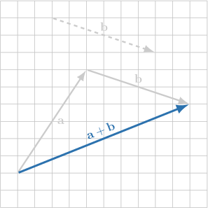

We call this method the **triangle law of addition**. The vector obtained by adding two or more vectors is sometimes called the **resultant**.

### Example: Adding Two Vectors Using the Triangle Law

#### Question

The vectors $\textbf{a}$ and $\textbf{b}$ are shown in the diagram below. Draw $\textbf{a}+\textbf{b}.$

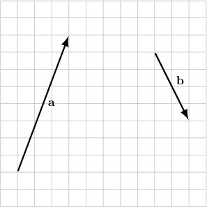

#### Explanation

First, we draw the vector that is equal to $\mathbf{b}$ and has its tail placed at the head of $\mathbf{a}.$

Now, according to the triangle law of addition, the resultant

$$

\mathbf{a}+\mathbf{b}

$$

is the vector that goes from the tail of $\textbf{a}$ to the head of $\textbf{b}$, as shown below.

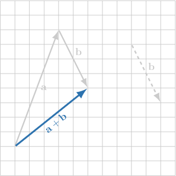

### Opposite Vectors and the Zero Vector

Given a vector $\overrightarrow{AB},$ the **opposite vector** is the vector $\overrightarrow{BA}$ that has the same length but goes in the opposite direction.

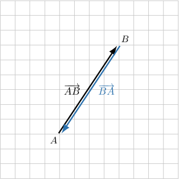

We write

$$

\overrightarrow{AB}=-\overrightarrow{BA}.

$$

To compute the sum of two opposite vectors,

$$

\overrightarrow{AB}+\overrightarrow{BA},

$$

we can use the triangle law of addition.

According to the triangle law of addition, the resultant is the vector that goes from the tail of $\overrightarrow{AB}$ to the head of $\overrightarrow{BA}.$ Therefore, we obtain a new vector for which the tail and head are the same point, $A.$ We denote that vector as

$$

\overrightarrow{AB}+\overrightarrow{BA} = \overrightarrow{AA}=\mathbf{0}.

$$

The vector $\mathbf{0}$ is called the **zero vector**. The zero vector has no direction and zero magnitude. With the zero vector, the head coincides with the tail.

### Example: Adding Two Opposite Vectors Using the Triangle Law

#### Question

Consider the vector $\overrightarrow{AB},$ shown below. What is the resultant of $\overrightarrow{AB}+\overrightarrow{BA}?$

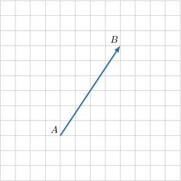

#### Explanation

According to the triangle law of addition, the resultant is the vector that goes from the tail of $\overrightarrow{AB}$ to the head of $\overrightarrow{BA}.$ Therefore, we obtain a new vector for which the tail and head are the same point, $A.$

That vector is called the zero vector, and we write

$$

\overrightarrow{AB}+\overrightarrow{BA} = \overrightarrow{AA}=\mathbf{0}.

$$

### Using the Triangle Law for Subtraction

We've seen how to use the triangle law to add two vectors. We can also use the triangle law to subtract two vectors.

The trick is to interpret the subtraction as the addition of a negative vector. For example, the subtraction

$$

\mathbf{a}-\mathbf{b}

$$

can be interpreted as the addition

$$

\mathbf{a} + (-\mathbf{b}),

$$

where $-\mathbf{b}$ is the vector that has the same magnitude as $\mathbf{b}$ but goes in the direction *opposite* of $\mathbf{b}.$

Let's see a concrete example.

### Example: Subtracting Two Vectors Using the Triangle Law

#### Question

Consider the diagram that shows the vectors $\mathbf{a}$ and $\mathbf{b}$. Draw $\mathbf{a}-\mathbf{b}.$

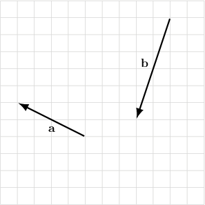

#### Explanation

We interpret the subtraction

$$

\mathbf{a}-\mathbf{b}

$$

as the addition

$$

\mathbf{a} + (-\mathbf{b}),

$$

where $-\mathbf{b}$ is the vector that has the same magnitude as $\mathbf{b}$ but goes in the direction ** of $\mathbf{b}.$

Finally, we use the triangle law to add the vectors $\mathbf{a}$ and $-\mathbf{b}\mathbin{:}$

- We can start $\mathbf{a}$ from an arbitrary point on the plane.

- Next, we draw the vector that is equal to $\mathbf{-b}$ and has its tail placed at the head of $\mathbf{a}.$

- Now, according to the triangle law of addition, the resultant is the vector that goes from the tail of $\textbf{a}$ to the head of $-\textbf{b}$, as shown below.

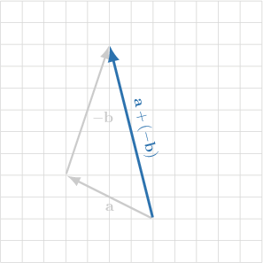

### Example: Adding More Than Two Vectors Using the Triangle Law

#### Question

The vectors $\textbf{a},$ $\textbf{b},$ and $\textbf{c}$ are shown in the diagram below. Find $\textbf{a}+\textbf{b}-\textbf{c}.$

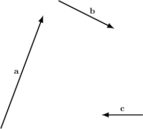

#### Explanation

First, we use the triangle law of addition to find

$$

\textbf{a}+\textbf{b}.

$$

The resultant $\mathbf{a}+\mathbf{b}$ is the vector that joins the tail of $\textbf{a}$ and the head of $\textbf{b}\mathbin{:}$

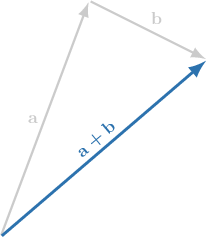

Now, we use the triangle law of addition to find

$$

(\textbf{a}+\textbf{b})+(-\textbf{c}).

$$

We draw $-\textbf{c}$ from the head of $\textbf{a}+\textbf{b}.$ So, we have the vector that goes from the tail of $\textbf{a}$ to the head of $-\textbf{c}\mathbin{:}$

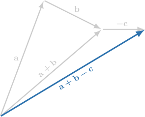
