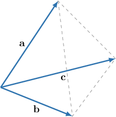
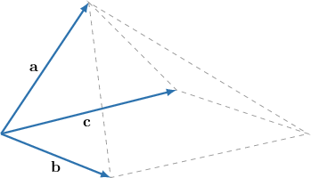

# Finding Volumes of Tetrahedrons and Pyramids Using Vector Products

Source: https://www.mathacademy.com/topics/1170?courseId=43
Topic ID: 1170

## Prerequisites

- [Volumes of Parallelepipeds](./1287-volumes-of-parallelepipeds.md)

## Lesson

### Introduction

Remember that to find the volume of the parallelepiped spanned by the vectors $\mathbf{a},$ $\mathbf{b},$ and $\mathbf{c},$ we take the absolute value of the triple product:

$$

V = | \mathbf{a}\cdot (\mathbf{b} \times \mathbf{c}) |

$$

However, sometimes we want to compute the volume of the *tetrahedron* spanned by the same vectors, as shown in the diagram below.

To compute the volume of the tetrahedron, we can just take $\dfrac{1}{6}$ of the volume of the corresponding parallelepiped. So, denoting the volume of the tetrahedron by $V_T,$ we get

$$

V_T = \dfrac{1}{6} V = \dfrac{1}{6} | \mathbf{a}\cdot (\mathbf{b} \times \mathbf{c}) |.

$$

### Example: Calculating the Volume of a Tetrahedron Spanned by Three Vectors

#### Question

Calculate the volume of the tetrahedron spanned by $\mathbf{a}=\langle -1,-7,0 \rangle,$ $\mathbf{b}=\langle -8,2,4 \rangle,$ and $\mathbf{c}=\langle 2,-3,1 \rangle.$

#### Explanation

Remember that the volume of a tetrahedron is $\dfrac{1}{6}$ the volume of the corresponding parallelepiped:

$$

V_{T}=\dfrac{1}{6}V = \dfrac{1}{6}\left|\mathbf{a}\cdot (\mathbf{b}\times\mathbf{c})\right|

$$

First, let's compute the triple product:

$$

\begin{aligned}𝐚⋅(𝐛×𝐜) & =\begin{matrix}−1 & −7 & 0 \\ −8 & 2 & 4 \\ 2 & −3 & 1\end{matrix} \\ & =(−1)⋅\begin{matrix}2 & 4 \\ −3 & 1\end{matrix}−(−7)⋅\begin{matrix}−8 & 4 \\ 2 & 1\end{matrix}+0⋅\begin{matrix}−8 & 2 \\ 2 & −3\end{matrix} \\ & =−(2+12)+7(−8−8)+0 \\ & =−14−112 \\ & =−126\end{aligned}

$$

So the volume of the corresponding parallelepiped is

$$

V = |-126| = 126.

$$

Therefore, the volume of the tetrahedron is

$$

V_{T} = \dfrac{1}{6}V = \dfrac{1}{6} \cdot 126 = 21.

$$

### The Volume of a Pyramid

Other times, we might want to compute the volume of the *pyramid* spanned by the vectors $\mathbf{a},$ $\mathbf{b},$ and $\mathbf{c},$ as shown in the diagram below (notice that vectors $\mathbf{b}$ and $\mathbf{c}$ span a parallelogram which is the base of our pyramid).

To compute the volume of the pyramid, we can just take $\dfrac{1}{3}$ of the volume of the corresponding parallelepiped. So, denoting the volume of the pyramid by $V_P,$ we get

$$

V_P = \dfrac{1}{3} V = \dfrac{1}{3} | \mathbf{a}\cdot (\mathbf{b} \times \mathbf{c}) |.

$$

For example, consider the pyramid $SABCD$ that has the parallelogram $ABCD$ as its base. Assume that we are given that

$$

\overrightarrow{AS} = \langle 6, 1, 1 \rangle, \qquad \overrightarrow{AB} = \langle 0, 2, 0 \rangle, \qquad \overrightarrow{AD} = \langle 0, 0, 2 \rangle.

$$

I this case, the formula for the volume of the pyramid gives

$$

V_{P}=\dfrac{1}{3}V = \dfrac{1}{3}\left| \overrightarrow{AS} \cdot ( \overrightarrow{AB} \times \overrightarrow{AD} )\right|

$$

First, let's compute the triple product:

$$

\begin{aligned}\overset{𝐴𝑆}{}⋅(\overset{𝐴𝐵}{}×\overset{𝐴𝐷}{}) & =\begin{matrix}6 & 1 & 1 \\ 0 & 2 & 0 \\ 0 & 0 & 2\end{matrix} \\ & =6⋅\begin{matrix}2 & 0 \\ 0 & 2\end{matrix}−1⋅\begin{matrix}0 & 0 \\ 0 & 2\end{matrix}+1⋅\begin{matrix}0 & 2 \\ 0 & 0\end{matrix} \\ & =6(4−0)−(0−0)+(0−0) \\ & =24−0+0 \\ & =24\end{aligned}

$$

So the volume of the corresponding parallelepiped is

$$

V=|24|=24,

$$

and therefore, the volume of the pyramid is

$$

V_{P}=\dfrac{1}{3}V=\dfrac{1}{3}\cdot 24=8.

$$

### Example: Calculating the Volume of a Pyramid Spanned by Three Vectors

#### Question

The parallelogram $ABCD$ is the base of the pyramid $SABCD.$ Calculate the volume $V_{P}$ of the pyramid if

$$

\overrightarrow{AB} = \langle 3, -1, 2 \rangle, \qquad \overrightarrow{AD} = \langle -2, 4, 1 \rangle, \qquad \overrightarrow{OA} =\langle 1, 2, -1 \rangle, \qquad \overrightarrow{OS} =\langle -1, 3, 2 \rangle.

$$

#### Explanation

Remember that the volume of a pyramid is $\dfrac{1}{3}$ the volume of the corresponding parallelepiped:

$$

V_{P}=\dfrac{1}{3}V = \dfrac{1}{3}\left| \overrightarrow{AS} \cdot ( \overrightarrow{AB} \times \overrightarrow{AD} )\right|

$$

Note that the vector $\overrightarrow{AS}$ is not given directly. But we can evaluate it in the following way:

$$

\begin{aligned}\overset{𝐴𝑆}{} & =\overset{𝑂𝑆}{}−\overset{𝑂𝐴}{} \\ & =⟨−1,3,2⟩−⟨1,2,−1⟩ \\ & =⟨−2,1,3⟩\end{aligned}

$$

Now, let's compute the triple product:

$$

\begin{aligned}\overset{𝐴𝑆}{}⋅(\overset{𝐴𝐵}{}×\overset{𝐴𝐷}{}) & =\begin{matrix}−2 & 1 & 3 \\ 3 & −1 & 2 \\ −2 & 4 & 1\end{matrix} \\ & =(−2)⋅\begin{matrix}−1 & 2 \\ 4 & 1\end{matrix}−1⋅\begin{matrix}3 & 2 \\ −2 & 1\end{matrix}+3⋅\begin{matrix}3 & −1 \\ −2 & 4\end{matrix} \\ & =(−2)(−1−8)−1(3−(−4))+3(12−2) \\ & =18−7+30 \\ & =41\end{aligned}

$$

So, the volume of the corresponding parallelepiped is

$$

V=|{41}|=41,

$$

and therefore, the volume of the pyramid is

$$

V_{P}=\dfrac{1}{3}V=\dfrac{1}{3}\cdot 41=\boxed{\dfrac{41}{3}}.

$$

### Example: Calculating the Volume of a Tetrahedron Given the Coordinates of the Vertices

#### Question

Calculate the volume of the tetrahedron $ABCD$ given the points $A(-1,1,-2),$ $B(2,1,1),$ $C(2,2,1),$ and $D(1,0,-1).$

#### Explanation

First, we find the vectors $\overrightarrow{AB},$ $\overrightarrow{AC},$ and $\overrightarrow{AD}$ that span the tetrahedron:

$$

\begin{aligned}\overset{𝐴𝐵}{} & =𝐛−𝐚 \\ & =⟨2,1,1⟩−⟨−1,1,−2⟩ \\ & =⟨3,0,3⟩ \\ \overset{𝐴𝐶}{} & =𝐜−𝐚 \\ & =⟨2,2,1⟩−⟨−1,1,−2⟩ \\ & =⟨3,1,3⟩ \\ \overset{𝐴𝐷}{} & =𝐝−𝐚 \\ & =⟨1,0,−1⟩−⟨−1,1,−2⟩ \\ & =⟨2,−1,1⟩\end{aligned}

$$

Now, remember that the volume of a tetrahedron is $\dfrac{1}{6}$ the volume of the corresponding parallelepiped:

$$

V_T = \dfrac{1}{6}V = \dfrac{1}{6} |\overrightarrow{AB} \cdot (\overrightarrow{AC} \times \overrightarrow{AD})|

$$

Let's compute the triple product:

$$

\begin{aligned}\overset{𝐴𝐵}{}⋅(\overset{𝐴𝐶}{}×\overset{𝐴𝐷}{}) & =\begin{matrix}3 & 0 & 3 \\ 3 & 1 & 3 \\ 2 & −1 & 1\end{matrix} \\ & =3⋅\begin{matrix}1 & 3 \\ −1 & 1\end{matrix}−0⋅\begin{matrix}3 & 3 \\ 2 & 1\end{matrix}+3⋅\begin{matrix}3 & 1 \\ 2 & −1\end{matrix} \\ & =3(1+3)−0+3(−3−2) \\ & =12−0−15 \\ & =−3\end{aligned}

$$

So, the volume of the tetrahedron is

$$

V_T = \dfrac{1}{6} \cdot |{-3}| = \dfrac{1}{6} \cdot 3 = \dfrac{1}{2}.

$$
