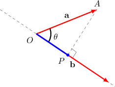
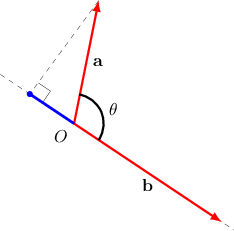
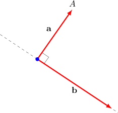

# Calculating a Scalar Projection

Source: https://www.mathacademy.com/topics/1285?courseId=43
Topic ID: 1285

## Prerequisites

- [The Angle Between Two Vectors](./1278-the-angle-between-two-vectors.md)

## Lesson

### Introduction

The **scalar projection** of a vector $\mathbf{a}$ onto another vector $\mathbf{b}$ is the distance that the vector $\mathbf{a}$ extends in the direction of $\mathbf{b}.$

For example, consider two vectors $\mathbf{a}$ and $\mathbf{b}$ shown below. Suppose we know that $|\,\mathbf{a}\,|=2$ and that the angle between the vectors is $\theta = \dfrac{\pi}{4}.$

To illustrate the projection of $\mathbf{a}$ along $\mathbf{b},$ consider the point $P$ on the line that contains $\mathbf{b}$ with $AP \perp \mathbf{b},$ as shown below.

The length $OP$ is called the **scalar projection** of $\mathbf{a}$ onto $\mathbf{b}$ (or the **component** of $\mathbf{a}$ along $\mathbf{b}$). It is denoted as $\text{comp}_{\mathbf{b}}\,\mathbf{a},$ and we can compute it using cosine in $\triangle OPA$ as follows:

$$

\begin{aligned}comp_{𝐛}\,𝐚 & =𝑂𝑃 \\ & =|\,𝐚\,|cos⁡𝜃 \\ & =2cos⁡(\frac{𝜋}{4}) \\ & =2⋅\frac{\sqrt{√2}}{2} \\ & =\sqrt{√2}\end{aligned}

$$

This formula is the general definition of the scalar projection:

$$

\text{comp}_{\mathbf{b}}\,\mathbf{a}= |\,\mathbf{a}\,| \cos\theta

$$

### Negative Scalar Projections

The scalar projection of $\mathbf{a}$ onto $\mathbf{b}$ can be negative. This happens when the vector $\mathbf{a}$ extends in the direction opposite to that of $\mathbf{b}.$

For example, consider two vectors $\mathbf{a}$ and $\mathbf{b},$ where it is known that

$$

|\,\mathbf{a}\,|=2, \qquad \theta = 135^\circ.

$$

Notice that the angle $\theta$ between the vectors is obtuse.

Computing the scalar projection of $\mathbf a$ onto $\mathbf b$ using the formula, we obtain

$$

\begin{aligned}comp_{𝐛}\,𝐚 & =|\,𝐚\,|cos⁡𝜃 \\ & =2cos⁡(135^{∘}) \\ & =2⋅(−\frac{\sqrt{√2}}{2}) \\ & =−\sqrt{√2}.\end{aligned}

$$

In general, if $90^\circ < \theta \leq 180^\circ,$ then $\cos\theta <0$ and the scalar projection will be negative.

### Example: Calculating a Scalar Projection Using Angles and Magnitudes

#### Question

Suppose $|\,\mathbf{a}\,|=13$ and the angle between vectors $\mathbf{a}$ and $\mathbf{b}$ is $\theta = \dfrac{2\pi}{3}.$ Find the scalar projection of $\mathbf{a}$ onto $\mathbf{b}.$

#### Explanation

Using the formula for the scalar projection, we obtain

$$

\begin{aligned}comp_{𝐛}\,𝐚 & =|\,𝐚\,|cos⁡𝜃 \\ & =13cos⁡(\frac{2𝜋}{3}) \\ & =13⋅(−\frac{1}{2}) \\ & =−\frac{13}{2}.\end{aligned}

$$

### Deriving a General Formula

We have been using the following formula for the scalar projection of $\mathbf{a}$ onto $\mathbf{b}\mathbin{:}$

$$

\text{comp}_{\mathbf{b}}\,\mathbf{a}= |\,\mathbf{a}\,| \cos\theta

$$

However, sometimes we are not given the angle between two vectors. In such cases, we can solve for $\cos \theta$ in terms of the dot product:

$$

\begin{aligned}𝐚⋅𝐛 & =|\,𝐚\,|\,|\,𝐛\,|cos⁡𝜃 \\ cos⁡𝜃 & =\frac{𝐚⋅𝐛}{|\,𝐚\,|\,|\,𝐛\,|}\end{aligned}

$$

Substituting this into our original formula, we get

$$

\begin{aligned}comp_{𝐛}\,𝐚 & =|\,𝐚\,|cos⁡𝜃 \\ & =|\,𝐚\,|⋅\frac{𝐚⋅𝐛}{|\,𝐚\,|\,|\,𝐛\,|} \\ & =\frac{𝐚⋅𝐛}{|\,𝐛\,|}.\end{aligned}

$$

Therefore, another general formula for the scalar projection of $\mathbf{a}$ onto $\mathbf{b}$ is

$$

\begin{aligned}comp_{𝐛}\,𝐚 & =\frac{𝐚⋅𝐛}{|\,𝐛\,|}.\end{aligned}

$$

### Example: Calculating a Scalar Projection Using Components

#### Question

Let $\mathbf{a}=\langle 3,3,-1 \rangle$ and $\mathbf{b}=\langle 2,-7,0 \rangle.$ Find the scalar projection of $\mathbf{a}$ onto $\mathbf{b}.$

#### Explanation

Using the formula for the scalar projection, we obtain

$$

\begin{aligned}comp_{𝐛}\,𝐚 & =\frac{𝐚⋅𝐛}{|\,𝐛\,|} \\ & =\frac{𝑎_{𝑥}𝑏_{𝑥}+𝑎_{𝑦}𝑏_{𝑦}+𝑎_{𝑧}𝑏_{𝑧}}{\sqrt{√𝑏_{2𝑥}^{}+𝑏_{2𝑦}^{}+𝑏_{2𝑧}^{}}} \\ & =\frac{3⋅2+3⋅(−7)+(−1)⋅0}{\sqrt{√2^{2}+(−7)^{2}+0^{2}}} \\ & =−\frac{15}{\sqrt{√53}}.\end{aligned}

$$

### Projecting Perpendicular Vectors

Notice that if two vectors $\mathbf{a}$ and $\mathbf{b}$ are perpendicular, then the scalar projection of $\mathbf{a}$ onto $\mathbf{b}$ (or $\mathbf{b}$ onto $\mathbf{a}$) is equal to $0.$

For example, consider the following illustration. Notice that, since $\mathbf{a} \perp \mathbf{b},$ the vector $\mathbf{a}$ doesn't extend in the direction of $\mathbf{b}$ at all. So, the scalar projection of $\mathbf{a}$ onto $\mathbf{b}$ is $0.$

Furthermore, we have the following fact:

*If $\mathbf{a}$ is a nonzero vector, its scalar projection onto another nonzero vector $\mathbf{b}$ equals $0$ if and only if the vectors are perpendicular.*

### Example: Projecting a Vector Onto a Perpendicular Vector

#### Question

Let $\begin{aligned}0 \\ 0 \\ 1\end{aligned}$ and $\begin{aligned}2 \\ −4 \\ 0\end{aligned}$ Find the scalar projection of $\mathbf{a}$ onto $\mathbf{b}.$

#### Explanation

Using the formula for the scalar projection, we obtain

$$

\begin{aligned}comp_{𝐛}\,𝐚 & =\frac{𝐚⋅𝐛}{|\,𝐛\,|} \\ & =\frac{𝑎_{𝑥}𝑏_{𝑥}+𝑎_{𝑦}𝑏_{𝑦}+𝑐_{𝑧}𝑏_{𝑧}}{\sqrt{√𝑏_{2𝑥}^{}+𝑏_{2𝑦}^{}+𝑏_{2𝑧}^{}}} \\ & =\frac{0⋅2+0⋅(−4)+1⋅0}{\sqrt{√2^{2}+(−4)^{2}+0^{2}}} \\ & =\frac{0}{\sqrt{√2^{2}+(−4)^{2}+0^{2}}} \\ & =0.\end{aligned}

$$
