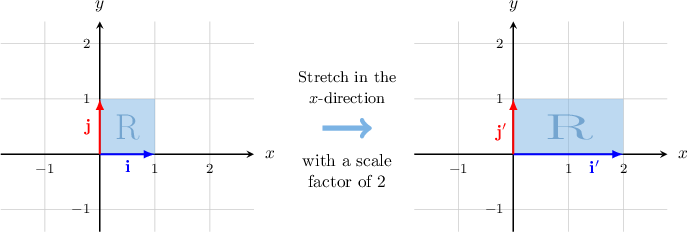
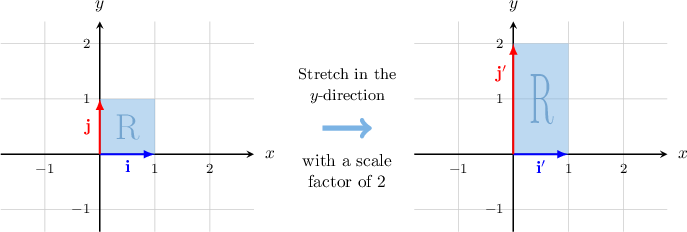
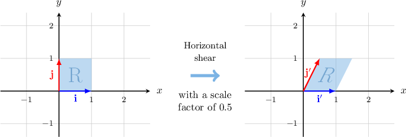
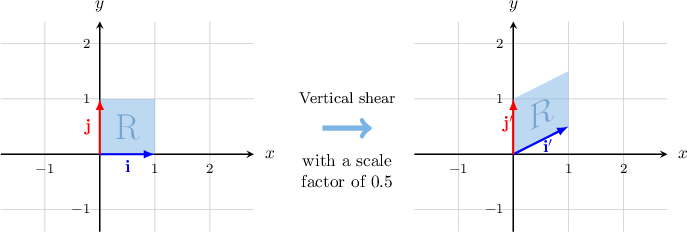
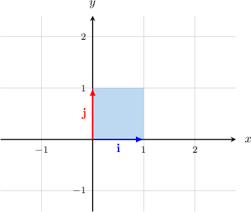
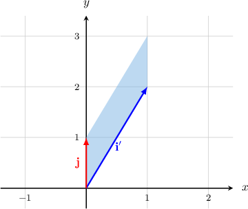
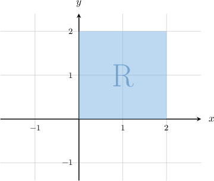
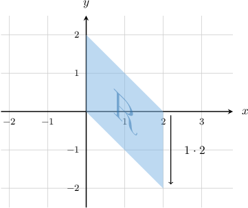

# Shear and Stretch as Linear Transformations

Source: https://www.mathacademy.com/topics/1358?courseId=43
Topic ID: 1358

## Prerequisites

- [Linear Transformations of Objects in the Plane](./866-linear-transformations-of-objects-in-the-plane.md)
- [Stretches of Geometric Figures](../geometry/2217-stretches-of-geometric-figures.md)

## Lesson

### Introduction

Consider the standard basis $\big\{\mathbf{i},\mathbf{j} \big\}$ of the Euclidean plane $\mathbb{R}^2$ and the unit square spanned by the vectors.

Let $[\begin{aligned}2 & 0 \\ 0 & 1\end{aligned}]$ be a matrix of a linear transformation $\mathbf T.$ We can find the images of $\{\mathbf{i},\mathbf{j} \}$ under $\mathbf{T}$ as follows:

$$

\begin{aligned}𝐢^{′} & =𝐓(𝐢)=[\begin{matrix}2 & 0 \\ 0 & 1\end{matrix}][\begin{matrix}1 \\ 0\end{matrix}]=[\begin{matrix}2 \\ 0\end{matrix}]=2𝐢 \\ 𝐣^{′} & =𝐓(𝐣)=[\begin{matrix}2 & 0 \\ 0 & 1\end{matrix}][\begin{matrix}0 \\ 1\end{matrix}]=[\begin{matrix}0 \\ 1\end{matrix}]=𝐣\end{aligned}

$$

Applying this transformation, we obtain the following image:

We see that the transformation represented by the matrix $T$ multiplies the vector $\mathbf{i}$ by a factor of $2$ and leaves the vector $\mathbf j$ unchanged. This type of transformation is called a **stretch in the $\mathbf x$-direction.** We can also call it a **horizontal stretch.** In this case, we have a **horizontal stretch of scale factor** $\mathbf 2.$

In general, a stretch in the $x$-direction of scale factor $k$ with its center at the origin is represented by the matrix

$$

[\begin{aligned}𝑘 & 0 \\ 0 & 1\end{aligned}]

$$

### Vertical Stretch

Now, let $[\begin{aligned}1 & 0 \\ 0 & 2\end{aligned}]$ be a matrix of a linear transformation $\mathbf T.$ We can find the images of $\{\mathbf{i},\mathbf{j} \}$ under $\mathbf T$ as follows:

$$

\begin{aligned}𝐢^{′} & =𝐓(𝐢)=[\begin{matrix}1 & 0 \\ 0 & 2\end{matrix}][\begin{matrix}1 \\ 0\end{matrix}]=[\begin{matrix}1 \\ 0\end{matrix}]=𝐢 \\ 𝐣^{′} & =𝐓(𝐣)=[\begin{matrix}1 & 0 \\ 0 & 2\end{matrix}][\begin{matrix}0 \\ 1\end{matrix}]=[\begin{matrix}0 \\ 2\end{matrix}]=2𝐣\end{aligned}

$$

Applying this transformation, we obtain the following image:

The transformation represented by the matrix $T$ multiplies the vector $\mathbf{j}$ by $2$ and leaves the vector $\mathbf i$ unchanged. This type of transformation is called a **stretch in the $\mathbf y$-direction.** We can also call this a **vertical stretch**. In this case, we have a **vertical stretch of scale factor** $\mathbf 2$.

In general, a stretch in the $y$-direction of scale factor $k$ with its center at the origin is represented by the matrix

$$

[\begin{aligned}1 & 0 \\ 0 & 𝑘\end{aligned}]

$$

### Example: Finding the Standard Matrix of a Stretch Transformation Given a Vector and its Image

#### Question

A linear transformation $\mathbf{T}$ represents a stretch along the $x$-axis or $y$-axis. Given that $[\begin{aligned}−4 \\ 3\end{aligned}]$ and $[\begin{aligned}−16 \\ 3\end{aligned}]$ what is the standard matrix of $\mathbf{T}?$

#### Explanation

First, we are told that $\mathbf{T}$ represents a stretch along the $x$-axis or $y$-axis.

Comparing the $x$- and $y$-components of $\mathbf{v}$ and $\mathbf{T}(\mathbf{v}),$ we note the following:

- the $x$-component of $\mathbf{T}(\mathbf{v})$ is $4$ times the $x$-component of $\mathbf{v},$ while

- the $y$-components of $\mathbf{v}$ and $\mathbf{T}(\mathbf{v})$ are the same.

So, we conclude that $\mathbf{T}$ represents a stretch of scale factor $4$ in the $x$-direction.

Therefore, the standard matrix of $\mathbf{T}$ is

$$

[\begin{aligned}4 & 0 \\ 0 & 1\end{aligned}]

$$

### Horizontal Shear

Consider the standard basis $\big\{\mathbf{i},\mathbf{j} \big\}$ of the Euclidean plane $\mathbb{R}^2$ and the unit square spanned by the vectors.

Let $[\begin{aligned}1 & 0.5 \\ 0 & 1\end{aligned}]$ be a matrix of a linear transformation $\mathbf T.$ We can find the images of $\{\mathbf{i},\mathbf{j} \}$ under $\mathbf{T}$ as follows:

$$

\begin{aligned}𝐢^{′} & =𝐓(𝐢)=[\begin{matrix}1 & 0.5 \\ 0 & 1\end{matrix}][\begin{matrix}1 \\ 0\end{matrix}]=[\begin{matrix}1 \\ 0\end{matrix}]=𝐢 \\ 𝐣^{′} & =𝐓(𝐣)=[\begin{matrix}1 & 0.5 \\ 0 & 1\end{matrix}][\begin{matrix}0 \\ 1\end{matrix}]=[\begin{matrix}0.5 \\ 1\end{matrix}]=0.5𝐢+𝐣\end{aligned}

$$

Applying this transformation, we obtain the following image:

The transformation represented by the matrix $T$ adds $0.5\mathbf{i}$ to $\mathbf j,$ while the vector $\mathbf i$ remains unchanged. This type of transformation is called a **horizontal shear.** In this case, we have a **horizontal shear with a shear factor of** $\mathbf{0.5}.$

In general, a horizontal shear of scale factor $k$ with its center at the origin is represented by the matrix

$$

[\begin{aligned}1 & 𝑘 \\ 0 & 1\end{aligned}]

$$

### Vertical Shear

Now, let $[\begin{aligned}1 & 0 \\ 0.5 & 1\end{aligned}]$ be a matrix of a linear transformation $\mathbf T.$ We can find the images of $\{\mathbf{i},\mathbf{j} \}$ under $\mathbf{T}$ as follows:

$$

\begin{aligned}𝐢^{′} & =𝐓(𝐢)=[\begin{matrix}1 & 0 \\ 0.5 & 1\end{matrix}][\begin{matrix}1 \\ 0\end{matrix}]=[\begin{matrix}1 \\ 0.5\end{matrix}]=𝐢+0.5𝐣 \\ 𝐣^{′} & =𝐓(𝐣)=[\begin{matrix}1 & 0 \\ 0.5 & 1\end{matrix}][\begin{matrix}0 \\ 1\end{matrix}]=[\begin{matrix}0 \\ 1\end{matrix}]=𝐣\end{aligned}

$$

This gives the following image:

The transformation represented by the matrix $T$ adds $0.5\mathbf{j}$ to $\mathbf i,$ while the vector $\mathbf j$ remains unchanged. This type of transformation is called a **vertical shear.** In this case, we have a **vertical shear with a shear factor of** $\mathbf{0.5}.$

In general, a vertical shear of scale factor $k$ with its center at the origin is represented by the matrix

$$

[\begin{aligned}1 & 0 \\ 𝑘 & 1\end{aligned}]

$$

### Example: Identifying a Shear or Stretch Transformation Given the Images of the Standard Basis Vectors

#### Question

Consider the standard basis $\{\mathbf{i}, \mathbf{j} \}$ of $\,\mathbb{R}^2.$ If $\mathbf{T}$ is a linear transformation such that $\mathbf{T}(\mathbf{i})=\mathbf{i}+2\mathbf{j}$ and $\mathbf{T}(\mathbf{j})=\mathbf{j}$ then, what is the geometric interpretation of the transformation $\mathbf{T}?$

#### Explanation

First, let's consider the unit square spanned by the vectors $\mathbf{i}$ and $\mathbf{j}.$

Now, using the fact that $\mathbf{T}(\mathbf{i})=\mathbf{i}+2\mathbf{j}$ and $\mathbf{T}(\mathbf{j})=\mathbf{j},$ we can draw the image of the square under the transformation $\mathbf{T}\mathbin{:}$

Therefore, the linear transformation $\mathbf{T}$ represents a vertical shear with a shear factor of $2.$

### Example: Identifying a Shear or Stretch Transformation Represented by a Matrix

#### Question

What linear transformation is represented by the following matrix $[\begin{aligned}1 & 2 \\ 0 & 1\end{aligned}]$

#### Explanation

We can find the images of the standard basis vectors $\mathbf i$ and $\mathbf j$ under the action of $\mathbf T,$ as follows:

$$

\begin{aligned}𝐓(𝐢) & =[\begin{matrix}1 & 2 \\ 0 & 1\end{matrix}][\begin{matrix}1 \\ 0\end{matrix}]=[\begin{matrix}1 \\ 0\end{matrix}]=𝐢 \\ 𝐓(𝐣) & =[\begin{matrix}1 & 2 \\ 0 & 1\end{matrix}][\begin{matrix}0 \\ 1\end{matrix}]=[\begin{matrix}2 \\ 1\end{matrix}]=2𝐢+𝐣\end{aligned}

$$

Therefore, the matrix represents a ** shear with a shear factor of $2.$

### Example: Finding the Image of a Square Under a Shear or Stretch Transformation

#### Question

Let $[\begin{aligned}1 & 0 \\ −1 & 1\end{aligned}]$ be the standard matrix of the linear transformation $\mathbf{T}.$ What is the image of the square $R$ (shown above) under the action of $\mathbf{T}?$

#### Explanation

Looking at the matrix $T,$ we can see that $\mathbf{T}$ represents a vertical shear of shear factor $-1.$ Therefore, the image of the square $R$ under $\mathbf{T}$ is as follows:

****

We can check that the vertices of $R$ are mapped to the vertices of the parallelogram shown above as follows:

$$

\begin{aligned}𝐓([\begin{matrix}0 \\ 0\end{matrix}]) & =[\begin{matrix}1 & 0 \\ −1 & 1\end{matrix}][\begin{matrix}0 \\ 0\end{matrix}]=[\begin{matrix}0 \\ 0\end{matrix}] \\ 𝐓([\begin{matrix}2 \\ 0\end{matrix}]) & =[\begin{matrix}1 & 0 \\ −1 & 1\end{matrix}][\begin{matrix}2 \\ 0\end{matrix}]=[\begin{matrix}2 \\ −2\end{matrix}] \\ 𝐓([\begin{matrix}2 \\ 2\end{matrix}]) & =[\begin{matrix}1 & 0 \\ −1 & 1\end{matrix}][\begin{matrix}2 \\ 2\end{matrix}]=[\begin{matrix}2 \\ 0\end{matrix}] \\ 𝐓([\begin{matrix}0 \\ 2\end{matrix}]) & =[\begin{matrix}1 & 0 \\ −1 & 1\end{matrix}][\begin{matrix}0 \\ 2\end{matrix}]=[\begin{matrix}0 \\ 2\end{matrix}]\end{aligned}

$$
