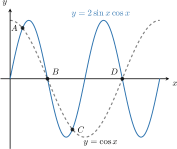

# Solving Trigonometric Equations Using the Zero-Product Property

Source: https://www.mathacademy.com/topics/1471?courseId=43
Topic ID: 1471

## Prerequisites

- [Solving Quadratic Equations with No Constant Term](../algebra-i/393-solving-quadratic-equations-with-no-constant-term.md)
- [Elementary Trigonometric Equations Containing Secant](./1565-elementary-trigonometric-equations-containing-secant.md)
- [Elementary Trigonometric Equations Containing Cosecant](./1566-elementary-trigonometric-equations-containing-cosecant.md)
- [Elementary Trigonometric Equations Containing Cotangent](./1567-elementary-trigonometric-equations-containing-cotangent.md)

## Lesson

### Introduction

Suppose we want to find all of the solutions to the equation

$$

\sin{x}\cos{x}-\dfrac{1}{2}\sin{x} = 0, \qquad 0^\circ \leq x \leq 180^\circ.

$$

First, we factor the equation:

$$

\begin{aligned}sin⁡𝑥cos⁡𝑥−\frac{1}{2}sin⁡𝑥 & =0 \\ sin⁡𝑥(cos⁡𝑥−\frac{1}{2}) & =0\end{aligned}

$$

We can now apply the zero product rule, which states that $ab=0$ if and only if $a=0$ or $b=0.$ This gives us two equations,

$$

\sin{x} = 0 \quad \text{and} \quad \cos{x}-\dfrac12=0.

$$

We now solve each of these equations separately.

- First, we solve $\sin{x}=0.$ The solutions to this equation that lie in the given domain are $x = 0^\circ$ and $x=180^\circ.$

- Then, we solve $\cos{x}-\dfrac12=0,$ or equivalently, $\cos{x}=\dfrac12.$ The only solution to this equation that lies in the given domain is $x = 60^\circ.$

Combining all the solutions from both equations, the solutions of the original equation (in ascending order) are

$$

x_1 = 0^\circ,\quad x_2 = 60^\circ,\quad x_3 = 180^\circ.

$$

### Example: Solving a Trigonometric Equation by Factoring

#### Question

Consider the equation $\sqrt{3}\sin{\theta}\tan{\theta}-\sin{\theta} = 0$ for $0^\circ \leq \theta < 360^\circ.$ If the solutions $\theta_1, \theta_2, \theta_3, \theta_4$ are written in ascending order, then what is the numerical value of $\theta_2\cdot \theta_3?$

#### Explanation

Note that the function $\tan{\theta}$ is not defined at $\theta = 90^\circ, 270^\circ,$ so these values cannot be solutions to the equation.

First, we factor the equation:

$$

\begin{aligned}\sqrt{3}sin⁡𝜃tan⁡𝜃−sin⁡𝜃 & =0 \\ sin⁡𝜃(\sqrt{3}tan⁡𝜃−1) & =0\end{aligned}

$$

By the zero-product property, we have to solve two equations:

$$

\sin{\theta } = 0, \qquad \sqrt{3}\tan{\theta } - 1 =0.

$$

Let's solve each equation separately.

- First, we solve $\sin{\theta} = 0.$ The solutions to this equation for $0^\circ \leq \theta < 360^\circ$ are $\theta = 0^\circ, \, 180^\circ.$

- Then, we solve $\sqrt{3}\tan{\theta} - 1 =0,$ or equivalently $\tan{\theta} = \dfrac{\sqrt{3}}{3}.$ The solutions to this equation for $0^\circ \leq \theta < 360^\circ$ are $\theta=30^\circ, \, 210^\circ.$

Combining all solutions from both equations, we get

$$

\theta_1 = 0^\circ, \quad \theta_2= 30^\circ, \quad \theta_3=180^\circ, \quad \theta_4= 210^\circ.

$$

Finally,

$$

\theta_2\cdot \theta_3 =30 \cdot 180 = 5\,400.

$$

### Example: Solving a Trigonometric Equation by Rearranging the Equation and Then Factoring

#### Question

Consider the equation $\sqrt{2} \sin{x} \cos{x} = -\sin{x}$ for $0 \leq x \leq \pi.$ If the solutions $x_1, x_2, x_3$ are written in ascending order, then what is $x_2\cdot x_3?$

#### Explanation

First, we factor the equation:

$$

\begin{aligned}\sqrt{2}sin⁡𝑥cos⁡𝑥 & =−sin⁡𝑥 \\ \sqrt{2}sin⁡𝑥cos⁡𝑥+sin⁡𝑥 & =0 \\ sin⁡𝑥(\sqrt{2}cos⁡𝑥+1) & =0\end{aligned}

$$

By the zero-product property, we have to solve two equations:

$$

\sin{x} = 0, \qquad \sqrt{2} \cos{x} + 1 =0.

$$

Let's solve each equation separately.

- First, we solve $\sin{x} = 0.$ The solutions to this equation for $0\leq x \leq \pi$ are $x = 0,\, \pi.$

- Then, we solve $\sqrt{2} \cos{x} + 1= 0,$ or equivalently $\cos{x} =-\dfrac{\sqrt{2}}{2}.$ The solution to this equation for $0\leq x \leq \pi$ is $x =\dfrac{3\pi}{4}.$

Combining all solutions from both equations, we get

$$

x_1 = 0,\quad x_2=\dfrac{3\pi}{4},\quad x_3= \pi.

$$

Finally,

$$

x_2\cdot x_3 = \dfrac{3\pi}{4} \cdot \pi=\dfrac{3\pi^2}{4}.

$$

### Equations Containing Reciprocal Functions

We can solve some trigonometric equations containing reciprocal functions using the zero product rule.

For example, suppose we want to find all of the solutions to the equation

$$

(\sec x -1)(2\sin x +1)= 0, \qquad -\pi \leq x < \pi.

$$

First, note that the function $\sec{x}$ is not defined at the points where $\cos{x}=0.$ On the interval $[-\pi,\pi),$ the excluded values are $x=\pm\dfrac{\pi}{2}.$

The equation is already factored, so by the zero-product property, we have to solve two equations:

$$

\sec{x} -1 =0, \qquad 2\sin{x} + 1 = 0.

$$

Let's solve each equation separately.

- First, we solve $\sec{x} -1 =0,$ or equivalently, $\sec{x} =1.$ The only solution to this equation for $-\pi \leq x < \pi$ is $x = 0.$

- Then, we solve $2\sin{x} + 1 = 0,$ or equivalently, $\sin{x} = -\dfrac12.$ The solutions to this equation for $-\pi \leq x < \pi$ are $x=-\dfrac{5\pi}{6},-\dfrac{\pi}{6}.$

Combining all the solutions from both equations, the solutions to the original equation (in ascending order) are

$$

x_1 = - \dfrac{5\pi}{6},\quad x_2 = - \dfrac{\pi}{6},\quad x_3 = 0.

$$

### Example: Solving a Trigonometric Equation Containing Reciprocal Functions by Factoring

#### Question

Solve the equation $\csc{x} \tan{x} = \tan{x}$ for $0^\circ \leq x < 360^\circ.$

#### Explanation

Note that the function $\csc{x}$ is not defined at the points where $\sin{x} = 0.$ On the interval $0^\circ \leq x < 360^\circ,$ the excluded values are $x = 0^\circ, 180^\circ.$

On the other hand, the function $\tan{x}$ is not defined at the points where $\cos{x} = 0.$ In the given interval, the excluded values are $x = 90^\circ, 270^\circ.$

First, we factor the equation:

$$

\begin{aligned}csc⁡𝑥tan⁡𝑥 & =tan⁡𝑥 \\ csc⁡𝑥tan⁡𝑥−tan⁡𝑥 & =0 \\ (csc⁡𝑥−1)tan⁡𝑥 & =0\end{aligned}

$$

Therefore, by the zero-product property, we have to solve two equations:

$$

\csc{x} - 1 = 0, \qquad \tan{x} = 0

$$

Let's solve each equation separately.

- First, we solve $\csc{x} -1= 0,$ or equivalently, $\csc x=1.$ The solution to this equation for $0 ^\circ \leq x \lt 360^\circ$ is $x = 90^\circ.$

- Then, we solve $\tan{x} = 0.$ The solutions to this equation for $0^\circ\leq x \lt 360^\circ$ are $x = 0^\circ,\, 180^\circ.$

Finally, taking into account the values excluded from the interval, we conclude that the given equation has no solution.

### Example: Finding Some Coordinates on a Graph by Solving a Trigonometric Equation

#### Question

The graph shows the curve $y = 2\sin{x}\cos{x}$ and the curve $y = \cos{x}$ on the interval $0^\circ \leq x < 360^\circ.$ The curves intersect at the points $A,$ $B,$ $C,$ and $D,$ as shown. Find $x$-coordinates of these points.

#### Explanation

At the intersection points, the $y$ values of both graphs are the same. This gives the equation

$$

2\sin{x}\cos{x} = \cos{x}.

$$

First, we factor the equation:

$$

\begin{aligned}2cos⁡𝑥sin⁡𝑥−cos⁡𝑥 & =0 \\ cos⁡𝑥(2sin⁡𝑥−1) & =0\end{aligned}

$$

By the zero-product property, we have to solve two equations:

$$

\cos{x} = 0, \qquad 2\sin{x} - 1 = 0

$$

Let's solve each equation separately.

- First, we solve $\cos{x} = 0.$ The solutions to this equation for $0^\circ \leq x < 360^\circ$ are $x= 90^\circ, \, 270^\circ.$

- Then, we solve $2\sin{x} - 1 = 0,$ or equivalently $\sin{x}=\dfrac{1}{2}.$ The solutions to this equation for $0^\circ \leq x < 360^\circ$ are $x = 30^\circ,\, 150^\circ.$

Combining all solutions from both equations, we get

$$

x_1=30^\circ, \quad x_2=90^\circ,\quad x_3=150^\circ, \quad x_4 = 270^\circ.

$$
