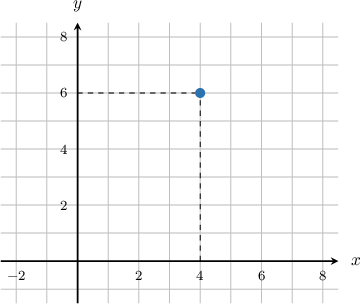
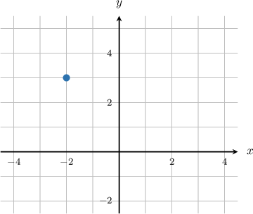
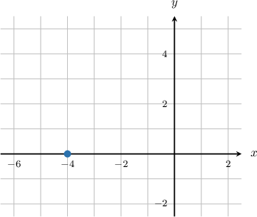
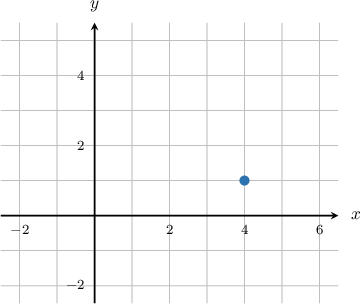

# The Complex Plane

Source: https://www.mathacademy.com/topics/157?courseId=43
Topic ID: 157

## Prerequisites

- [The Cartesian Coordinate System](../../../../middle-school/lessons/grade-6/92-the-cartesian-coordinate-system.md)
- [Complex Numbers](../algebra-ii/735-complex-numbers.md)

## Lesson

### Introduction

We often use $z=x+\text{i}y$ to denote a complex number $z$, where $x$ and $y$ are the real and imaginary parts of $z$ respectively.

We can also depict complex numbers using $xy$-coordinates. For example, the complex number $4+6\text{i}$ can be represented by the point $(4,6),$ as follows:

In the context of complex numbers, the $x$-axis is called the **real axis**, and the $y$-axis is called the **imaginary axis**.

When using a two-dimensional plane to represent complex numbers, we call this the **complex plane** (another name for it is the **Argand diagram**). The complex plane is often denoted as $\mathbb{C}.$

### Example: Identifying a Complex Number Represented by an Argand Diagram

#### Question

What complex number is represented in the Argand diagram below?

#### Explanation

The coordinates of the point are $(-2,3)$.

- The real part of this complex number is $x=-2,$ and

- the imaginary part is $y=3.$

Therefore, the number depicted is $z=-2+3\text{i}.$

### Example: Identifying a Complex Number With No Real or No Imaginary Part Represented by an Argand Diagram

#### Question

What complex number is represented in the Argand diagram below?

#### Explanation

The coordinates of the point are $(-4,0).$

- The real part of this complex number is $x=-4,$ and

- the imaginary part is $y=0.$

Therefore, the number depicted is $z=-4+0\text{i},$ which can be simplified to $z= -4.$

### Example: Identifying an Argand Diagram Corresponding to a Complex Number

#### Question

Draw an Argand diagram representing the complex number $z=4+\text{i}$.

#### Explanation

We are given the complex number $z=4+\text{i}$.

- The real part of this complex number is $x=4,$ and

- the imaginary part is $y=1.$

Therefore, the coordinates of the point are $(4,1)$, as shown in the Argand diagram below.

