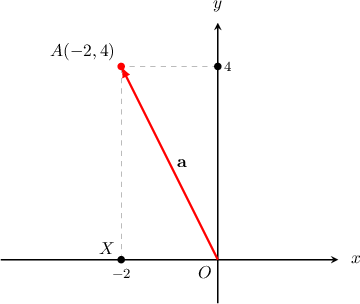
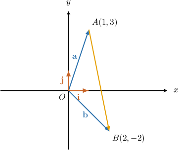

# Calculating the Magnitude of Cartesian Vectors in 2D

Source: https://www.mathacademy.com/topics/176?courseId=43
Topic ID: 176

## Prerequisites

- [Addition and Scalar Multiplication of Cartesian Vectors in 2D](./244-addition-and-scalar-multiplication-of-cartesian-vectors-in-2d.md)

## Lesson

### Introduction

Consider the vector $\mathbf{a}=\langle -2,4 \rangle$ shown below.

Expressed in component form, our vector is $\mathbf{a}=-2\mathbf{i} + 4 \mathbf{j}.$

To find the magnitude (length) of $\mathbf{a},$ we can use the Pythagorean theorem on $\triangle OXA.$

The legs of the triangle have lengths

$$

\begin{aligned}|\overset{𝑂𝑋}{}| & =|−2|=2\end{aligned}

$$

and

$$

\begin{aligned}|\overset{𝑋𝐴}{}| & =|\,4\,|=4.\end{aligned}

$$

Now, using the Pythagorean theorem, we have

$$

\begin{aligned}|\,𝐚\,| & =\sqrt{√|\overset{𝑂𝑋}{}|^{2}+|\overset{𝑋𝐴}{}|^{2}} \\ & =\sqrt{√2^{2}+4^{2}} \\ & =2\sqrt{√5}.\end{aligned}

$$

### General Formula

We just saw that the magnitude of the vector $\mathbf{a}=\langle -2,4 \rangle$ was given by

$$

\begin{aligned}|\,𝐚\,| & =\sqrt{√(−2)^{2}+4^{2}} \\ & =2\sqrt{√5}.\end{aligned}

$$

In general, given a vector

$$

[\begin{aligned}𝑎_{𝑥} \\ 𝑎_{𝑦}\end{aligned}]

$$

the magnitude of the vector can always be computed as

$$

|\,\mathbf{a}\,| = \sqrt{a_x^2+a_y^2}.

$$

**Note**

We sometimes use the notation $|| \mathbf a ||$ to denote the magnitude of a vector.

### Example: Calculating the Magnitude of a Vector Given in Component Form

#### Question

Let $\mathbf{a}=\langle -4, 6 \rangle.$ Find $|\,\mathbf{a}\,|.$

#### Explanation

Using the formula, we have

$$

\begin{aligned}|\,𝐚\,| & =\sqrt{√𝑎_{2𝑥}^{}+𝑎_{2𝑦}^{}} \\ & =\sqrt{√(−4)^{2}+(6)^{2}} \\ & =\sqrt{√16+36} \\ & =2\sqrt{√13}.\end{aligned}

$$

### Example: Calculating a Vector From Position Vectors and then Computing its Magnitude

#### Question

Let $A(1,3)$ and $B(2,-2).$ Find $|\overrightarrow{AB}|.$

#### Explanation

We have

$$

\begin{aligned} & \overset{𝑂𝐴}{}=𝐚=𝐢+3𝐣, \\ & \overset{𝑂𝐵}{}=𝐛=2𝐢−2𝐣.\end{aligned}

$$

Expressing $\overrightarrow{AB}$ as the difference of position vectors, we obtain:

$$

\begin{aligned}\overset{𝐴𝐵}{} & =\overset{𝑂𝐵}{}−\overset{𝑂𝐴}{} \\ & =𝐛−𝐚 \\ & =(2𝐢−2𝐣)−(𝐢+3𝐣) \\ & =𝐢−5𝐣\end{aligned}

$$

Now, using the formula for the magnitude of a vector, we get

$$

\begin{aligned}|\overset{𝐴𝐵}{}| & =\sqrt{√1^{2}+(−5)^{2}} \\ & =\sqrt{√1+25} \\ & =\sqrt{√26}.\end{aligned}

$$

### Example: Calculating a Unit Vector Parallel to a Given Vector

#### Question

Let $[\begin{aligned}−2 \\ 0\end{aligned}]$ and $[\begin{aligned}1 \\ −1\end{aligned}]$ Find a unit vector that is parallel to $\mathbf{a}+2\mathbf{b}.$

#### Explanation

Remember that to find a unit vector that is parallel to a given vector, we need to divide the given vector by its length:

$$

\begin{aligned}𝐮 & =\frac{𝐚+2𝐛}{|𝐚+2𝐛|}\end{aligned}

$$

First, let's compute the sum:

$$

\begin{aligned}𝐚+2𝐛 & =[\begin{aligned}−2 \\ 0\end{aligned}]+2⋅[\begin{aligned}1 \\ −1\end{aligned}] \\ & =[\begin{aligned}−2 \\ 0\end{aligned}]+[\begin{aligned}2 \\ −2\end{aligned}] \\ & =[\begin{aligned}−2+2 \\ 0+(−2)\end{aligned}] \\ & =[\begin{aligned}0 \\ −2\end{aligned}]\end{aligned}

$$

Using the formula for the magnitude of a vector, we get

$$

\begin{aligned}|𝐚+2𝐛| & =\sqrt{√0^{2}+(−2)^{2}} \\ & =\sqrt{√4} \\ & =2.\end{aligned}

$$

Finally, we divide $\mathbf{a}+2\mathbf{b}$ by its length and get the following unit vector:

$$

\begin{aligned}𝐮 & =\frac{𝐚+2𝐛}{|𝐚+2𝐛|} \\ & =\frac{1}{2}(𝐚+2𝐛) \\ & =\frac{1}{2}⋅[\begin{aligned}0 \\ −2\end{aligned}] \\ & =[\begin{aligned}0 \\ −1\end{aligned}]\end{aligned}

$$
