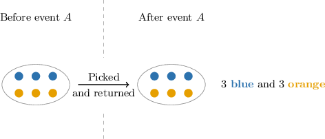
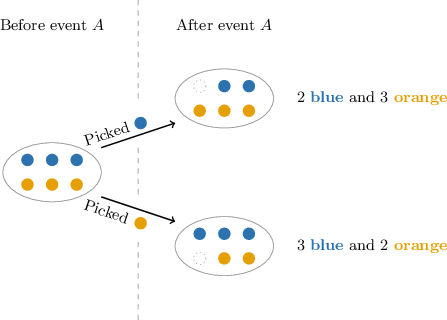

# Independent Events

Source: https://www.mathacademy.com/topics/183?courseId=43
Topic ID: 183

## Prerequisites

- [The Multiplication Law for Conditional Probability](../geometry/715-the-multiplication-law-for-conditional-probability.md)

## Lesson

### Introduction

In probability, we say that two events are **independent** when the outcome of one event doesn't influence the outcome of the other event. Otherwise, the events are **dependent**.

Let's imagine a situation where we have $3$ blue marbles and $3$ orange marbles in a bag, and we draw two marbles from the bag, one after the other. Let the event $A$ be the outcome of the first draw, and let $B$ be the outcome of the second draw.

- If the marbles are drawn **with replacement** (meaning that each marble is put back into the bag after drawing), then event $B$ is not influenced by event $A.$ In this case, $A$ and $B$ are *independent.*

- On the other hand, if the marbles are drawn **without replacement** (meaning that each marble is *not* put back into the bag after drawing), then event $B$ is influenced by event $A.$ In this case, $A$ and $B$ are *dependent*.

### Example: Identifying Independent Events

#### Question

A box contains black, green, and blue marbles. Consider the following scenarios:

1. A marble is drawn from the box and put back into the box again. A second marble is then drawn. Let $G$ be the event "the first marble is green" and let $B$ be the event "the second marble is blue."

2. A marble is drawn from the box and set aside. A second marble is then drawn. Let $C_1$ be the event "the first marble is black" and let $C_2$ be the event "the second marble is black."

Which of the following statements are true?

1. $G$ and $B$ are independent

2. $C_1$ and $C_2$ are independent

3. $C_1$ and $C_2$ are dependent

#### Explanation

Let's consider the situations in turn:

- Statement I is true. The events $G$ and $B$ are independent because the outcome of the first draw does not influence the result of the second draw.

- Statement II is false, while statement III is true. The events $C_1$ and $C_2$ are dependent because the first marble is not replaced after drawing. So, the number of black marbles in the box is influenced by the outcome of the first draw, which then affects the second draw.

Therefore, statements I and III are true.

### The Multiplication Law for Independent Events

To calculate the probability of the intersection of two independent events, $P(A\cap B)$, we use the **multiplication law for independent events**, which states that

$$

P(A\cap B) = P(A)\cdot P(B).

$$

To derive the multiplication law for independent events, we first recall the multiplication law for conditional probability:

$$

P(A\cap B) = P(A) \cdot P(B|A)

$$

If $A$ and $B$ are independent, then the probability of $B$ occurring is not influenced by whether or not $A$ has occurred. Therefore, we must have

$$

P(B|A) = P(B).

$$

Replacing $P(B|A)$ with $P(B)$ in the multiplication law for conditional probability gives

$$

P(A\cap B) = P(A) \cdot P(B).

$$

### Example: Computing the Probability of Two Independent Events

#### Question

A fair coin is tossed twice. What is the probability of getting heads on the first toss and then tails on the second toss?

#### Explanation

Let's call $H$ the event "we get a head on the first toss" and $T$ the event "we get a tail on the second toss." Then the required probability is $P(H \cap T).$

Since the coin tosses are independent events, we can use the multiplication law for independent events, which states that

$$

P(H \cap T) = P(H) \cdot P(T).

$$

Let's find $P(H)$ and $P(T).$ A fair coin has two sides, a head and a tail, so we have

$$

\begin{aligned}𝑃(𝐻) & =𝑃(𝑇)=\frac{1}{2}.\end{aligned}

$$

Therefore, substituting the above into the multiplication law for independent events, we get

$$

\begin{aligned}𝑃(𝐻∩𝑇) & =\frac{1}{2}⋅\frac{1}{2} \\ & =\frac{1}{4}.\end{aligned}

$$

### The Multiplication Law for More Than Two Events

The multiplication law for independent events generalizes to any number of events. That is, if $E_1,$ $E_2,$ $\ldots,$ $E_n$ are independent events, then we have that

$$

P(E_1\cap E_2\cap \ldots \cap E_n) = P(E_1)P(E_2)\ldots P(E_n).

$$

### Example: Computing the Probability of More Than Two Independent Events

#### Question

Suppose we flip a coin three times. What's the probability of getting three heads in a row?

#### Explanation

Let us call $A$ the event "We get a head on the first flip", $B$ the event "We get a head on the second flip", and $C$ the event "We get a head on the third flip". Then the required probability is $P(A\cap B\cap C).$

Since coin flips are independent events, we can use the multiplication law for independent events, which states that

$$

P(A\cap B\cap C) = P(A)P(B)P(C).

$$

Let's find $P(A),$ $P(B),$ and $P(C).$ A coin has $2$ sides, $1$ of which is a head, so we have

$$

P(A) = P(B) = P(C) = \dfrac12.

$$

Therefore, substituting the above into the multiplication law for independent events, we get

$$

\begin{aligned}𝑃(𝐴∩𝐵∩𝐶) & =𝑃(𝐴)𝑃(𝐵)𝑃(𝐶) \\ & =\frac{1}{2}⋅\frac{1}{2}⋅\frac{1}{2} \\ & =\frac{1}{8}.\end{aligned}

$$
