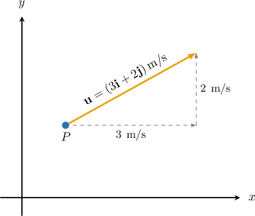

# Velocity and Acceleration for Plane Motion

Source: https://www.mathacademy.com/topics/2036?courseId=43
Topic ID: 2036

## Prerequisites

- [Calculating the Magnitude of Cartesian Vectors in 2D](./176-calculating-the-magnitude-of-cartesian-vectors-in-2d.md)
- [Speed-Time Graphs](../algebra-i/2327-speed-time-graphs.md)
- [Consistency and Dependency in Linear Systems](../algebra-i/4638-consistency-and-dependency-in-linear-systems.md)

## Lesson

### Introduction

We can describe the **velocity** of a particle moving in the $xy$-plane using a **velocity vector.** The velocity vector tells us the magnitude and direction at which the particle moves. We denote the velocity vector of a particle as $\mathbf u.$

As an example, consider the particle $P$ shown below.

In this case, the velocity vector is given by

$$

\mathbf{u} = (3\,\mathbf{i} + 2\,\mathbf{j}) \: \text{m/s}.

$$

We should think of the particle's velocity as being made up of two components:

- a *horizontal* component of $3 \: \text{m/s}$ (moving to the right), and

- a *vertical* component of $2 \: \text{m/s}$ (moving upward).

In other words, the particle moves $3$ meters to the right and $2$ units up every second. Also, since the horizontal and vertical components are constants, we say that the particle moves with **constant velocity.**

The magnitude of the velocity vector gives the **speed** of the particle. Therefore, in our example, the speed of the particle is

$$

\begin{aligned}|𝐮| & =|3𝐢+2𝐣| \\ & =\sqrt{3^{2}+2^{2}} \\ & =\sqrt{9+4} \\ & =\sqrt{13}\,m/s.\end{aligned}

$$

### Example: Calculating the Speed of a Particle Given Its Velocity

#### Question

A particle moves with a constant velocity of $\mathbf{u}=(5\mathbf{i} +2\mathbf{j}) \,\text{km/h}.$ Find the speed of the particle.

#### Explanation

The speed of a particle equals the magnitude of its velocity.

Therefore, the speed of the particle is

$$

\begin{aligned}|𝐮| & =|5𝐢+2𝐣| \\ & =\sqrt{5^{2}+2^{2}} \\ & =\sqrt{25+4} \\ & =\sqrt{29}\end{aligned}

$$

kilometers per hour.

### Relating Velocity and Acceleration

The acceleration of a particle tells us the rate at which its velocity changes over time. We can use vectors to model the acceleration of a particle moving in the $xy$-plane.

For example, consider a particle $P$ whose acceleration vector $\mathbf a$ is given by

$$

\mathbf a = (3\mathbf{i}+4\mathbf{j})\,\text{m/s}^2.

$$

We should think of this particle's acceleration as being made up of two components:

- a *horizontal* component of $3 \: \text{m/s}^2$ (to the right), and

- a *vertical* component of $4 \: \text{m/s}^2$ (upward).

In other words,

- the horizontal component of the velocity increases by $3\,\text{m/s}$ every second, and

- the vertical component of the velocity increases by $4\,\text{m/s}$ every second.

Also, since both components are constants, we say that this particle moves with **constant acceleration**.

If a particle is moving with constant acceleration, the velocity vector $\mathbf v$ at time $t$ can be found using

$$

\mathbf{v} = \mathbf{u} + \mathbf{a}t,

$$

where $\mathbf{u}$ is the velocity of the particle when $t=0$ (i.e., the **initial velocity**).

For example, suppose that the initial velocity of our particle is given by $\mathbf{u} = (2\mathbf{i} + 3\mathbf{j}) \, \text{m/s}.$ What is the particle's velocity when $t=2 \, \text{s}?$

Substituting our data into the formula above, we obtain that the velocity of the particle will be

$$

\begin{aligned}𝐯 & =𝐮+𝐚𝑡 \\ & =(2𝐢+3𝐣)+(3𝐢+4𝐣)(2) \\ & =(2𝐢+3𝐣)+(6𝐢+8𝐣) \\ & =(8𝐢+11𝐣)\,m/s.\end{aligned}

$$

### Example: Calculating the Final Velocity of a Particle

#### Question

The velocity of a particle is $(\mathbf{i} -4\mathbf{j}) \, \text{m/s}$ when $t=0\,\text{s}.$ If the particle moves with a constant acceleration of $(2\mathbf{i}+\mathbf{j}) \, \text{m/s}^2,$ find the velocity of the particle when $t=5 \, \text{s}.$

#### Explanation

Recall that when a particle moves with constant acceleration, the velocity vector at time $t$ can be found using

$$

\mathbf{v} = \mathbf{u} + \mathbf{a}t,

$$

where $\mathbf{u}$ is the initial velocity, and $\mathbf{a}$ is the acceleration of the particle.

Here, we have

$$

\mathbf u = \mathbf{i} -4\mathbf{j}, \qquad \mathbf a = 2\mathbf{i}+\mathbf{j} .

$$

Therefore, after $t = 5 \, \text{s},$ the velocity of the particle will be

$$

\begin{aligned}𝐯 & =𝐮+𝐚𝑡 \\ & =(𝐢−4𝐣)+(2𝐢+𝐣)(5) \\ & =(𝐢−4𝐣)+(10𝐢+5𝐣) \\ & =(11𝐢+𝐣)\,m/s.\end{aligned}

$$

### Example: Calculating the Acceleration of a Particle

#### Question

A particle moves with constant acceleration. When $t=0 \, \text{h},$ the velocity of the particle is $4\mathbf{i} \, \text{km/h},$ and when $t=3\, \text{h},$ the velocity of the particle is $(7\mathbf{i}+15\mathbf{j}) \, \text{km/h}.$ Calculate the acceleration of the particle.

#### Explanation

Recall that when a particle moves with constant acceleration, the velocity vector at time $t$ can be found using

$$

\mathbf{v} = \mathbf{u} + \mathbf{a}t,

$$

where $\mathbf{u}$ is the initial velocity, and $\mathbf{a}$ is the acceleration of the particle.

Substituting

$$

\mathbf{u} = 4\mathbf{i}, \qquad \mathbf{v} = 7\mathbf{i}+15\mathbf{j}, \qquad t =3

$$

into the equation above, we can solve for $\mathbf{a}$ as follows:

$$

\begin{aligned}𝐯 & =𝐮+𝐚𝑡 \\ 7𝐢+15𝐣 & =4𝐢+𝐚(3) \\ 3𝐢+15𝐣 & =3𝐚 \\ 𝐚 & =\frac{1}{3}(3𝐢+15𝐣) \\ 𝐚 & =(𝐢+5𝐣)\,km/h^{2}.\end{aligned}

$$

### Example: Finding the Time when a Particle Reaches a Particular Velocity

#### Question

A particle moves with a constant acceleration of $(\mathbf{i} + 2\mathbf{j}) \, \text{km/h}^2.$ The velocity of the particle is $(-\mathbf{i} - \mathbf{j}) \, \text{km/h}$ when $t=0\,\text{h}.$ Find the time when the velocity of the particle equals $(3\mathbf{i}+7\mathbf{j}) \, \text{km/h}.$

#### Explanation

Recall that when a particle moves with constant acceleration, the velocity vector at time $t$ can be found using

$$

\mathbf{v} = \mathbf{u} + \mathbf{a}t,

$$

where $\mathbf{u}$ is the initial velocity, and $\mathbf{a}$ is the acceleration of the particle.

Substituting

$$

\mathbf{a} = \mathbf{i} + 2\mathbf{j}, \qquad \mathbf{u} = -\mathbf{i} -\mathbf{j}, \qquad \mathbf{v} = 3\mathbf{i}+7\mathbf{j}

$$

into the equation above, we can solve for $t$ as follows:

$$

\begin{aligned}𝐯 & =𝐮+𝐚𝑡 \\ 3𝐢+7𝐣 & =(−𝐢−𝐣)+(𝐢+2𝐣)𝑡 \\ 4𝐢+8𝐣 & =(𝐢+2𝐣)𝑡 \\ 4𝐢+8𝐣 & =𝑡𝐢+2𝑡𝐣\end{aligned}

$$

Equating the $\mathbf i$ and $\mathbf j$ components in the last equation, we obtain

$$

\begin{aligned}4=𝑡 \\ 8=2𝑡\end{aligned}

$$
