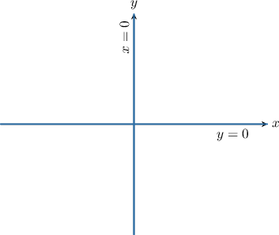
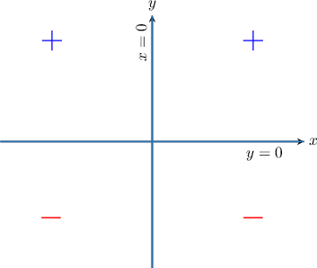
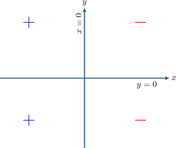
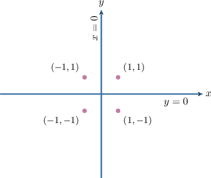
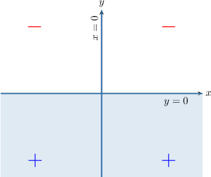

# Solving Two-Variable Nonlinear Inequalities

Source: https://www.mathacademy.com/topics/2076?courseId=43
Topic ID: 2076

## Prerequisites

- [Solving Quadratic Inequalities Using the Sign Table Method](./118-solving-quadratic-inequalities-using-the-sign-table-method.md)
- [Further Graphing of Two-Variable Linear Inequalities](../algebra-i/3822-further-graphing-of-two-variable-linear-inequalities.md)

## Lesson

### Introduction

Consider the function $f(x,y),$ defined as

$$

f(x,y) = 2x^2y.

$$

This is a function of two variables, $x$ and $y.$ The function is positive for some values of $(x,y)$ and negative for others. How can we determine those values of $x$ and $y$ for which the function is positive, and those for which the function is negative?

To answer this question, we first solve $f(x,y) = 0.$ This gives

$$

\begin{aligned}2𝑥^{2}⋅𝑦=0\, & ⟹\,2𝑥^{2}=0\,or\,𝑦=0.\end{aligned}

$$

Solving the equations $2x^2 = 0$ and $y = 0$ gives the solutions $x=0$ and $y=0.$ These solutions divide the $xy$-plane into four regions, as shown below.

Our task now is to determine the sign of $f(x,y)$ in each region. To do this, we pick four test points, one for each region.

We compute the sign of $f(x,y)$ in each region by calculating the sign at each test point. We record our results in a sign table.

Using the *last* column of the table above, we get the following picture:

We can also record our findings using a simplified sign table, like the one below.

### Example: Identifying Quadrants Where a Function Is Positive or Negative Using a Sign Table

#### Question

Consider the expression $f(x,y) = -3xy^2.$ What are the missing entries in the following sign table of $f(x,y)?$

#### Explanation

Notice that $f(x,y)$ equals zero when $x=0$ and $y=0.$ These lines divide the $xy$-plane into four regions, as shown below.

To determine the sign of $f(x,y)$ in each region, we pick four test points, one for each region.

Next, we calculate the sign of $f(x,y)$ in each region using a sign table:

Using the ** column of the table above, we get the following picture:

Finally, we fill in the required sign table.

### Example: Identifying Quadrants Where a Function Is Positive or Negative

#### Question

Suppose that $f(x,y) = -6x^2y.$ Determine the region that gives the solution to the inequality $f(x,y) \geq 0?$

#### Explanation

Notice that $f(x,y)$ equals zero when $x=0$ and $y=0.$ These lines divide the $xy$-plane into four regions, as shown below. Since we have an "or equal to" inequality, we use solid lines to divide the plane.

To determine the sign of $f(x,y)$ in each region, we pick four test points, one for each region.

Next, we calculate the sign of $f(x,y)$ in each region using a sign table:

Finally, on our diagram, we shade in the solutions to $f(x,y) \geq 0$ using the ** column of the table above.

