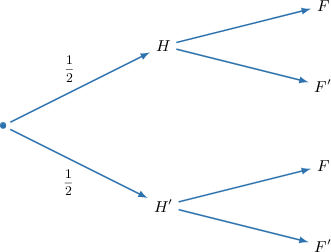
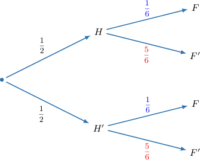
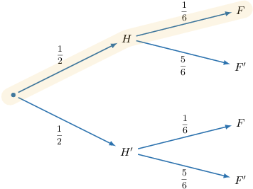
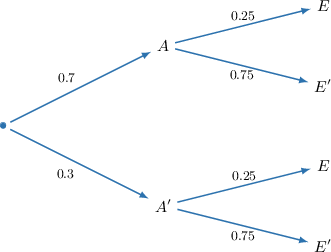
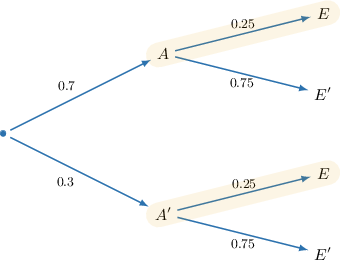
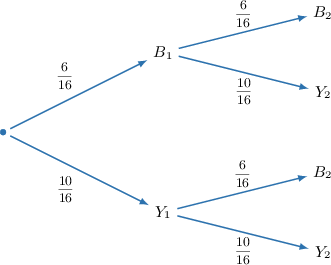
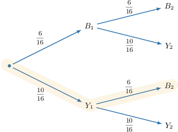
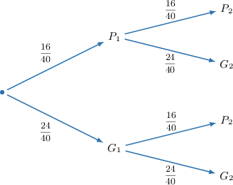
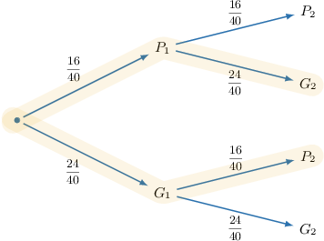

# Tree Diagrams for Independent Events

Source: https://www.mathacademy.com/topics/2155?courseId=43
Topic ID: 2155

## Prerequisites

- [Tree Diagrams for Dependent Events: Applications](../geometry/3658-tree-diagrams-for-dependent-events-applications.md)

## Lesson

### Introduction

A fair coin is tossed, then a fair die is rolled. What is the probability of the coin landing on heads and the die landing on $5?$

Let's call $H$ the event "the coin lands on heads," and $F$ is the event "the die lands on $5$". Notice that $H$ and $F$ are independent events since the outcome of one event doesn't influence the other. Let's use a tree diagram to compute the required probability.

The probabilities on the first level of the tree correspond to the event $H\mathbin{:}$

$$

P(H) = \dfrac12, \qquad P(H') = \dfrac12

$$

Let's add these values to our diagram.

Next, we find the probabilities on the second level. Since $H$ and $F$ are independent, these correspond to the probability of $F$ occurring:

$$

\begin{aligned}𝑃(𝐹|𝐻) & =𝑃(𝐹|𝐻^{′})=𝑃(𝐹)=\frac{1}{6} \\ 𝑃(𝐹^{′}|𝐻) & =𝑃(𝐹^{′}|𝐻^{′})=𝑃(𝐹^{′})=\frac{5}{6}\end{aligned}

$$

Let's add these to our diagram:

Finally, to compute the event that the coin lands on heads and the die lands on five, we multiply across the branches:

Therefore,

$$

P(H\cap F) = \dfrac12\cdot\dfrac16 = \dfrac{1}{12}.

$$

### Example: Interpreting a Tree Diagram for Independent Events

#### Question

The tree diagram below represents the probabilities of the independent events $A$ and $E.$ What is $P(E)?$

#### Explanation

Since the events $A$ and $E$ are independent, we have

$$

P(E) = P(E|A) = P(E|A').

$$

From the tree diagram, we can see that

$$

P(E|A) = P(E|A') = 0.25.

$$

Therefore, $P(E)=0.25.$

### Example: Multiplying Across Branches

#### Question

A box contains $10$ yellow marbles and $6$ blue marbles. Donald randomly takes a marble, records its color, and puts it back in the box. He then takes out another marble and records its color. What is the probability that the first marble is yellow and the second marble is blue?

#### Explanation

Notice that there are $10 + 6 = 16$ marbles in total.

Let

- $Y_1$ be the event "the first marble is yellow,"

- $Y_2$ be the event "the second marble is yellow,"

- $B_1$ be the event "the first marble is blue,"

- $B_2$ be the event "the second marble is blue."

Since the marbles are drawn with replacement, the events are independent. Therefore,

$$

\begin{aligned}𝑃(𝑌_{1}) & =𝑃(𝑌_{2})=\frac{10}{16}, \\ 𝑃(𝐵_{1}) & =𝑃(𝐵_{2})=\frac{6}{16}.\end{aligned}

$$

Let's represent our probabilities on a tree diagram.

The required probability is $P(Y_1 \cap B_2),$ highlighted below.

Therefore,

$$

\begin{aligned}𝑃(𝑌_{1}∩𝐵_{2}) & =𝑃(𝑌_{1})⋅𝑃(𝐵_{2}) \\ & =\frac{10}{16}⋅\frac{6}{16} \\ & =\frac{5}{8}⋅\frac{3}{8} \\ & =\frac{15}{64}.\end{aligned}

$$

### Example: Adding Between Branches

#### Question

A bag contains $24$ green balls and $16$ pink balls. First, a ball is drawn at random and returned to the bag. Then a second ball is drawn at random. What is the probability that the two drawn balls have different colors?

#### Explanation

Notice that there are $24 + 16 = 40$ balls in total.

Let

- $G_1$ be the event "the first ball is green,"

- $G_2$ be the event "the second ball is green,"

- $P_1$ be the event "the first ball is pink,"

- $P_2$ be the event "the second ball is pink."

Since the balls are drawn with replacement, the events are independent. Therefore,

$$

\begin{aligned}𝑃(𝐺_{1}) & =𝑃(𝐺_{2})=\frac{24}{40}, \\ 𝑃(𝑃_{1}) & =𝑃(𝑃_{2})=\frac{16}{40}.\end{aligned}

$$

Let's represent our probabilities on a tree diagram.

The required probability is

$$

P\left( (G_1 \cap P_2) \cup (P_1 \cap G_2)\right),

$$

which is highlighted below.

Therefore,

$$

\begin{aligned}𝑃((𝐺_{1}∩𝑃_{2})∪(𝑃_{1}∩𝐺_{2})) & =𝑃(𝐺_{1})⋅𝑃(𝑃_{2})+𝑃(𝑃_{1})⋅𝑃(𝐺_{2}) \\ & =\frac{24}{40}⋅\frac{16}{40}+\frac{16}{40}⋅\frac{24}{40} \\ & =\frac{3}{5}⋅\frac{2}{5}+\frac{2}{5}⋅\frac{3}{5} \\ & =\frac{6}{25}+\frac{6}{25} \\ & =\frac{12}{25}.\end{aligned}

$$
