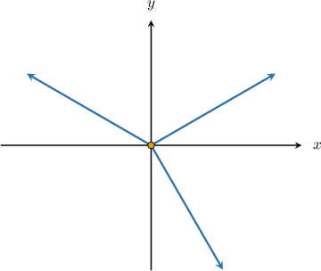
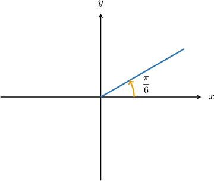
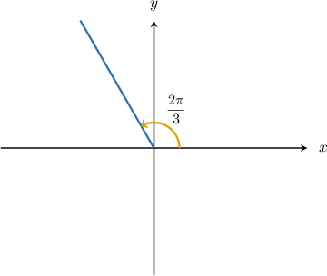
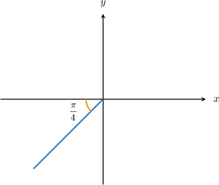
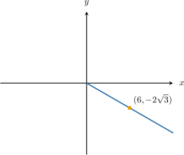
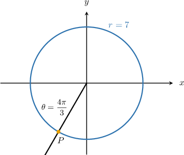

# Polar Equations of Radial Lines

Source: https://www.mathacademy.com/topics/2173?courseId=43
Topic ID: 2173

## Prerequisites

- [Polar Equations of Circles Centered at the Origin](./937-polar-equations-of-circles-centered-at-the-origin.md)

## Lesson

### Introduction

A **radial line** is a ray that starts at the origin of a given coordinate system. Some examples of radial lines in the Cartesian plane are shown below.

We can use polar coordinates to express any radial line in a simple way. For any given radial line, each point on the line has the same polar angle. Therefore, we can write the radial line in polar coordinates as

$$

\theta=K,

$$

where $K$ is the angle between the line and the positive $x$-axis, measured counterclockwise.

For example, let's consider the following radial line.

Since the polar angle at every point on the line is $\dfrac{\pi}{6},$ its equation in polar coordinates is

$$

\theta = \dfrac{\pi}{6}.

$$

Notice that the same radial line expressed in Cartesian coordinates is

$$

y = \dfrac{\sqrt 3}{3}x, \qquad x\geq 0.

$$

Once again, polar coordinates give us a much simpler way of describing this object compared with Cartesian coordinates.

### Example: Identifying a Radial Line Given Its Polar Equation

#### Question

Plot the graph of the polar curve $\theta=\dfrac{2\pi}{3}.$

#### Explanation

The polar curve defined by the equation $\theta=\dfrac{2\pi}{3}$ is the ray that starts at the origin and makes a counterclockwise angle of $\dfrac{2\pi}{3}$ with the positive $x$-axis.

The correct graph is shown below.

### Example: Finding the Polar Equation of a Radial Line Given an Acute Angle

#### Question

What is the polar equation of the ray shown above?

#### Explanation

The counterclockwise angle that the ray makes with the positive $x$-axis is

$$

\pi+\dfrac{\pi}{4}=\dfrac{5\pi}{4}.

$$

Therefore, the polar equation of the ray is $\theta=\dfrac{5\pi}{4}.$

### Example: Finding the Polar Equation of a Radial Line That Passes Through a Given Point

#### Question

Given that the ray above passes through the point with Cartesian coordinates $(6,-2\sqrt{3})$, find the polar equation of the ray.

#### Explanation

First, we find the reference angle associated with the point:

$$

\begin{aligned}𝜃_{𝑅} & =arctan⁡\frac{𝑦}{𝑥} \\ & =arctan⁡\frac{−2\sqrt{3}}{6} \\ & =arctan⁡(\frac{\sqrt{3}}{3}) \\ & =\frac{𝜋}{6}\end{aligned}

$$

Now, notice that the ray lies in the fourth quadrant. So, we find the angle in the fourth quadrant that has a reference angle $\theta_R = \dfrac{\pi}{6},$ as follows:

$$

\begin{aligned}𝜃 & =2𝜋−𝜃_{𝑅} \\ & =2𝜋−\frac{𝜋}{6} \\ & =\frac{11𝜋}{6}.\end{aligned}

$$

Therefore, the polar equation of the ray is

$$

\theta = \dfrac{11\pi}{6}.

$$

### Example: Finding the Point of Intersection of a Circle and a Radial Line

#### Question

The polar curve $r=7$ and the ray $\theta=\dfrac{4\pi}{3}$ intersect at the point $P,$ as shown above. What are the Cartesian coordinates of $P?$

#### Explanation

The polar coordinates of $P$ are $(r, \theta) = \left(7, \dfrac{4\pi}{3}\right).$ We can convert the polar coordinates of $P$ to Cartesian coordinates, as follows:

$$

\begin{aligned}𝑥 & =𝑟cos⁡𝜃 \\ & =7cos⁡(\frac{4𝜋}{3}) \\ & =7⋅(−\frac{1}{2}) \\ & =−\frac{7}{2} \\ 𝑦 & =𝑟sin⁡𝜃 \\ & =7sin⁡(\frac{4𝜋}{3}) \\ & =7⋅(−\frac{\sqrt{3}}{2}) \\ & =−\frac{7\sqrt{3}}{2}\end{aligned}

$$

Therefore, the Cartesian coordinates of $P$ are $\left(-\dfrac 72, -\dfrac{7\sqrt 3}2\right).$
