# Arithmetic in the Complex Plane

Source: https://www.mathacademy.com/topics/2242?courseId=43
Topic ID: 2242

## Prerequisites

- [Addition and Scalar Multiplication of Cartesian Vectors in 2D](./244-addition-and-scalar-multiplication-of-cartesian-vectors-in-2d.md)
- [Products of Complex Numbers Expressed in Polar Form](./1231-products-of-complex-numbers-expressed-in-polar-form.md)

## Lesson

### Introduction

In this lesson, we will discuss how addition, subtraction, multiplication, and conjugation of complex numbers correspond to transformations of vectors in the complex plane.

Consider a vector representing some complex number $z=x+\textrm{i}y$ in the complex plane, as shown below.

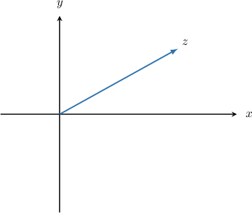

To compute the complex conjugate $\bar{z}$ of $z,$ we flip the sign of the imaginary part:

$$

\bar{z} = x-\textrm{i}y

$$

Therefore, from a geometric perspective, complex conjugation has the effect of reflecting $z$ in the real axis, as shown below:

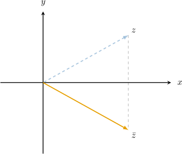

### Example: Sketching the Complex Conjugate of a Complex Number

#### Question

The complex number $z$ is shown on the argand diagram below. Sketch a diagram that shows the complex conjugate of $z.$

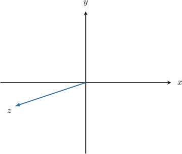

#### Explanation

The conjugate of $z=x + \textrm{i} y,$ denoted $\bar{z},$ is given by

$$

\bar{z} = x - \textrm{i} y.

$$

To plot $\overline{z}$ on an Argand diagram, we reflect $z$ across the real axis, as illustrated below.

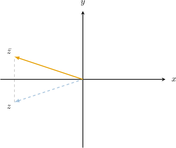

### The Sum of Two Complex Numbers as Vector Addition

Whenever we add two complex numbers $z_1$ and $z_2,$ we sum their real and imaginary parts. Geometrically, the real and imaginary parts of $z_1$ and $z_2$ can also be interpreted as components of two-dimensional Cartesian vectors.

In this sense, the addition of complex numbers is done component-wise (the same as vectors), and we can thus use the **parallelogram law** to add complex numbers geometrically.

To illustrate, let's look at the argand diagram for $z_1$ and $z_2$ below.

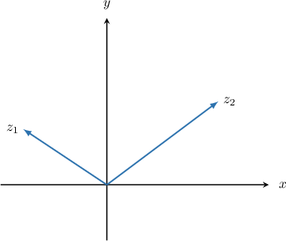

The sum of the two numbers (vectors) is obtained by placing them head to tail and drawing an arrow from the first tail to the last head.

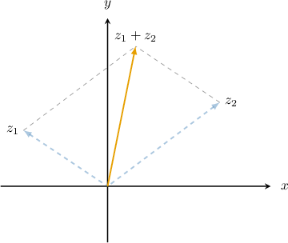

Vector addition works in precisely the same way.

### The Difference of Two Complex Numbers as Vector Subtraction

To plot the difference between two complex numbers, say

$$

z_1-z_2,

$$

we plot the sum

$$

z_1 + (-z_2).

$$

Just like the negative of a vector, the complex number $-z_2$ has the same magnitude as $z_2$ but opposite direction.

To illustrate, let's plot the difference $z_1 - z_2$ for the complex numbers shown below.

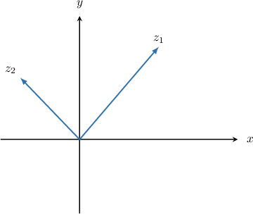

First, we plot the complex number $-z_2\mathbin{:}$

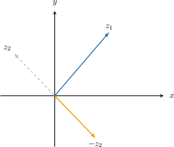

Now, we add the vectors corresponding to $z_1$ and $(-z_2)$ using the parallelogram law:

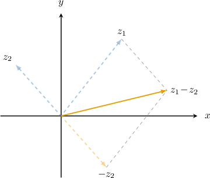

### Example: Sketching a Sum or Difference of Complex Numbers

#### Question

The complex numbers $z_1$ and $z_2$ are shown on the argand diagram below. Sketch a diagram that shows the complex number $z_3 = z_2 - z_1.$

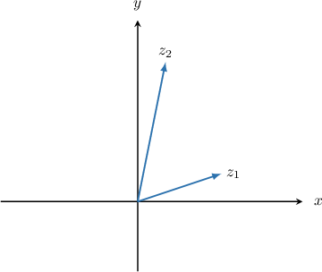

#### Explanation

Recall that the difference $z_2 - z_1$ is equivalent to the sum $z_2 + (-z_1).$

First, we plot the complex number $(-z_1){:}$

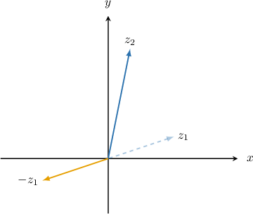

Now, we add the vectors corresponding to $z_2$ and $(-z_1)$ using the parallelogram law, as shown below:

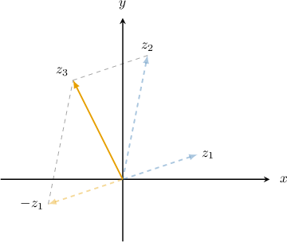

### The Product of Two Complex Numbers in the Complex Plane

How do we plot the product of two complex numbers in the complex plane?

First, let's assume that $z_1$ and $z_2$ are expressed in polar form:

$$

\begin{aligned}𝑧_{1} & =𝑟_{1}(cos⁡𝜃_{1}+isin⁡𝜃_{1}) \\ 𝑧_{2} & =𝑟_{2}(cos⁡𝜃_{2}+isin⁡𝜃_{2})\end{aligned}

$$

As we know, the product $z_1\cdot z_2$ is given by the following formula:

$$

z_3 = z_1\cdot z_2 = r_1 \cdot r_2\left( \cos(\theta_1+\theta_2) + \textrm{i} \sin(\theta_1+\theta_2)\right)

$$

This formula reveals some vital information:

- The modulus of $z_3$ equals the product of the moduli of $z_1$ and $z_2\mathbin{:}$

- The argument of $z_3$ equals the *sum* of the arguments of $z_1$ and $z_2\mathbin{:}$

Let's see an example.

### Example: Sketching a Product of Complex Numbers

#### Question

The complex numbers $z_1$ and $z_2$ are shown on the argand diagram below. Sketch a diagram that shows the complex number $z_3 = z_1 \cdot z_2.$

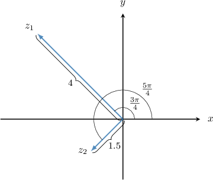

#### Explanation

First, we calculate the modulus of $z_3{:}$

$$

|z_3|=|z_1|\cdot|z_2|=4 \cdot 1.5 = 6.

$$

From the diagram, the arguments of $z_1$ and $z_2$ are equal to $\theta_1=\dfrac{3\pi}{4}$ and $\theta_2=\dfrac{5\pi}{4},$ respectively. So, the argument of $z_3$ equals

$$

\theta_3 = \theta_1 + \theta_2 = \dfrac{3\pi}{4} + \dfrac{5\pi}{4} = 2\pi.

$$

The diagram below shows the resulting complex number.

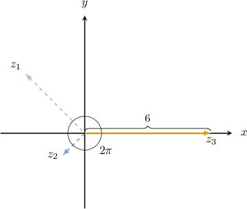
