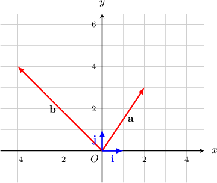
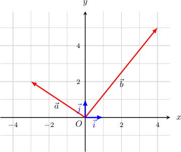

# Addition and Scalar Multiplication of Cartesian Vectors in 2D

Source: https://www.mathacademy.com/topics/244?courseId=43
Topic ID: 244

## Prerequisites

- [Two-Dimensional Vectors Expressed in Component Form](./1165-two-dimensional-vectors-expressed-in-component-form.md)

## Lesson

### Introduction

Suppose we are given two vectors $\mathbf{a} = \langle 2,3 \rangle$ and $\mathbf{b} = \langle -4,4 \rangle,$ shown below. How do we compute the vectors $\mathbf{a} + \mathbf{b}$ and $-5\mathbf{a}$ in terms of the standard basis $\mathbf{i},\mathbf{j}?$

To compute $\mathbf{a}+\mathbf{b},$ we collect all of the $\mathbf{i}$'s and $\mathbf{j}$'s. We know that $\mathbf{a} = {\color{red}2}\mathbf{i} + {\color{blue}3}\mathbf{j}$ and $\mathbf{b} = {\color{red}-4}\mathbf{i} + {\color{blue}4}\mathbf{j}.$ Therefore,

$$

\begin{aligned}𝐚+𝐛 & =(2𝐢+3𝐣)+(−4𝐢+4𝐣) \\ & =(2+(−4))𝐢+(3+4)𝐣 \\ & =−2𝐢+7𝐣.\end{aligned}

$$

Writing our answer in angle bracket and column vector notations, we get

$$

[\begin{aligned}−2 \\ 7\end{aligned}]

$$

To compute $-5\mathbf{a},$ we multiply each of the components by $-5\mathbin{:}$

$$

\begin{aligned}−5⋅𝐚 & =−5(2𝐢+3𝐣) \\ & =(−5⋅2)𝐢+(−5⋅3)𝐣 \\ & =−10𝐢+−15𝐣\end{aligned}

$$

Writing our answer in angle bracket and column vector notations, we get

$$

[\begin{aligned}−10 \\ −15\end{aligned}]

$$

### Example: Addition and Scalar Multiplication of Vectors in Component Form

#### Question

Find $\mathbf{a}-2\mathbf{b}$ if $\mathbf{a}=-4\mathbf{i}+6\mathbf{j}$ and $\mathbf{b}=12\mathbf{i}.$

#### Explanation

To compute $\mathbf{a}-2\mathbf{b},$ we just need to compute all of the $\mathbf{i}$'s and $\mathbf{j}$'s, as follows:

$$

\begin{aligned}𝐚−2𝐛 & =(−4𝐢+6𝐣)−2(12𝐢) \\ & =−4𝐢+6𝐣−24𝐢 \\ & =(−4𝐢−24𝐢)+6𝐣 \\ & =−28𝐢+6𝐣\end{aligned}

$$

### Sums and Scalar Multiplication of Vectors in Angle Bracket or Column Vector Form

To add or subtract vectors given in angle bracket or column vector form, we just need to add or subtract each component separately.

For example, in angle bracket notation, we have

$$

\begin{aligned}⟨2,5⟩+⟨−3,7⟩ & = \\ ⟨2+(−3),5+7⟩ & = \\ ⟨−1,12⟩ & ,\end{aligned}

$$

and in column vector notation, we have

$$

\begin{aligned}[\begin{aligned}2 \\ 5\end{aligned}]+[\begin{aligned}−3 \\ 7\end{aligned}] & =[\begin{aligned}2+(−3) \\ 5+7\end{aligned}]=[\begin{aligned}−1 \\ 12\end{aligned}].\end{aligned}

$$

Likewise, to multiply a vector given in angle bracket or column vector form, we just need to multiply each component separately.

For example, in angle bracket notation, we have

$$

\begin{aligned}−5⋅⟨2,5⟩ & = \\ ⟨(−5)⋅2,(−5)⋅5⟩ & = \\ ⟨−10,−25⟩ & ,\end{aligned}

$$

and in column vector notation, we have

$$

\begin{aligned}−5⋅[\begin{aligned}2 \\ 5\end{aligned}] & =[\begin{aligned}(−5)⋅2 \\ (−5)⋅5\end{aligned}]=[\begin{aligned}−10 \\ −25\end{aligned}].\end{aligned}

$$

### Example: Calculating Sums and Scalar Multiplication of Vectors Using Angle Bracket Notation

#### Question

Let $\mathbf{a}=\langle -7, 15 \rangle$ and $\mathbf{b}=\langle 14, -11 \rangle$. Find $\mathbf{a}-3\mathbf{b}$.

#### Explanation

To compute $\mathbf{a}-3\mathbf{b},$ we just need to perform the required operations with each component separately:

$$

\begin{aligned}𝐚−3𝐛 & =⟨−7,15⟩−3⋅⟨14,−11⟩ \\ & =⟨−7,15⟩−⟨42,−33⟩ \\ & =⟨−7−42,15−(−33)⟩ \\ & =⟨−49,48⟩\end{aligned}

$$

### Example: Calculating Sums and Scalar Multiplication of Column Vectors

#### Question

Let $[\begin{aligned}1 \\ −5\end{aligned}]$ $[\begin{aligned}2 \\ 4\end{aligned}]$ and $[\begin{aligned}−3 \\ 7\end{aligned}]$ Find $2\mathbf{a}-(\mathbf{b}-5\mathbf{c}).$

#### Explanation

To compute the result, we just need to perform the required operations with each component separately:

$$

\begin{aligned}2𝐚−(𝐛−5𝐜) & =2⋅[\begin{aligned}1 \\ −5\end{aligned}]−([\begin{aligned}2 \\ 4\end{aligned}]−5⋅[\begin{aligned}−3 \\ 7\end{aligned}]) \\ & =[\begin{aligned}2 \\ −10\end{aligned}]−([\begin{aligned}2 \\ 4\end{aligned}]−[\begin{aligned}−15 \\ 35\end{aligned}]) \\ & =[\begin{aligned}2 \\ −10\end{aligned}]−[\begin{aligned}17 \\ −31\end{aligned}] \\ & =[\begin{aligned}−15 \\ 21\end{aligned}]\end{aligned}

$$

### Common Notations Used When Describing Vectors

To denote a vector, we have used two notations:

- a single bold lowercase letter, such as $\mathbf{v},$ or

- two uppercase letters representing the points of the ends of the vector, with an arrow over them, such as $\overrightarrow{AB}.$

We will mostly stick to these notations. However, there are many possible notations for vectors. For example, sometimes a vector can be denoted as

$$

\vec{v}, \quad \overrightarrow{V}, \quad v, \quad \hat{v}.

$$

The rightmost notation, $\hat{v},$ is usually used to represent unit vectors in particular.

### Example: Calculating Sums and Scalar Multiplication of Vectors Given in Alternative Notation

#### Question

The vectors $\vec{a}$ and $\vec{b}$ are given in the picture below. Find the coordinates of $\vec{a}+6\vec{b}.$

#### Explanation

From the picture, we obtain $\vec{a}=\langle -3,2 \rangle$ and $\vec{b}=\langle 4,5 \rangle.$

Therefore, to compute the result, we just need to perform the required operations with each component separately:

$$

\begin{aligned}\overset{𝑎}{⃗}+6\overset{𝑏}{⃗} & =⟨−3,2⟩+6⋅⟨4,5⟩ \\ & =⟨−3,2⟩+⟨6⋅4,6⋅5⟩ \\ & =⟨−3,2⟩+⟨24,30⟩ \\ & =⟨21,32⟩\end{aligned}

$$
