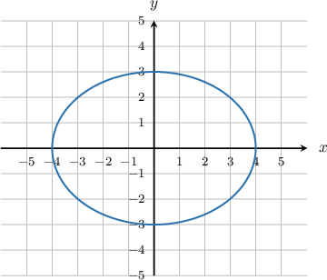
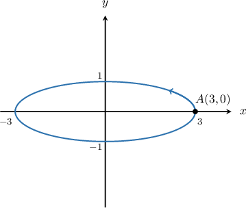
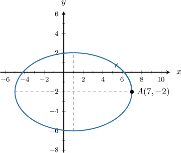
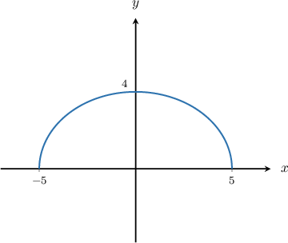
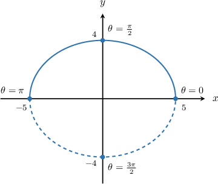

# Parametric Equations of Ellipses

Source: https://www.mathacademy.com/topics/2746?courseId=43
Topic ID: 2746

## Prerequisites

- [Parametric Equations of Circles](./806-parametric-equations-of-circles.md)
- [Equations of Ellipses Centered at a General Point](./849-equations-of-ellipses-centered-at-a-general-point.md)

## Lesson

### Introduction

Consider the following ellipse:

This ellipse is centered at the origin, has a horizontal radius of $4$ and a vertical radius of $3.$

The parametric equations for this ellipse are

$$

x = 4\cos{\theta},\quad y=3\sin\theta, \quad 0\leq \theta \lt 2\pi.

$$

In general, an ellipse centered at $O$ with horizontal radius $a$ and vertical radius $b$ has parametric equations

$$

x = a\cos{\theta},\quad y=b\sin\theta, \quad 0\leq \theta \lt 2\pi.

$$

Under this parameterization, the ellipse is traversed once counterclockwise starting from the point $(a,0).$

### Example: The Parametric Equations of an Ellipse Centered at the Origin

#### Question

Consider the ellipse centered at the origin with horizontal radius $3$ and vertical radius $1,$ as shown below. Which set of parametric equations, defined for $\theta\in[0,2\pi),$ traverse the ellipse once in the counterclockwise direction starting at the point $A(3,0)?$

#### Explanation

The parametric equations of an ellipse centered at the origin with a horizontal radius of length $a$ and a vertical radius of length $b$ are

$$

x= a\cos\theta,\quad y=b\sin\theta, \quad \theta \in [0,2\pi).

$$

Under this parametrization, the ellipse is traversed once in the counterclockwise direction, starting from $(a,0).$

In our case, $a=3$ and $b=1.$ Therefore, the parametric equations of the ellipse are

$$

x= 3\cos\theta,\quad y=\sin\theta, \quad \theta \in [0,2\pi).

$$

### Example: The Parametric Equations of an Ellipse Centered at a General Point

#### Question

Consider the ellipse centered at $(1,-2)$ with horizontal radius $6$ and vertical radius $4,$ as shown below. Which set of parametric equations, defined for $\theta\in[0,2\pi),$ traverse the ellipse once in the counterclockwise direction starting at the point $A(7,-2)?$

#### Explanation

The parametric equations of an ellipse centered at the point $(h,k)$ with a horizontal radius of length $a$ and a vertical radius of length $b$ are

$$

x= a\cos\theta+h,\quad y=b\sin\theta+k, \quad \theta \in [0,2\pi).

$$

Under this parametrization, the ellipse is traversed once in the counterclockwise direction, starting from $(h+a,k).$

In our case, the ellipse is centered at the point $(1,-2),$ $a=6$ and $b=4.$ Therefore, the parametric equations of the ellipse are

$$

x=6\cos\theta+1,\quad y=4\sin\theta-2,\quad \theta\in [0,2\pi).

$$

### Example: Parametrizing Part of an Ellipse

#### Question

The semi-ellipse below is defined by the parametric equations

$$

x = 5\cos\theta, \qquad y = 4\sin\theta.

$$

What is the domain of the parameter $\theta?$

#### Explanation

The parametric equations of an ellipse centered at the origin with a horizontal radius of length $a$ and a vertical radius of length $b$ are

$$

x= a\cos\theta,\quad y=b\sin\theta, \quad \theta \in [0,2\pi).

$$

In our case, $a=5$ and $b=4.$ Therefore, the parametric equations of the ** ellipse are

$$

x= 5\cos\theta,\quad y=4\sin\theta, \quad \theta \in [0,2\pi).

$$

To restrict the parameterization to a semi-ellipse, we associate the parameter $\theta$ with the central angle formed by a point $(x,y)$ on the ellipse and the $x$-axis.

We can see that if we restrict $\theta$ to $\left[0, \pi\right],$ we get the semi-ellipse.

Therefore, the parametric equations of the semi-ellipse are

$$

x= 5\cos\theta,\quad y=4\sin\theta, \quad \theta \in\left[0, \pi\right].

$$

### Example: The Cartesian Equation of an Ellipse

#### Question

Find the Cartesian equation of the ellipse

$$

x= 4\cos\theta,\quad y=2\sin\theta - 1, \quad 0\leq\theta<2\pi.

$$

#### Explanation

To find the Cartesian equation of the ellipse, we need to eliminate the parameter $\theta.$ We can do this using the Pythagorean theorem.

By isolating the $\cos\theta$ term in the $x$-equation and squaring, we get

$$

\begin{aligned}𝑥 & =4cos⁡𝜃 \\ \frac{𝑥}{4} & =cos⁡𝜃 \\ \frac{𝑥^{2}}{4^{2}} & =cos^{2}⁡𝜃 \\ \frac{𝑥^{2}}{16} & =cos^{2}⁡𝜃.\end{aligned}

$$

By isolating the $\sin\theta$ term in the $y$-equation and squaring, we get

$$

\begin{aligned}𝑦+1 & =2sin⁡𝜃 \\ \frac{𝑦+1}{2} & =sin⁡𝜃 \\ \frac{(𝑦+1)^{2}}{2^{2}} & =sin^{2}⁡𝜃 \\ \frac{(𝑦+1)^{2}}{4} & =sin^{2}⁡𝜃.\end{aligned}

$$

Adding the two equations and using $\cos^2\theta + \sin^2\theta =1,$ we get

$$

\begin{aligned}\frac{𝑥^{2}}{16}+\frac{(𝑦+1)^{2}}{4} & =cos^{2}⁡𝜃+sin^{2}⁡𝜃=1.\end{aligned}

$$

So the Cartesian equation of the ellipse is

$$

\frac{x^2}{16}+\frac{(y+1)^2}{4} = 1.

$$
