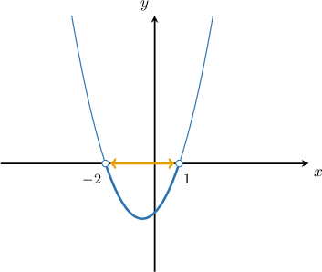

# Solving Inequalities Involving Exponential Functions and Polynomials

Source: https://www.mathacademy.com/topics/2859?courseId=43
Topic ID: 2859

## Prerequisites

- [Inequalities Involving Powers of Binomials](./2855-inequalities-involving-powers-of-binomials.md)
- [Solving Exponential Equations Using the Zero-Product Property](../algebra-ii/2979-solving-exponential-equations-using-the-zero-product-property.md)
- [Solving Quadratic Inequalities Using the Graphical Method](./3833-solving-quadratic-inequalities-using-the-graphical-method.md)

## Lesson

### Introduction

When we have an inequality involving an exponential function with a positive base, we're allowed to multiply or divide both sides by the exponential function.

For example, consider the following inequality:

$$

(x-2)e^x < 0

$$

Dividing both sides by $e^x$ and solving for $x,$ we get the following solution:

$$

\begin{aligned}\frac{(𝑥−2)𝑒^{𝑥}}{𝑒^{𝑥}} & <\frac{0}{𝑒^{𝑥}} \\ 𝑥−2 & <0 \\ 𝑥 & <2\end{aligned}

$$

The reason why we can multiply or divide both sides by $e^x$ is that $e^x > 0$ for all $x.$ When we multiply or divide an inequality by a positive number, the inequality sign remains the same.

### Example: Solving a Factored Inequality Involving an Exponential Function and a Polynomial

#### Question

Solve the inequality $\dfrac{(x^2-8)^3}{11^x} \geq 0.$

#### Explanation

When we have an inequality involving an exponential function with a positive base, we're allowed to multiply or divide both sides by the exponential function.

Multiplying both sides of the given inequality by $11^x,$ we get

$$

\begin{aligned}\frac{(𝑥^{2}−8)^{3}}{11^{𝑥}} & ≥0 \\ 11^{𝑥}⋅\frac{(𝑥^{2}−8)^{3}}{11^{𝑥}} & ≥11^{𝑥}⋅0 \\ (𝑥^{2}−8)^{3} & ≥0.\end{aligned}

$$

Now, we can solve the inequality using familiar methods:

$$

\begin{aligned}\sqrt[√(𝑥^{2}−8)^{3}]{3} & ≥\sqrt[√0]{3} \\ 𝑥^{2}−8 & ≥0 \\ 𝑥^{2} & ≥8 \\ \sqrt{𝑥^{2}} & ≥\sqrt{8} \\ |𝑥| & ≥2\sqrt{2}\end{aligned}

$$

Therefore, the solution to the inequality is $x \leq -2\sqrt 2$ or $x \geq 2 \sqrt 2.$

### Example: Solving an Inequality Involving Exponential Functions with the Same Exponents and a Polynomial

#### Question

Solve the inequality $x^2e^{x+1}-2e^{x+1} < -xe^{x+1}.$

#### Explanation

First, we move all the terms to the left side of the inequality and factor:

$$

\begin{aligned}𝑥^{2}𝑒^{𝑥+1}−2𝑒^{𝑥+1} & <−𝑥𝑒^{𝑥+1} \\ 𝑥^{2}𝑒^{𝑥+1}+𝑥𝑒^{𝑥+1}−2𝑒^{𝑥+1} & <0 \\ (𝑥^{2}+𝑥−2)𝑒^{𝑥+1} & <0 \\ (𝑥+2)(𝑥−1)𝑒^{𝑥+1} & <0\end{aligned}

$$

Now, we divide both sides by $e^{x+1}$ and get

$$

(x+2)(x-1) < 0.

$$

This represents an upwards parabola whose roots are at $x=-2$ and $x=1.$ The parabola is below the $x$-axis when $-2 < x < 1.$

Therefore, the solution is $-2 < x < 1.$

### Example: Solving an Inequality Involving Exponential Functions with Different Exponents and a Polynomial

#### Question

Solve the inequality $x^5 \cdot 4^{x} > 4^{x - 15}.$

#### Explanation

First, we move all the terms to the left side of the inequality and factor:

$$

\begin{aligned}𝑥^{5}⋅4^{𝑥} & >4^{𝑥−15} \\ 𝑥^{5}⋅4^{𝑥}−4^{𝑥−15} & >0 \\ (𝑥^{5}−4^{−15})⋅4^{𝑥} & >0\end{aligned}

$$

Now, we divide both sides by $4^{x}$ and get

$$

x^5 - 4^{-15} > 0.

$$

Finally, we can solve this inequality using familiar methods:

$$

\begin{aligned}𝑥^{5} & >4^{−15} \\ \sqrt[√𝑥^{5}]{5} & >\sqrt[√4^{−15}]{5} \\ 𝑥 & >(4^{−15})^{1/5} \\ 𝑥 & >4^{−3} \\ 𝑥 & >\frac{1}{64}\end{aligned}

$$

Therefore, the solution to the inequality is $x > \dfrac{1}{64}.$
