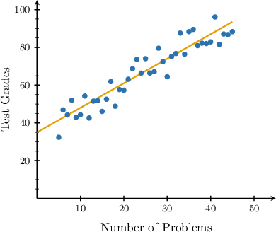
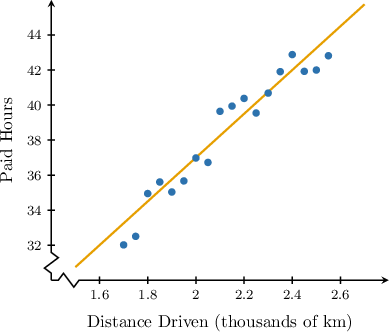
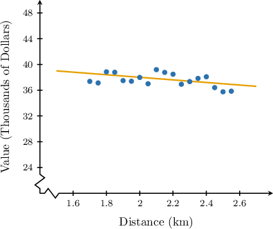

# Interpreting Trend Line Coefficients

Source: https://www.mathacademy.com/topics/3590?courseId=43
Topic ID: 3590

## Prerequisites

- [Analyzing and Interpreting Graphs of Linear Equations](../algebra-i/1588-analyzing-and-interpreting-graphs-of-linear-equations.md)
- [Making Predictions Using Trend Lines](../algebra-i/3753-making-predictions-using-trend-lines.md)

## Lesson

### Introduction

When we find or approximate the trend line equation for data with a linear trend, we can interpret the trend line coefficients in the original context. Let's consider an example.

A teacher wants to determine the relationship between the number of problems students solve the week before a test and their test grades. So, they collected data from their students and represented it using a scatter plot, shown below.

Features of the trend line are often meaningful in real life. For example, we see that the $y$-intercept of the trend line is $35.$ What is our interpretation of the $y$-intercept in this context?

Since the $y$-intercept of the trend line is $35,$ this line intersects the vertical axis at the point with coordinates $({\color{blue}0},{\color{red}{35}}).$

Now, notice the following:

- The unit along the horizontal axis is "number of problems." So, ${\color{blue}0}$ means no problems are solved.

- The unit along the vertical axis is "test grades." So, $35$ means getting a test grade of ${\color{red}{35}}$ points.

Therefore, we obtain the following interpretation of the $y$-intercept in this context:

*Students who solve no problems will get approximately $35$ points on the test.*

### Example: Interpreting Y-intercepts of Trend Lines

#### Question

The scatter plot above shows the relationship between the distance truck drivers in a particular company drive each week and the number of hours they're paid. The $y$-intercept of the corresponding trend line is $12.$ What is the interpretation of the $y$-intercept in this context?

#### Explanation

Since the $y$-intercept of the trend line is $12,$ this line intersects the vertical axis at the point with coordinates $(0,12).$

Now, notice the following:

- The unit along the horizontal axis is "distance driven (in thousands of kilometers)." So, $0$ means they don't drive at all.

- The unit along the vertical axis is "paid hours." So, $12$ means they're paid for working $12$ hours.

Therefore, we obtain the following interpretation:

**.

### Interpreting Slopes of Trend Lines

Let's again consider the scatter plot that shows the relationship between the number of exercises and the test grades among a group of students.

If the trend line has a slope of $1.3,$ what is its interpretation in this context?

Since the slope of the trend line is $1.3,$ when we move one unit to the right, the vertical coordinate increases by $1.3$ units on average.

Now, notice the following:

- The unit along the horizontal axis is "number of exercises." So, one unit means ${\color{blue}{1}}$ exercise.

- The unit along the vertical axis is "test grades." So, $1.3$ units means ${\color{red}{1.3}}$ points on the test.

Therefore, we obtain the following interpretation:

*On average, the test grade increases by ${\color{red}{1.3}}$ points for each additional exercise solved.*

### Example: Interpreting Slopes of Trend Lines

#### Question

The scatter plot above shows the relationship between the market value of some vacation rentals in a particular area (in thousands of dollars) and their distance to the nearest beach. The corresponding trend line has a slope of $-2.$ What is the interpretation of the slope in this context?

#### Explanation

The slope of the trend line is $-2.$ Therefore:

**.

Now, notice the following:

- The unit along the horizontal axis is "distance (in kilometers)." So, one unit means $1$ kilometer.

- The unit along the vertical axis is "value (in thousands of dollars)." So, $2$ units mean $2\,000.$

Therefore, we obtain the following interpretation:

**.
