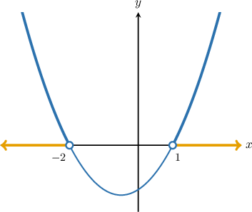
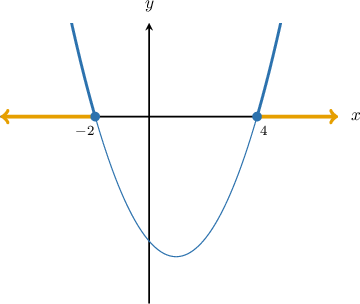
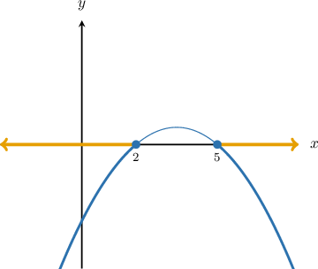
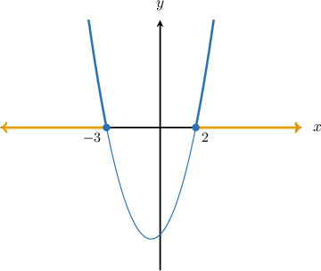
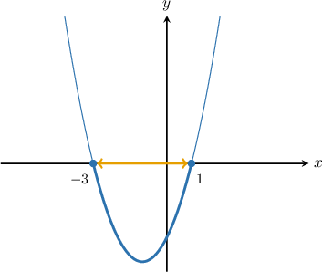
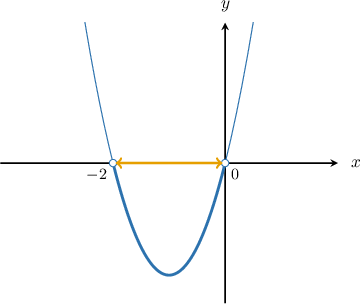

# Solving Quadratic Inequalities Using the Graphical Method

Source: https://www.mathacademy.com/topics/3833?courseId=43
Topic ID: 3833

## Prerequisites

- [The Discriminant of a Quadratic Equation](../algebra-i/425-the-discriminant-of-a-quadratic-equation.md)
- [Solving Quadratic Inequalities From Graphs](./468-solving-quadratic-inequalities-from-graphs.md)

## Lesson

### Introduction

We can use the so-called **graphical method** to solve quadratic inequalities. For example, consider the inequality

$$

x^2 + x - 2 > 0.

$$

To solve it, we need to find the values of $x$ for which the parabola

$$

y=x^2+x-2

$$

is *above* the $x$-axis.

First, let's find the roots of the parabola:

$$

\begin{aligned}𝑥^{2}+𝑥−2 & =0 \\ (𝑥+2)(𝑥−1) & =0\end{aligned}

$$

So, the roots are $x=-2$ and $x=1,$ and we can graph the parabola as follows:

The values marked in blue show all $x$-values where the parabola lies *above* the $x$-axis.

So, the solution to the inequality is $x \lt -2$ or $x \gt 1.$

### Example: Solving Greater Than (Or Equal To) Inequalities

#### Question

Find the solution of $x^2-2x-8 \geq 0.$

#### Explanation

To solve the inequality

$$

x^2-2x-8 \geq 0,

$$

we need to find the values of $x$ for which the parabola

$$

y=x^2-2x-8

$$

lies ** the $x$-axis or touches this axis.

First, let's find the roots of the parabola:

$$

\begin{aligned}𝑥^{2}−2𝑥−8 & =0 \\ (𝑥+2)(𝑥−4) & =0\end{aligned}

$$

So, the roots are $x=-2$ and $x=4,$ and we can graph the parabola as follows:

The values marked in blue show all $x$-values where the parabola lies ** the axis or touches this axis.

So, the solution to the inequality is $x \leq -2$ or $x \geq 4.$

### Example: Solving Less Than (Or Equal To) Inequalities

#### Question

Find the solution of $-x^2 + 7 x - 10 \leq 0.$

#### Explanation

To solve the inequality

$$

-x^2 + 7 x - 10 \leq 0,

$$

we need to find the values of $x$ for which the parabola

$$

y = -x^2 + 7 x - 10

$$

lies ** the $x$-axis or touches this axis.

First, let's find the roots of the parabola:

$$

\begin{aligned}−𝑥^{2}+7𝑥−10 & =0 \\ −(𝑥^{2}−7𝑥+10) & =0 \\ −(𝑥−2)(𝑥−5) & =0\end{aligned}

$$

So, the roots are $x=2$ and $x = 5,$ and we can graph the parabola as follows:

The values marked in blue show all $x$-values where the parabola lies ** the $x$-axis or touches this axis.

So, the solution to the inequality is $x \leq 2$ or $x \geq 5.$

### Solving Quadratic Inequalities That Require Rearrangement

Some inequalities require a rearrangement before applying the graphical method.

For example, let's find the solution of

$$

x^2 \ge 6-x.

$$

To solve this inequality using the graphical method, we first move all the terms to the left-hand side, leaving only $0$ on the right-hand side of our inequality. This gives

$$

\begin{aligned}𝑥^{2}+𝑥−6 & ≥0.\end{aligned}

$$

So, we need to find the values of $x$ for which the parabola $y = x^2 + x - 6$ lies above the $x$-axis or touches this axis. Let's find the roots of the parabola by factoring:

$$

\begin{aligned}𝑥^{2}+𝑥−6 & =0 \\ (𝑥+3)(𝑥−2) & =0\end{aligned}

$$

We see that the roots are $x = -3$ and $x = 2,$ so we can graph our parabola as follows:

Since we want to solve

$$

x^2 + x - 6 \ge 0,

$$

we look for the part of the parabola that is *above* the $x$-axis or touches this axis.

Based on the graph, the solution is $\color{blue}x \leq -3$ or $\color{blue}x \geq 2.$

We can also express our inequality in interval notation. In interval notation, our solution is

$$

x \in {\color{blue}\left(-\infty, - 3 \right]}\cup{\color{blue}\left[2, \infty\right)}.

$$

### Example: Solving Quadratic “Or Equal To” Inequalities That Require Rearrangement

#### Question

Find the solution of $2x^2-6 \le -4x.$

#### Explanation

To solve this inequality using the graphical method, we first need to move all of the numbers to the left-hand side so that the right-hand side is $0.$

$$

\begin{aligned}2𝑥^{2}−6 & ≤−4𝑥 \\ 2𝑥^{2}+4𝑥−6 & ≤0 \\ 𝑥^{2}+2𝑥−3 & ≤0.\end{aligned}

$$

So, we want to find the values of $x$ for which the parabola $y=x^2+2x-3$ lies below the $x$-axis. Let's find the roots of the parabola by factoring:

$$

\begin{aligned}𝑥^{2}+2𝑥−3 & =0 \\ (𝑥−1)(𝑥+3) & =0\end{aligned}

$$

We see that the roots are $x=1$ and $x=-3,$ and we can graph the parabola as follows:

Since we are interested in solving

$$

x^2+2x-3 \le 0,

$$

we look for the part of the parabola that is below the $x$-axis.

Based on the graph, the solution is $-3 \le x \le 1.$

Using interval notation, we write $x \in [-3,1].$

### Example: Solving Strict Quadratic Inequalities That Require Rearrangement

#### Question

Find the solution of $2x^2 < -4x.$

#### Explanation

To solve this inequality using the graphical method, we first need to move all of the numbers to the left-hand side so that the right-hand side is $0.$

$$

\begin{aligned}2𝑥^{2} & <−4𝑥 \\ 2𝑥^{2}+4𝑥 & <0.\end{aligned}

$$

So, we want to find the values of $x$ for which the parabola $y = 2x^2 + 4x$ lies below the $x$-axis. Let's find the roots of the parabola by factoring:

$$

\begin{aligned}2𝑥^{2}+4𝑥 & =0 \\ 2𝑥(𝑥+2) & =0\end{aligned}

$$

We see that the roots are $x = -2$ and $x = 0,$ and we can graph the parabola as follows:

Since we are interested in solving

$$

2x^2 + 4x \lt 0,

$$

we look for the part of the parabola that is below the $x$-axis.

Based on the graph, the solution is $-2 < x < 0.$

Using interval notation, we write $x \in \left(-2, 0\right).$
