# Computing Probabilities for Three Events Using Venn Diagrams

Source: https://www.mathacademy.com/topics/714?courseId=43
Topic ID: 714

## Prerequisites

- [Solving Two-Step Equations](../../../../middle-school/lessons/grade-7/66-solving-two-step-equations.md)
- [Computing Probabilities of Events Containing Complements Using Venn Diagrams](../geometry/4361-computing-probabilities-of-events-containing-complements-using-venn-diagrams.md)

## Lesson

### Introduction

Consider the following Venn diagram, which shows the events $A,$ $B,$ and $C,$ and the number of outcomes in each region of the sample space $\mathcal S.$ Each outcome in the sample space is equally likely.

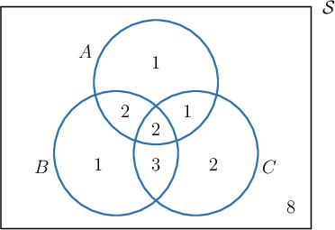

Suppose we wish to compute the following probability:

$$

P(B\cap C)

$$

We start by shading the region corresponding to $B\cap C$ on our diagram:

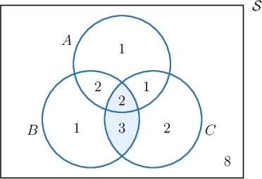

Each outcome in the sample space is equally likely. So, to compute the required probability, we need to divide the number of outcomes in the region $B\cap C$ by the total number of outcomes in the sample space.

We see from the diagram that the sample space $\mathcal S$ contains $20$ outcomes, and $B\cap C$ contains $2+3=5$ outcomes. Therefore,

$$

P(B\cap C)=\dfrac{5}{20}=0.25.

$$

### Example: Computing a Probability Given a Venn Diagram

#### Question

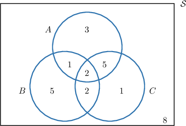

The Venn diagram above represents three events $A,$ $B,$ and $C,$ and the number of outcomes in each region of the sample space. Given that each outcome in the sample space is equally likely, find $P((A\cup B)\cap C').$

#### Explanation

In the Venn diagram, $(A\cup B)\cap C'$ corresponds to the region that is in $A$ or $B$ but not $C.$ This region is shaded below.

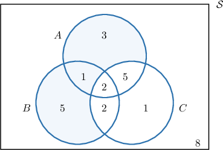

The diagram shows that the sample space $\mathcal{S}$ contains $27$ outcomes, and $(A\cup B)\cap C'$ contains $3+1+5=9$ outcomes. Therefore,

$$

P((A\cup B)\cap C')=\dfrac{9}{27}= \dfrac{1}{3}.

$$

### Example: Solving for Unknown Values in a Venn Diagram

#### Question

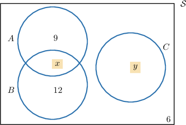

The Venn diagram above represents the events $A,$ $B,$ and $C$ in the sample space $\mathcal S.$ Given that $\mathcal S$ has $40$ equally likely outcomes in total and $P(A)=\dfrac{1}{2},$ what is the value of $x \cdot y?$

#### Explanation

Let's denote the number of outcomes in some region $R$ as $N(R),$ and the corresponding probability as $P(R).$

Since $P(A)=\dfrac{1}{2}$ and $N(\mathcal S)=40,$ we get

$$

\begin{aligned}𝑃(𝐴) & =\frac{𝑁(𝐴)}{𝑁(S)} \\ \frac{1}{2} & =\frac{𝑁(𝐴)}{40} \\ 𝑁(𝐴) & =\frac{1}{2}⋅40 \\ 𝑁(𝐴) & =20.\end{aligned}

$$

From the diagram,

$$

N(A)=9+N(A\cap B).

$$

Therefore,

$$

N(A\cap B)=20-9=11.

$$

Let's add this to our diagram.

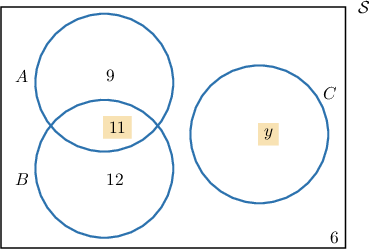

We also find

$$

\begin{aligned}9+11+12+6+𝑁(𝐶) & =40 \\ 38+𝑁(𝐶) & =40 \\ 𝑁(𝐶) & =2.\end{aligned}

$$

Therefore, the completed Venn diagram is as follows:

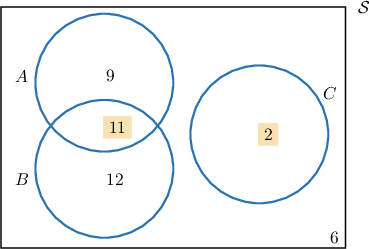

Finally,

$$

x \cdot y = 11 \cdot 2 = 22.

$$

### Example: Constructing a Venn Diagram Given Information on Three Events

#### Question

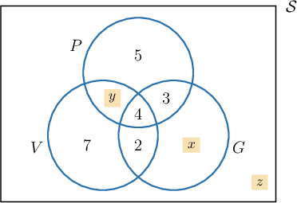

In a music academy, $35$ students were randomly selected and surveyed about what instruments they can play. The survey results were as follows:

- $14$ students play Piano

- $15$ students play Violin

- $15$ students play Guitar

- $6$ students play Piano and Violin

- $7$ students play Piano and Guitar

- $6$ students play Violin and Guitar

- $4$ students play Piano, Violin, and Guitar

Let $P$ be the event "the student plays Piano," $V$ the event "the student plays Violin," and $G$ the event "the student plays Guitar." Given that the Venn diagram above represents the three sets, what is the value of $x\cdot y\cdot z?$

#### Explanation

We start from the middle and work outward when constructing a Venn diagram for $3$ events.

First, note that there are $4$ students that play Piano, Violin, and Guitar.

- Since there are $6$ students who play Piano and Violin, there are $6-4=2$ students playing Piano and Violin, but not Guitar.

- Since there are $7$ students who play Piano and Guitar, there are $7-4=3$ students playing Piano and Guitar, but not Violin.

- Since there are $6$ students who play Violin and Guitar, there are $6-4=2$ students playing Violin and Guitar, but not Piano.

Then our Venn diagram is as follows:

We find the numbers in the remaining regions by subtracting the appropriate amounts.

- Since there are $14$ students who play Piano, there are $14-2-4-3=5$ students who play Piano but play neither Violin nor Guitar.

- Since there are $15$ students that play Violin, there are $15-2-4-2=7$ students that play Violin but play neither Piano nor Guitar.

- Since there are $15$ students that play Guitar, there are $15-2-4-3=6$ students that play Guitar but play neither Piano nor Violin.

Therefore, the correct Venn diagram is as follows:

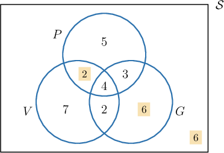

Note that, in the bottom-right corner of the Venn diagram, we have placed a $6$ because there are

$$

35 - 4-3-2-2-5-6-7 = 6

$$

students that don't play Piano, Violin, or Guitar.

Finally,

$$

x\cdot y\cdot z=6\cdot 2\cdot 6=72.

$$

### Example: Computing a Probability Given Information on Three Events

#### Question

In a school, $60$ students were randomly selected and surveyed about their reading habits. The survey results were as follows:

- $25$ students read books

- $18$ students read newspapers

- $37$ students read magazines

- $5$ students read books and newspapers

- $7$ students read books and magazines

- $12$ students read magazines and newspapers

- $2$ students read books, newspapers, and magazines

A student is randomly selected among the $60$ students of the survey. What is the probability that they read books but read neither newspapers nor magazines?

#### Explanation

When constructing a Venn diagram for $3$ events, we start from the middle and work our way outward.

First, note that there are $2$ students that read books, newspapers, and magazines.

- Since there are $5$ students who read books and newspapers, there are $5-2=3$ students who read books and newspapers but don't read magazines.

- Since there are $7$ students who read books and magazines, there are $7-2=5$ students who read books and magazines but don't read newspapers.

- Since there are $12$ students that read magazines and newspapers, there are $12-2=10$ students that read magazines and newspapers but don't read books.

Let $B$ be the event "The student reads books," $N$ the event "The student reads newspapers," and $M$ the event "The student reads magazines." Then our Venn diagram is as follows:

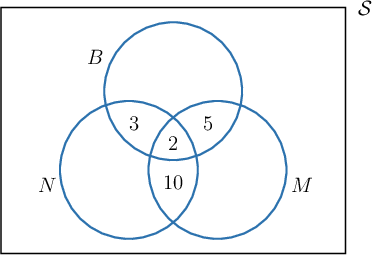

We find the numbers in the remaining regions by subtracting off the appropriate amounts.

- Since there are $25$ students who read books, there are $25-3-2-5=15$ students that read books but read neither newspapers nor magazines

- Since there are $18$ students who read newspapers, there are $18-3-2-10=3$ students that read newspapers but read neither books nor magazines

- Since there are $37$ students who read magazines, there are $37-5-2-10=20$ students that read magazines but read neither books nor newspapers

We update our Venn diagram as follows and shade in the region that corresponds to students that read books but neither newspapers nor magazines.

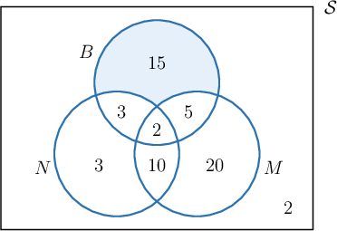

Note that, in the bottom-right corner of the Venn diagram, we have placed a $2$ because there are

$$

60-15-3-2-5-20-10-3=2

$$

students that don't read books, newspapers, or magazines.

Finally, the required probability is

$$

P(B\cap N'\cap M') = \frac{15}{60} = 0.25.

$$
