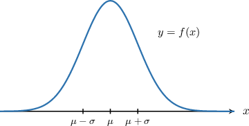
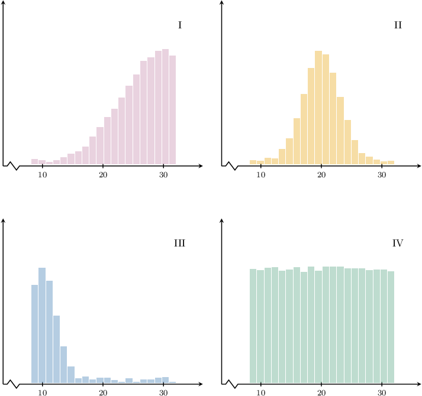
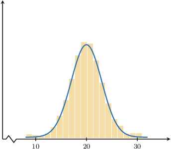

# Modeling With the Normal Distribution

Source: https://www.mathacademy.com/topics/788?courseId=43
Topic ID: 788

## Prerequisites

- [Mean and Variance of the Normal Distribution](./1470-mean-and-variance-of-the-normal-distribution.md)
- [Percentage Points of the Standard Normal Distribution](./3214-percentage-points-of-the-standard-normal-distribution.md)

## Lesson

### Introduction

Suppose that $X\sim N(\mu, \sigma^2)$ is normally distributed. Then the probability density function $f(x)$ of $X$ is a unimodal, bell-shaped curve. Moreover, it is symmetrical about the mean, median, and mode, which all equal $\mu$.

We can use the normal distribution to model a wide range of real-life situations because many real-world distributions are roughly bell-shaped and symmetrical around a mean value.

Patients' blood pressures, people's weights, measurement errors, and IQ scores are just some of the real-world examples that can be modeled as a normal distribution.

To determine whether a given data is normal, the first thing to do is to check the shape of the distribution. For example, if a data set is roughly bell-shaped, then it *might* be normally distributed.

It should be noted that, in practice, statisticians will often need to perform several tests on the data to check for normality (these are called **normality tests**). We cannot rely only on a distribution's shape since other distributions are also bell-shaped. However, checking the shape is often a good starting point.

### Example: Identifying Data Sets That Could Be Normally Distributed

#### Question

Which of the following data sets **** be normally distributed?

#### Explanation

If a large data set is normally distributed, it should be approximately bell-shaped.

Among the given options, the only bell-shaped curve is shown in diagram II:

It's important to note that other bell-shaped distributions exist. Therefore, further tests on the data are required to confirm whether the underlying distribution is normal.

### Example: Calculating a Probability Given a Normal Distribution Model

#### Question

The birth weights of newborns in a given population are normally distributed with a mean of $3\,543$ grams and a standard deviation of $609$ grams. What is the probability that a randomly selected newborn baby weighs more than $3\,100$ grams but less than $3\,600$? Round your answer to $2$ decimal places.

**

#### Explanation

Let $X$ represent the weight of a randomly selected baby. Then we have $X \sim N(3\,543, 609^2).$

We want to find $P(3\,100 < X < 3\,600).$ First, we convert $X$ to a standard normal random variable by $z$-scoring:

$$

\begin{aligned}𝑃(3\,100<𝑋<3\,600) & =𝑃(\frac{3\,100−3\,543}{609}<𝑍<\frac{3\,600−3\,543}{609}) \\ & =𝑃(−0.73<𝑍<0.09)\end{aligned}

$$

Now, we express the required probability in terms of $\Phi(z)\mathbin{:}$

$$

\begin{aligned}𝑃(−0.73<𝑍<0.09) & =𝑃(𝑍<0.09)−𝑃(𝑍<−0.73) \\ & =𝑃(𝑍≤0.09)−𝑃(𝑍≤−0.73) \\ & =Φ(0.09)−Φ(−0.73)\end{aligned}

$$

From the table, we have the following:

$$

\begin{aligned}Φ(−0.73) & =0.2327 \\ Φ(0.09) & =0.5359\end{aligned}

$$

Therefore, we have

$$

\begin{aligned}𝑃(−0.73<𝑍<0.09) & =Φ(0.09)−Φ(−0.73) \\ & =0.5359−0.2327 \\ & =0.3032.\end{aligned}

$$

In conclusion, the probability that a randomly selected newborn baby weighs more than $3\,100$ grams but less than $3\,600$ is $0.30.$

### Example: Finding an Unknown Population Parameter Using a Percentage Points Table

#### Question

The average duration (in minutes) of the episodes of a popular podcast is $43\,\text{min}.$ Additionally, $20\%$ of the episodes have a duration of less than $38$ minutes. Assuming that the duration of a randomly selected episode is normally distributed, find the standard deviation of the episode durations, rounded to the nearest minute.

**

#### Explanation

Let $X$ represent the duration of a randomly selected episode. Then, we have $X \sim N(43, \sigma^2),$ and we want to find the standard deviation $\sigma.$

We know that $P(X \leq 38) = 0.20.$ Converting $X$ to a standard normal random variable by $z$-scoring, we get

$$

\begin{aligned}𝑃(𝑋≤38) & =0.20 \\ 𝑃(𝑍≤\frac{38−43}{𝜎}) & =0.20 \\ Φ(−\frac{5}{𝜎}) & =0.20 \\ −\frac{5}{𝜎} & =Φ^{−1}(0.20).\end{aligned}

$$

From the table,

$$

\Phi^{-1}(0.20) =-0.8416.

$$

Finally then,

$$

\begin{aligned}−\frac{5}{𝜎} & =−0.8416 \\ \frac{1}{𝜎} & =0.1683 \\ 𝜎 & =\frac{1}{0.1683} \\ 𝜎 & ≈6\,minutes.\end{aligned}

$$

### Example: Finding a Probability When a Population Parameter is Unknown

#### Question

The systolic blood pressure of a group of people is normally distributed with a mean of $\mu\,\text{mm}\,\text{Hg}$ and a standard deviation of $12\,\text{mm}\,\text{Hg}.$ Additionally, $50\%$ of the people have a systolic blood pressure between $0.93\mu\,\text{mm}\,\text{Hg}$ and $1.07\mu\,\text{mm}\,\text{Hg}$. Find, as a percentage, the proportion of people with a systolic blood pressure lower than $120\,\text{mm}\,\text{Hg}.$

**

**.

#### Explanation

Let $X$ represent the systolic blood pressure of a randomly selected person. Then we have $X \sim N(\mu, 12^2),$ and we want to find $P(X < 120).$ But first, we need to find the mean $\mu.$

We know that $P(0.93\mu < X < 1.07\mu) = 0.5.$ First, we convert this to a cumulative probability:

$$

\begin{aligned}𝑃(0.93𝜇<𝑋<1.07𝜇) & =0.5 \\ 2𝑃(𝜇<𝑋<1.07𝜇) & =0.5 \\ 𝑃(𝜇<𝑋<1.07𝜇) & =0.25 \\ 𝑃(𝑋<𝜇)+𝑃(𝜇<𝑋<1.07𝜇) & =0.5+0.25 \\ 𝑃(𝑋<1.07𝜇) & =0.75\end{aligned}

$$

Next, we convert $X$ to a standard normal random variable by $z$-scoring. We get

$$

\begin{aligned}𝑃(𝑋<1.07𝜇) & =0.75 \\ 𝑃(𝑍<\frac{0.07𝜇}{12}) & =0.75 \\ Φ(\frac{0.07𝜇}{12}) & =0.75 \\ \frac{0.07𝜇}{12} & =Φ^{−1}(0.75).\end{aligned}

$$

From the table,

$$

\Phi^{-1}(0.75) \approx 0.6745.

$$

Therefore, we have

$$

\begin{aligned}\frac{0.07𝜇}{12} & =0.6745 \\ 0.07𝜇 & =8.094 \\ 𝜇 & =\frac{8.094}{0.07} \\ & ≈115.629.\end{aligned}

$$

Finally, we can find $P(X < 120)$ as follows:

$$

\begin{aligned}𝑃(𝑋<120) & =𝑃(𝑍<\frac{120−115.629}{12}) \\ & ≈𝑃(𝑍<0.36) \\ & =Φ(0.36) \\ & =0.6406 \\ & ≈64.1\%\end{aligned}

$$

Therefore, approximately $64.1\%$ of the people have systolic blood pressure lower than $120\,\text{mm}\,\text{Hg}.$
