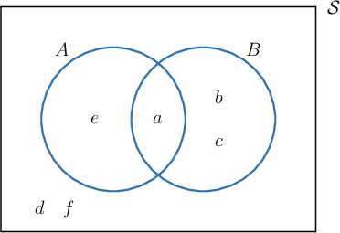
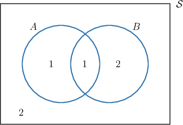
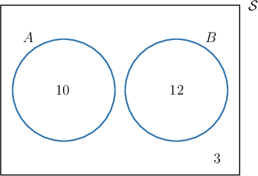
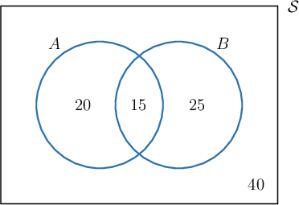
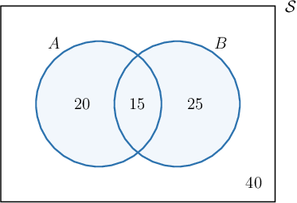
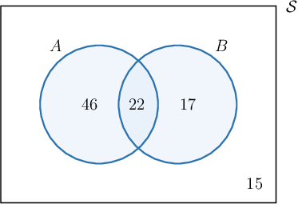

# Computing Probabilities for Compound Events Using Venn Diagrams

Source: https://www.mathacademy.com/topics/794?courseId=43
Topic ID: 794

## Prerequisites

- [Compound Events in Probability From Experimental Data](../geometry/131-compound-events-in-probability-from-experimental-data.md)
- [Venn Diagrams in Probability](../geometry/793-venn-diagrams-in-probability.md)

## Lesson

### Introduction

Suppose we have a bag of tiles labeled $a,b,c,d,e,$ and $f,$ where the bag contains an equal number of each tile. We draw a single tile at random from the bag. The sample space $\mathcal S$ of all possible outcomes is

$$

\mathcal S = \{ a, b, c, d, e, f \}.

$$

Let's define two events, $A$ and $B,$ as follows:

- Let $A$ be the event that we draw a vowel. Then, we have

- Let $B$ be the event that we get one of the first three letters of the alphabet. Then, we have

How do we calculate $P(A\cap B)?$

Let's use a Venn diagram representation for $A\cap B,$ as shown below. Notice that we haven't included the probabilities, just the values contained within $\mathcal S.$

Let's construct another Venn diagram in which we count the number of entries in each region of the Venn diagram above.

We're told that there is an equal number of each tile, so every outcome in the sample space is equally likely. Therefore, to compute $P(A \cap B),$ we need to count the number of events in $A \cap B$ and divide by the total number of events in $\mathcal S.$

- In a Venn diagram, $A \cap B$ is represented by the area where the circles overlap. From the diagram above, we see that there is only $\color{red}1$ event in $A \cap B.$

- The total number of events in $\mathcal S$ is $1+1+2+2={\color{blue}{6}}.$

Therefore, we have

$$

P(A\cap B) = \frac{\color{red}1}{\color{blue}6}.

$$

So, to calculate the probability of an event using a Venn diagram, we count the number of outcomes in the region representing the event we're interested in and divide by the total number of outcomes in the sample space $\mathcal S.$

Finally, it is important to remember that this method works *only* if every outcome in the sample space is equally likely.

### Example: Creating a Venn Diagram Given a Description of a Sample Space

#### Question

A dietician has $25$ patients, $10$ of whom are smokers, and $12$ of whom have diabetes. None of the diabetic patients are smokers. Represent the corresponding sample space using a Venn diagram.

#### Explanation

Let us call $A$ the event "The patient is a smoker" and $B$ the event "The patient has diabetes."

Since none of the diabetic patients are smokers, we draw two non-overlapping circles to represent the events $A$ and $B.$

- Since there are $10$ smokers, we write the number $10$ within the circle $A.$

- Since there are $12$ patients with diabetes, we write the number $12$ within the circle $B.$

There are $25$ patients in total, so the number of remaining patients is

$$

25 - 10 - 12 = 3.

$$

To represent the $3$ remaining patients, we write the number $3$ outside of the circles $A$ and $B.$

Finally, our Venn diagram looks as follows:

### Example: Computing a Probability Using a Venn Diagram

#### Question

The Venn diagram shown below represents two events $A$ and $B$ and the number of outcomes on each region of the sample space. Given that every outcome is equally likely, find $P(A\cup B).$

#### Explanation

To calculate the probability of an event using a Venn diagram, we count the number of outcomes in the region that represents the event and divide by the total number of outcomes of the sample space $S.$

In the Venn diagram, $A\cup B$ is represented by the area that is in either circle (see the illustration below).

We count up the outcomes:

- The number of outcomes in $A \cup B$ is

- The total number of outcomes in $S$ is

So, we have

$$

P(A\cup B)=\dfrac{60}{100}= 0.6.

$$

### Example: Computing a Probability Given a Description of a Sample Space

#### Question

A survey conducted among $100$ students of a music school found that $68$ of them play piano, $39$ of them play violin, and there are $22$ students who play both instruments. Draw a Venn diagram representing this sample space. If a student is randomly selected among the $100$ students, what is the probability that they play at least one of these instruments?

#### Explanation

Let us call $A$ the event "The student plays piano" and $B$ the event "The student plays violin."

Note that there are $22$ students who play both piano and violin. We draw two overlapping circles representing the events $A$ and $B$ and write the number $22$ where the circles overlap.

- The number of students who play ** the piano is so we write the number $46$ in the part of circle $A$ that does not overlap with circle $B.$

- The number of students who play ** the violin is so we write the number $17$ in the part of the circle $B$ that does not overlap with circle $A.$

The total number of students who play at least one of the instruments is

$$

22+46+17 = 85,

$$

and there are $100$ students in total, so the number of remaining students is

$$

100 - 85 = 15.

$$

To represent these $15$ students who play neither piano nor violin, we write the number $15$ outside of the circles $A$ and $B.$

Therefore, our Venn diagram looks as shown below:

The shaded part of the Venn diagram corresponds to students who play at least one of the instruments. The probability that a randomly selected student is from this group is given by

$$

P\left(A\cup B\right)=\dfrac{85}{100}= 0.85.

$$
