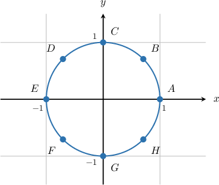
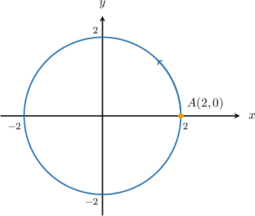
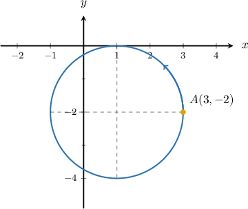
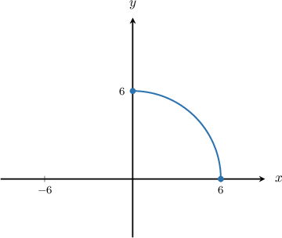
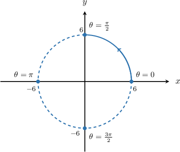

# Parametric Equations of Circles

Source: https://www.mathacademy.com/topics/806?courseId=43
Topic ID: 806

## Prerequisites

- [Equations of Circles](../geometry/843-equations-of-circles.md)
- [Cartesian Equations of Parametric Curves](./1255-cartesian-equations-of-parametric-curves.md)

## Lesson

### Introduction

The parametric equations of a circle of radius $1$ centered at the origin are

$$

x=\cos\theta,\quad y=\sin\theta, \quad 0\leq \theta <2\pi.

$$

If we make a table of values and plot them, we can see why this is a circle. Let's label each point $A-H.$

The $\theta$ domain $0\leq \theta<2\pi$ ensures that we go around the entire circle. If we were to cut the $\theta$ domain in half (i.e., $0\leq\theta\leq \pi$), we would get a semicircle.

For a general circle of radius $r$ centered at the origin $O,$ the parametric equations are

$$

x=r\cos\theta,\quad y=r\sin\theta, \quad 0\leq \theta <2\pi.

$$

This parametrization starts at the point $(r,0)$ (corresponding the $\theta = 0$) and traverses the circle in the counterclockwise direction. This is the most common parameterization of a circle and is the one that we'll mostly use.

Another set of parametric equations for a circle of radius $r$ centered at $O$ is

$$

x=r\sin\theta,\quad y=r\cos\theta, \quad 0\leq \theta <2\pi.

$$

### Example: Finding the Parametric Equations of a Circle Centered at the Origin

#### Question

Consider the circle of radius $2$ centered at the origin, as shown below. Construct a set of parametric equations, defined for $\theta\in[0,2\pi),$ that traverse the circle once in the counterclockwise direction starting at the point $A(2,0).$

#### Explanation

The parametric equations of a circle of radius $r$ centered at the origin are

$$

x = r\cos\theta, \quad y = r\sin\theta, \quad \theta \in [0,2\pi).

$$

Under this parametrization, the circle is traversed once in the counterclockwise direction, starting from $(r,0).$

In our case, the radius is $r = 2.$ Therefore, the parametric equations of the circle are

$$

x=2\cos\theta,\quad y=2\sin\theta, \quad \theta \in [0,2\pi).

$$

### The Parametric Equations of a Circle Centered at a General Point

The parametric equations of a circle of radius $r$ centered at the point $(a,b)$ are

$$

x= r\cos\theta+a,\quad y=r\sin\theta+b,\quad \theta \in [0,2\pi).

$$

For example, the parametric equations of a circle of radius $2$ centered at the point $(1,-2)$ are

$$

x= 2\cos\theta+1,\quad y=2\sin\theta-2,\quad \theta \in [0,2\pi).

$$

These parametric equations traverse the circle once in the counterclockwise direction starting at the point $A(3,-2),$ the rightmost point on the curve.

### Example: Finding the Parametric Equations of a Circle Centered at a General Point

#### Question

Construct a set of parametric equations, defined for $\theta\in[0,2\pi),$ that generates a circle of radius $2$ centered at the point $(4,6).$

#### Explanation

The parametric equations of a circle of radius $r$ centered at the point $(a,b)$ are

$$

x= r\cos\theta+a,\quad y=r\sin\theta+b,\quad \theta \in [0,2\pi).

$$

In our case, we have a circle of radius $2$ centered at the point $(4,6).$ Therefore, the parametric equations of the circle are

$$

x=2\cos\theta+4,\quad y=2\sin\theta+6,\quad\theta \in [0,2\pi).

$$

### Example: Parametrizing Part of a Circle

#### Question

The quarter-circle above is defined by the parametric equations

$$

x = 6\cos\theta, \qquad y = 6\sin\theta.

$$

What is the domain of the parameter $\theta?$

#### Explanation

The parametric equations of a circle of radius $r$ centered at the origin are

$$

x = r\cos\theta, \quad y = r\sin\theta, \quad \theta \in [0,2\pi).

$$

In our case, the radius $r = 6.$ So, the parametric equations of the ** circle are

$$

x=6\cos\theta,\quad y=6\sin\theta, \quad \theta \in [0,2\pi).

$$

To restrict the parameterization to a quarter-circle, we associate the parameter $\theta$ with the central angle formed by a point $(x,y)$ on the circle and the $x$-axis.

We can see that if we restrict $\theta$ to $\left[0,\dfrac{\pi}{2} \right],$ we get the required quarter-circle.

Therefore, the parametric equations of the quarter-circle are

$$

x=6\cos\theta,\quad y=6\sin\theta, \quad \theta \in \left[0,\dfrac{\pi}{2} \right].

$$

### Converting the Parametric Equations of a Circle to Cartesian Form

To convert the parametric equations of a circle to a Cartesian equation, we can eliminate the parameter $\theta$ using the Pythagorean identity:

$$

\cos^2 \theta + \sin^2 \theta = 1

$$

To demonstrate, consider the circle defined parametrically as

$$

x=5\cos\theta,\quad y=5\sin\theta, \quad 0\leq\theta\lt 2\pi.

$$

By isolating the $\cos\theta$ term in the $x$-equation and squaring, we get

$$

\begin{aligned}\frac{𝑥}{5} & =cos⁡𝜃 \\ \frac{𝑥^{2}}{5^{2}} & =cos^{2}⁡𝜃 \\ \frac{𝑥^{2}}{25} & =cos^{2}⁡𝜃.\end{aligned}

$$

By isolating the $\sin\theta$ term in the $y$-equation and squaring, we get

$$

\begin{aligned}\frac{𝑦}{5} & =sin⁡𝜃 \\ \frac{𝑦^{2}}{5^{2}} & =sin^{2}⁡𝜃 \\ \frac{𝑦^{2}}{25} & =sin^{2}⁡𝜃.\end{aligned}

$$

Substituting these values into the Pythagorean identity, we obtain

$$

\begin{aligned}cos^{2}⁡𝜃+sin^{2}⁡𝜃 & =1 \\ \frac{𝑥^{2}}{25}+\frac{𝑦^{2}}{25} & =1 \\ 𝑥^{2}+𝑦^{2} & =25.\end{aligned}

$$

Therefore the Cartesian equation is $x^2+y^2 = 25.$

### Example: Finding the Cartesian Equation of a Parametrized Circle

#### Question

Calculate the Cartesian equation of the circle

$$

x=3\cos\theta + 2,\quad y=3\sin\theta - 4, \quad 0\leq\theta\lt 2\pi.

$$

#### Explanation

To find the Cartesian equation of the circle, we need to eliminate the parameter $\theta.$ We can do this using the Pythagorean identity:

$$

\cos^2 \theta + \sin^2 \theta = 1

$$

By isolating the $\cos\theta$ term in the $x$-equation and squaring, we get

$$

\begin{aligned}\frac{𝑥−2}{3} & =cos⁡𝜃 \\ \frac{(𝑥−2)^{2}}{3^{2}} & =cos^{2}⁡𝜃 \\ \frac{(𝑥−2)^{2}}{9} & =cos^{2}⁡𝜃.\end{aligned}

$$

By isolating the $\sin\theta$ term in the $y$-equation and squaring, we get

$$

\begin{aligned}\frac{𝑦+4}{3} & =sin⁡𝜃 \\ \frac{(𝑦+4)^{2}}{3^{2}} & =sin^{2}⁡𝜃 \\ \frac{(𝑦+4)^{2}}{9} & =sin^{2}⁡𝜃.\end{aligned}

$$

Substituting these values into the Pythagorean identity, we obtain

$$

\begin{aligned}cos^{2}⁡𝜃+sin^{2}⁡𝜃 & =1 \\ \frac{(𝑥−2)^{2}}{9}+\frac{(𝑦+4)^{2}}{9} & =1 \\ (𝑥−2)^{2}+(𝑦+4)^{2} & =9.\end{aligned}

$$

Therefore the Cartesian equation is $(x-2)^2 + (y+4)^2 = 9.$
