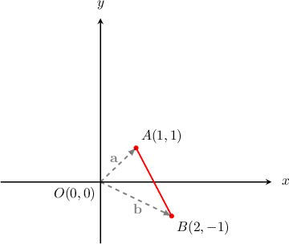
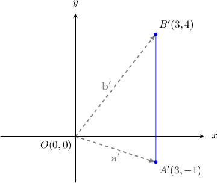
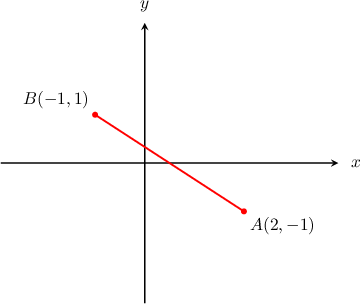
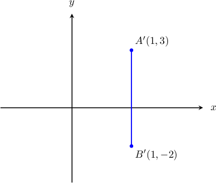
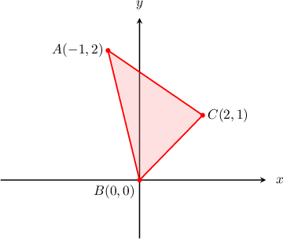
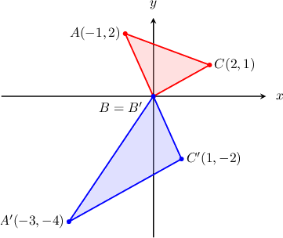

# Linear Transformations of Objects in the Plane

Source: https://www.mathacademy.com/topics/866?courseId=43
Topic ID: 866

## Prerequisites

- [Multiplying Matrices](./1196-multiplying-matrices.md)
- [Linear Transformations of Points and Lines in the Plane](./2706-linear-transformations-of-points-and-lines-in-the-plane.md)

## Lesson

### Introduction

Consider a line segment $\overline{AB}$ whose endpoints are located at $A(1,1)$ and $B(2,-1).$ Let's denote $\mathbf{a}$ and $\mathbf{b}$ as the position vectors of the points $A$ and $B$ respectively, as shown below.

In the plane, we know that a non-singular linear transformation maps a straight line onto a straight line. Similarly, a linear transformation maps a line segment onto another line segment.

Suppose that $\overline{A'B'}$ is the image of $\overline{AB}$ under the action of the linear transformation $\mathbf{T}$ represented by the matrix

$$

[\begin{aligned}2 & 1 \\ 1 & −2\end{aligned}]

$$

How do we compute $\overline{A'B'}?$

To find the coordinates of $A'$ and $B'$ simultaneously, we first create a matrix $X$ containing the coordinates of both ends $A({\color{red}1},{\color{red}1})$ and $B({\color{blue}2},{\color{blue}-1})\mathbin{:}$

$$

[\begin{aligned}1 & 2 \\ 1 & −1\end{aligned}]

$$

Next, we compute the product $TX\mathbin{:}$

$$

[\begin{aligned}2 & 1 \\ 1 & −2\end{aligned}]

$$

Therefore, $A'({\color{red}3},{\color{red}-1})$ and $B'({\color{blue}3},{\color{blue}4})$. Our result is shown below.

### Example: Computing the Image of a Line Segment Under the Action of a Linear Transformation

#### Question

Consider the linear transformation $\mathbf T$ with matrix representation $T,$ given by

$$

[\begin{aligned}2 & 3 \\ 1 & −1\end{aligned}]

$$

The line segment $\overline{AB}$ is shown below. Find $\overline{A'B'},$ the image of $\overline{AB}$ under the action of $\mathbf T.$

#### Explanation

To find the image of $\overline{AB}$ under the action of $\mathbf T$, we first create a matrix $X$ containing the coordinates of the endpoints of $\overline{AB}\mathbin{:}$

$$

[\begin{aligned}2 & −1 \\ −1 & 1\end{aligned}]

$$

Now, we compute the image of $X$ under the action of $\mathbf T$ by calculating the matrix product $TX\mathbin{:}$

$$

\begin{aligned}𝑇𝑋 & =[\begin{aligned}2 & 3 \\ 1 & −1\end{aligned}][\begin{aligned}2 & −1 \\ −1 & 1\end{aligned}] \\ & =[\begin{aligned}1 & 1 \\ 3 & −2\end{aligned}]\end{aligned}

$$

Therefore, the coordinates of the respective endpoints of the image are $A'(1,3)$ and $B'(1,-2),$ as shown below.

### Example: Computing the Image of a Polygon Under the Action of a Linear Transformation

#### Question

Consider the linear transformation $\mathbf T$ with matrix representation $T,$ given by

$$

[\begin{aligned}1 & −1 \\ 0 & −2\end{aligned}]

$$

The triangle $\triangle ABC$ is shown below. Find $\triangle A'B'C',$ the image of $\triangle ABC$ under the action of $\mathbf T.$

#### Explanation

To find the image of $T$ under the action of $\mathbf T,$ we first create a matrix $X$ containing all of the vertices of $\triangle ABC\mathbin{:}$

$$

[\begin{aligned}−1 & 0 & 2 \\ 2 & 0 & 1\end{aligned}]

$$

Now, we compute the image of $X$ under the action of $\mathbf T$ by calculating the matrix product $TX\mathbin{:}$

$$

\begin{aligned}𝑇𝑋 & =[\begin{aligned}1 & −1 \\ 0 & −2\end{aligned}][\begin{aligned}−1 & 0 & 2 \\ 2 & 0 & 1\end{aligned}] \\ & =[\begin{aligned}−3 & 0 & 1 \\ −4 & 0 & −2\end{aligned}].\end{aligned}

$$

Therefore, the coordinates of the respective vertices of $\triangle A'B'C'$ are $(-3,-4), (0,0), (1,-2),$ as shown below.

