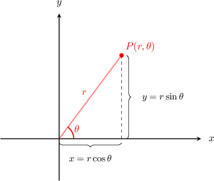
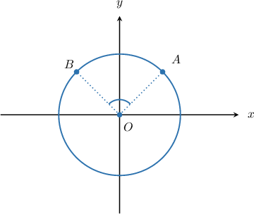

# Converting from Polar Coordinates to Cartesian Coordinates

Source: https://www.mathacademy.com/topics/936?courseId=43
Topic ID: 936

## Prerequisites

- [Introduction to Polar Coordinates](./935-introduction-to-polar-coordinates.md)
- [Evaluating Trigonometric Expressions](../algebra-ii/3766-evaluating-trigonometric-expressions.md)

## Lesson

### Introduction

Suppose we know the position of a point $P(r, \theta)$ in polar coordinates, and we want to convert it into Cartesian coordinates.

To do this, we can draw a right triangle with legs $x$ and $y$ and hypotenuse $r.$

Computing the trigonometric ratios for the triangle above and solving for $x$ and $y,$ we get the following formulas:

$$

\begin{aligned}cos⁡𝜃 & =\frac{𝑥}{𝑟}\, & ⇒ & \, & 𝑥 & =𝑟cos⁡𝜃, \\ sin⁡𝜃 & =\frac{𝑦}{𝑟}\, & ⇒ & \, & 𝑦 & =𝑟sin⁡𝜃.\end{aligned}

$$

Let's use these formulas to write the point $P(2, 60^\circ)$ in Cartesian coordinates. Here, we have $r=2$ and $\theta =60^\circ.$ So, we get

$$

\begin{aligned}𝑥 & =2cos⁡60^{∘}=2⋅\frac{1}{2}=1, \\ 𝑦 & =2sin⁡60^{∘}=2⋅\frac{\sqrt{√3}}{2}=\sqrt{√3}.\end{aligned}

$$

Therefore, $P$ can be written in Cartesian coordinates as $P(1, \sqrt{3}).$

### Example: Finding the Cartesian Coordinates of a Point Given in Polar Coordinates

#### Question

The point $P$ has polar coordinates $\left(6,\dfrac{\pi}{3} \right).$ Find the Cartesian coordinates of $P.$

#### Explanation

To convert from polar coordinates to Cartesian coordinates, we use

$$

x = r\cos\theta, \qquad y=r\sin\theta.

$$

First, we calculate the $x$-coordinate of $P\mathbin{:}$

$$

\begin{aligned} x &= r\cos\theta\\\[5pt] &= 6 \cos\left(\dfrac{\pi}{3} \right)\\\[5pt] &= 6 \cdot \dfrac{1}{2}\\\[5pt] &= 3 \end{aligned}

$$

Then, we calculate the $y$-coordinate of $P\mathbin{:}$

$$

\begin{aligned} y &= r\sin\theta\\\[5pt] &= 6 \sin\left(\dfrac{\pi}{3} \right)\\\[5pt] &= 6 \cdot \dfrac{\sqrt{3}}{2}\\\[5pt] &= 3\sqrt{3} \end{aligned}

$$

Therefore, the Cartesian coordinates of $P$ are $\left(3, 3\sqrt{3}\right).$

### Example: Finding the Cartesian Coordinates of a Point Given a Description of the Radius and Angle

#### Question

Given that the distance from a point $P$ to the origin is $2,$ and that $P$ makes an angle of $135^{\circ}$ with the positive $x$-axis, what are the Cartesian coordinates of $P?$

#### Explanation

We notice that the point $P$ is described using polar coordinates $(r,\theta),$ where

$$

r=2, \quad \theta=135^{\circ}.

$$

To convert from polar coordinates to Cartesian coordinates, we use

$$

x = r\cos\theta, \qquad y=r\sin\theta.

$$

First, we calculate the $x$-coordinate of $P\mathbin{:}$

$$

\begin{aligned} x &= r\cos\theta\\\[5pt] &=2 \cos\left( 135^{\circ} \right)\\\[5pt] &= 2 \left(-\dfrac{\sqrt{2}}{2}\right)\\\[5pt] &= -\sqrt{2} \end{aligned}

$$

Then, we calculate the $y$-coordinate of $P\mathbin{:}$

$$

\begin{aligned} y &= r\sin\theta\\\[5pt] &= 2 \sin\left(135^{\circ}\right)\\\[5pt] &= 2 \left(\dfrac{\sqrt{2}}{2}\right)\\\[5pt] &= \sqrt{2} \end{aligned}

$$

Therefore, the Cartesian coordinates of $P$ are $\left(-\sqrt{2}, \sqrt{2}\right).$

### Example: Finding the Cartesian Coordinates of a Point Given Some Information About Another Point

#### Question

The point $A$ has polar coordinates $\left(r, \dfrac{11\pi}{6} \right)$ and the point $B$ has polar coordinates $\left(5r,\dfrac{5\pi}{6}\right).$ Find the Cartesian coordinates of $B$ given that the Cartesian coordinates of $A$ are $(3,-\sqrt{3}).$

#### Explanation

First, we use the Cartesian coordinates of $A$ to find $r,$ the distance between $A$ and the origin:

$$

\begin{aligned} r &= \sqrt{x^2+y^2}\\[3pt] &=\sqrt{3^2+(\sqrt{3})^2}\\[3pt] &= \sqrt{12} \\[3pt] &= 2\sqrt{3} \end{aligned}

$$

Consequently, the polar coordinates of $B$ are

$$

\left(5(2\sqrt{3}),\dfrac{5\pi}{6}\right)=\left(10\sqrt{3},\dfrac{5\pi}{6}\right).

$$

Now, we convert $B$ to Cartesian coordinates. To convert from polar coordinates to Cartesian coordinates, we use

$$

x = r\cos\theta, \qquad y=r\sin\theta.

$$

First, we calculate the $x$-coordinate of $B\mathbin{:}$

$$

\begin{aligned} x &= r\cos\theta\\\[5pt] &=10\sqrt{3} \cos\left(\dfrac{5\pi}{6} \right)\\\[5pt] &= 10\sqrt{3} \left(-\dfrac{\sqrt{3}}{2} \right)\\\[5pt] &= -15 \end{aligned}

$$

Then, we calculate the $y$-coordinate of $B\mathbin{:}$

$$

\begin{aligned} y &= r\sin\theta\\\[5pt] &=10\sqrt{3} \sin\left(\dfrac{5\pi}{6} \right)\\\[5pt] &= 10\sqrt{3} \cdot\dfrac{1}{2} \\\[5pt] &=5\sqrt{3} \end{aligned}

$$

Therefore, the Cartesian coordinates of $B$ are $\left(-15, 5\sqrt{3}\right).$

### Example: Finding the Cartesian Coordinates of a Point Using a Diagram

#### Question

The diagram below shows a circle of radius $r$ centered at the origin. If the polar coordinates of the point $A$ are $\left(3,\dfrac{\pi}{4}\right)$ and $m \angle AOB=\dfrac{\pi}{2},$ what are the Cartesian coordinates of $B?$

#### Explanation

First, since $A$ has polar coordinates $\left(3,\dfrac{\pi}{4}\right),$ we must have $r=3.$ Also, since the points $A$ and $B$ both lie on a circle of radius $3,$ the $r$-coordinate of $B$ must also be $3.$

Notice that one must traverse the circle counterclockwise to move from the point $A$ to point $B.$ Since the $\theta$-coordinate of $A$ is $\dfrac{\pi}{4},$ the $\theta$-coordinate of $B$ must be

$$

\theta_B = \dfrac{\pi}{4}+\dfrac{\pi}{2} = \dfrac{3\pi}{4}.

$$

So, the polar coordinates of $B$ are $\left(3,\dfrac{3\pi}{4}\right)$

Now, we convert $B$ to Cartesian coordinates. To convert from polar coordinates to Cartesian coordinates, we use

$$

x = r\cos\theta, \qquad y=r\sin\theta.

$$

First, we calculate the $x$-coordinate of $B\mathbin{:}$

$$

\begin{aligned} x &= r\cos\theta\\\[5pt] &=3\cos\left(\dfrac{3\pi}{4} \right)\\\[5pt] &=3\left(-\dfrac{\sqrt{2}}{2}\right)\\\[5pt] &=-\dfrac{3\sqrt 2}{2} \end{aligned}

$$

Then, we calculate the $y$-coordinate of $B\mathbin{:}$

$$

\begin{aligned} y &= r\sin\theta\\\[5pt] &= 3\sin\left(\dfrac{3\pi}{4} \right)\\\[5pt] &= 3\cdot\dfrac{\sqrt{2}}{2}\\\[5pt] &=\dfrac{3\sqrt 2}{2} \end{aligned}

$$

Therefore, the Cartesian coordinates of $B$ are $\left(-\dfrac{3\sqrt 2}{2},\dfrac{3\sqrt 2}{2}\right).$
