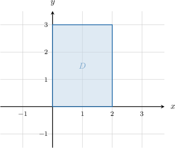
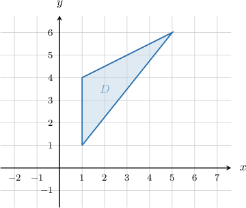
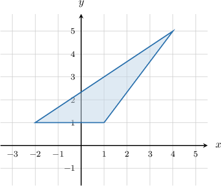

# Area Scale Factors of Linear Transformations

Source: https://www.mathacademy.com/topics/989?courseId=43
Topic ID: 989

## Prerequisites

- [Linear Transformations of Objects in the Plane](./866-linear-transformations-of-objects-in-the-plane.md)
- [The Geometric Interpretation of the 2x2 Determinant](./1169-the-geometric-interpretation-of-the-2x2-determinant.md)
- [Areas of Trapezoids](../../../../middle-school/lessons/grade-7/1353-areas-of-trapezoids.md)
- [Areas of Circles](../geometry/1745-areas-of-circles.md)

## Lesson

### Introduction

Consider the shaded region $D$ shown below.

How can we calculate the area of the image of $D$ under the action of the linear transformation $\mathbf{T}$ that is given by its standard matrix

$$

[\begin{aligned}0 & −2 \\ 2 & 0\end{aligned}]

$$

For any linear transformation $\mathbf{T},$ we have the following connection between the area of $D$ and the area of the image $\mathbf{T}(D)$ under the action of $\mathbf{T}\mathbin{:}$

$$

\text{Area}(\mathbf{T}(D)) = |\det(T)| \cdot \text{Area}(D)

$$

This equation is important. It tells us that $|\det(T)|$ is the **area scale factor** of the transformation.

From the diagram, we have

$$

\text{Area}(D) = 2 \cdot 3 = 6.

$$

Computing the determinant of $T,$ we get

$$

\det(T) = 0 \cdot 0 - (-2) \cdot 2 = 4.

$$

Therefore,

$$

\begin{aligned}Area(𝐓(𝐷)) & =|det(𝑇)|⋅Area(𝐷) \\ & =|\,4\,|⋅6 \\ & =24.\end{aligned}

$$

### Example: Computing the Area Scale Factor of a Linear Transformation

#### Question

What is the area scale factor of the linear transformation $\mathbf{T}$ that is given by its standard matrix

$$

[\begin{aligned}2 & 3 \\ 1 & 4\end{aligned}]

$$

#### Explanation

The area scale factor of a linear transformation $\mathbf T$ with standard matrix $T$ is equal to $|\det(T)|.$ Therefore,

$$

\begin{aligned}|det(𝑇)| & =|2⋅4−3⋅1| \\ & =|8−3| \\ & =5.\end{aligned}

$$

### Example: Calculating the Area of the Image of an Object Under a Linear Transformation Given a Diagram

#### Question

Consider the shaded region $D$ shown above. What is the area of the image of $D$ under the action of the linear transformation $\mathbf{T}$ with the standard matrix $T,$ given below?

$$

[\begin{aligned}4 & 2 \\ −1 & 2\end{aligned}]

$$

#### Explanation

Recall that for any linear transformation $\mathbf{T},$ we have the following connection between the area of $D$ and the area of the image $\mathbf{T}(D)$ under the action of $\mathbf{T}\mathbin{:}$

$$

\text{Area}(\mathbf{T}(D)) = |\det(T)| \cdot \text{Area}(D)

$$

From the diagram, we have

$$

\text{Area}(D) = \frac{1}{2} \cdot 3 \cdot 4 = 6.

$$

Computing the determinant of $T,$ we get

$$

\det(T) = 4 \cdot 2 - 2 \cdot (-1) = 10.

$$

Therefore,

$$

\begin{aligned}Area(𝐓(𝐷)) & =|det(𝑇)|⋅Area(𝐷) \\ & =|\,10\,|⋅6 \\ & =60.\end{aligned}

$$

### Example: Calculating the Area of the Image of an Object Under a Linear Transformation

#### Question

A triangle $D$ has vertices $(1,1)$, $(4,5),$ and $(-2,1).$ What is the area of the image of $D$ under the action of the linear transformation $\mathbf{T}$ with the standard matrix $T,$ given below?

$$

[\begin{aligned}−7 & 5 \\ −2 & 3\end{aligned}]

$$

#### Explanation

First, let's sketch our region:

Recall that for any linear transformation $\mathbf{T},$ we have the following connection between the area of $D$ and the area of the image $\mathbf{T}(D)$ under the action of $\mathbf{T}\mathbin{:}$

$$

\text{Area}(\mathbf{T}(D)) = |\det(T)| \cdot \text{Area}(D)

$$

From the diagram, we have

$$

\text{Area}(D) = \dfrac{1}{2} \cdot 3 \cdot 4 = 6.

$$

Computing the determinant of $T,$ we get

$$

\det(T) = (-7) \cdot 3 - 5 \cdot (-2) = -11.

$$

Therefore,

$$

\begin{aligned}Area(𝐓(𝐷)) & =|det(𝑇)|⋅Area(𝐷) \\ & =|−11|⋅6 \\ & =66.\end{aligned}

$$
