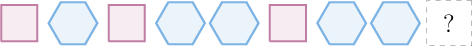
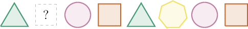
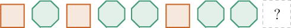
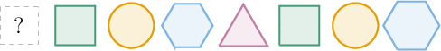
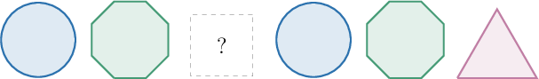

# Generating Patterns

- **Activity task:** `10848606`
- **Activity URL:** [Math Academy activity](https://www.mathacademy.com/students/43609/activity?taskId=10848606)
- **Related lesson:** [Generating Patterns](../../../elementary-school/lessons/grade-4/2430-generating-patterns.md)

> Raw task-page capture. It retains the page-visible prompts, mathematical expressions, instructional graphics, completion result, completion time, and elapsed time. The completed-attempt page did not expose a student response value for questions unless stated otherwise.

## KP 1. Finding a Missing Shape in a Shape Pattern

### Question 1.

**Prompt:** The rule for the pattern above is "one square, one hexagon, one square, two hexagons, ...," where the number of hexagons increases by 1 each time. What is the missing shape?

**Question graphic:**

**Result:** Incorrect
**Completed:** Mon, Jun 15th @ 8:10 PM
**Elapsed time:** 0:15
**Visible response value:** Not displayed on the completed task page.

### Question 2.

**Prompt:** The rule for the pattern above is "triangle, heptagon, circle, square, and repeat." What is the missing shape?

**Question graphic:**

**Result:** Correct
**Completed:** Mon, Jun 15th @ 8:10 PM
**Elapsed time:** 0:10
**Visible response value:** Not displayed on the completed task page.

### Question 3.

**Prompt:** The rule for the pattern above is "one square, one octagon, one square, two octagons, ...," where the number of octagons increases by 1 each time. What is the missing shape?

**Question graphic:**

**Result:** Incorrect
**Completed:** Mon, Jun 15th @ 8:10 PM
**Elapsed time:** 0:18
**Visible response value:** Not displayed on the completed task page.

### Question 4.

**Prompt:** The rule for the pattern above is "triangle, square, circle, hexagon, and repeat." What is the missing shape?

**Question graphic:**

**Result:** Correct
**Completed:** Mon, Jun 15th @ 8:12 PM
**Elapsed time:** 0:17
**Visible response value:** Not displayed on the completed task page.

### Question 5.

**Prompt:** The rule for the pattern above is "circle, octagon, triangle, and repeat." What is the missing shape?

**Question graphic:**

**Result:** Correct
**Completed:** Mon, Jun 15th @ 8:12 PM
**Elapsed time:** 0:06
**Visible response value:** Not displayed on the completed task page.

## KP 2. Finding a Missing Number in a Pattern

### Question 6.

**Prompt:** The rule for the pattern below is "subtract 7. " 29 , 22 , , 8 , 1 What is the missing number?

**Result:** Correct
**Completed:** Mon, Jun 15th @ 8:13 PM
**Elapsed time:** 1:00
**Visible response value:** Not displayed on the completed task page.

### Question 7.

**Prompt:** The rule for the pattern below is "subtract 3. " 22 , 19 , 16 , , 10 What is the missing number?

**Result:** Correct
**Completed:** Mon, Jun 15th @ 8:14 PM
**Elapsed time:** 0:29
**Visible response value:** Not displayed on the completed task page.

## KP 3. Finding Multiple Missing Numbers

### Question 8.

**Prompt:** The rule for the pattern below is "subtract 8. " What are the missing numbers? 89 , 81 , , 65 ,

**Result:** Correct
**Completed:** Mon, Jun 15th @ 8:15 PM
**Elapsed time:** 0:43
**Visible response value:** Not displayed on the completed task page.

### Question 9.

**Prompt:** The rule for the pattern below is "subtract 7. " What are the missing numbers? 162 , , 148 , , 134

**Result:** Correct
**Completed:** Mon, Jun 15th @ 8:15 PM
**Elapsed time:** 0:29
**Visible response value:** Not displayed on the completed task page.

## KP 4. Finding Numbers Appearing Later in a Pattern

### Question 10.

**Prompt:** The rule for the pattern below is "multiply by 3. " 1 , 3 , 9 If the pattern is continued, what will be the 4 th number?

**Result:** Incorrect
**Completed:** Mon, Jun 15th @ 8:16 PM
**Elapsed time:** 0:14
**Visible response value:** Not displayed on the completed task page.

### Question 11.

**Prompt:** The rule for the pattern below is "subtract 18. " 124 , 106 , 88 , 70 , 52 If the pattern is continued, what will be the 7 th number?

**Result:** Correct
**Completed:** Mon, Jun 15th @ 8:18 PM
**Elapsed time:** 2:24
**Visible response value:** Not displayed on the completed task page.

### Question 12.

**Prompt:** The rule for the pattern below is "subtract 8. " 49 , 41 , 33 , 25 , 17 If the pattern is continued, what will be the 7 th number?

**Result:** Correct
**Completed:** Mon, Jun 15th @ 8:19 PM
**Elapsed time:** 0:24
**Visible response value:** Not displayed on the completed task page.

