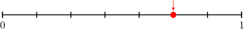

# Writing Fractions in Words

- **Activity task:** `10872868`
- **Activity URL:** [Math Academy activity](https://www.mathacademy.com/students/43609/activity?taskId=10872868)
- **Related lesson:** [Writing Fractions in Words](https://www.mathacademy.com/topics/3959)

> Raw task-page capture. It retains the page-visible prompts, mathematical expressions, instructional graphics, completion result, completion time, and elapsed time. The completed-attempt page did not expose a student response value for questions unless stated otherwise.

## KP 1. Expressing a Fraction With a Denominator Between 1 and 20 in Words

### Question 1.

**Prompt:** Write the fraction 7 11 in words.

**Result:** Incorrect
**Completed:** Tue, Jun 16th @ 4:25 PM
**Elapsed time:** 0:39
**Visible response value:** Not displayed on the completed task page.

### Question 2.

**Prompt:** Write the fraction 3 8 in words.

**Result:** Correct
**Completed:** Tue, Jun 16th @ 4:25 PM
**Elapsed time:** 0:24
**Visible response value:** Not displayed on the completed task page.

### Question 3.

**Prompt:** Write the fraction 2 15 in words.

**Result:** Correct
**Completed:** Tue, Jun 16th @ 4:25 PM
**Elapsed time:** 0:07
**Visible response value:** Not displayed on the completed task page.

## KP 2. Expressing a Fraction in Words Given a Model

### Question 4.

**Prompt:** In words, which fraction is represented by the model above?

**Question graphic:**

**Result:** Correct
**Completed:** Tue, Jun 16th @ 4:26 PM
**Elapsed time:** 0:36
**Visible response value:** Not displayed on the completed task page.

### Question 5.

**Prompt:** In words, which fraction is represented by the model above?

**Question graphic:**

**Result:** Correct
**Completed:** Tue, Jun 16th @ 4:26 PM
**Elapsed time:** 0:32
**Visible response value:** Not displayed on the completed task page.

## KP 3. Expressing a Fraction With a Denominator Greater Than 20 in Words

### Question 6.

**Prompt:** Write the fraction 8 93 in words.

**Result:** Incorrect
**Completed:** Tue, Jun 16th @ 4:27 PM
**Elapsed time:** 0:22
**Visible response value:** Not displayed on the completed task page.

### Question 7.

**Prompt:** Write the fraction 33 43 in words.

**Result:** Correct
**Completed:** Tue, Jun 16th @ 4:27 PM
**Elapsed time:** 0:19
**Visible response value:** Not displayed on the completed task page.

### Question 8.

**Prompt:** Write the fraction 23 100 in words.

**Result:** Incorrect
**Completed:** Tue, Jun 16th @ 4:28 PM
**Elapsed time:** 0:15
**Visible response value:** Not displayed on the completed task page.

### Question 9.

**Prompt:** Write the fraction 5 44 in words.

**Result:** Correct
**Completed:** Tue, Jun 16th @ 4:28 PM
**Elapsed time:** 0:28
**Visible response value:** Not displayed on the completed task page.

### Question 10.

**Prompt:** Write the fraction 7 57 in words.

**Result:** Correct
**Completed:** Tue, Jun 16th @ 4:28 PM
**Elapsed time:** 0:16
**Visible response value:** Not displayed on the completed task page.

