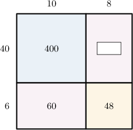
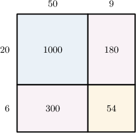
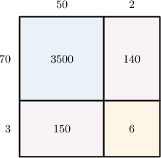
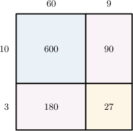

# Two-Digit by Two-Digit Multiplication Using Area Models

- **Activity task:** `10872999`
- **Activity URL:** [Math Academy activity](https://www.mathacademy.com/students/43609/activity?taskId=10872999)
- **Related lesson:** [Two-Digit by Two-Digit Multiplication Using Area Models](https://www.mathacademy.com/topics/2418)

> Raw task-page capture. It retains the page-visible prompts, mathematical expressions, instructional graphics, completion result, completion time, and elapsed time. The completed-attempt page did not expose a student response value for questions unless stated otherwise.

## KP 1. Completing an Area Model

### Question 1.

**Prompt:** Find the missing number in the area model above.

**Question graphic:**

**Result:** Correct
**Completed:** Thu, Jun 18th @ 4:15 PM
**Elapsed time:** 2:23
**Visible response value:** Not displayed on the completed task page.

### Question 2.

**Prompt:** From left to right and top to bottom, find the missing numbers in the area model above.

**Question graphic:**

**Result:** Correct
**Completed:** Thu, Jun 18th @ 4:16 PM
**Elapsed time:** 1:08
**Visible response value:** Not displayed on the completed task page.

## KP 2. Interpreting an Area Model

### Question 3.

**Prompt:** The area model above can be used to represent the following multiplication problem: 59 × 26 = . What is the missing number?

**Question graphic:**

**Result:** Correct
**Completed:** Thu, Jun 18th @ 4:26 PM
**Elapsed time:** 9:34
**Visible response value:** Not displayed on the completed task page.

### Question 4.

**Prompt:** The area model above represents the following multiplication problem. What is the missing number? 52 × 73 = 3 , 796

**Question graphic:**

**Result:** Incorrect
**Completed:** Thu, Jun 18th @ 4:29 PM
**Elapsed time:** 2:30
**Visible response value:** Not displayed on the completed task page.

### Question 5.

**Prompt:** The area model above can be used to represent the following multiplication problem: 73 × = 6 , 132. What is the missing number?

**Question graphic:**

**Result:** Correct
**Completed:** Thu, Jun 18th @ 4:30 PM
**Elapsed time:** 0:50
**Visible response value:** Not displayed on the completed task page.

### Question 6.

**Prompt:** The area model above represents the following multiplication problem. What is the missing number? 16 × 97 = 1 , 552

**Question graphic:**

**Result:** Incorrect
**Completed:** Thu, Jun 18th @ 4:34 PM
**Elapsed time:** 3:35
**Visible response value:** Not displayed on the completed task page.

### Question 7.

**Prompt:** The area model above can be used to represent the following multiplication problem: 69 × 13 = . What is the missing number?

**Question graphic:**

**Result:** Incorrect
**Completed:** Thu, Jun 18th @ 4:54 PM
**Elapsed time:** 19:26
**Visible response value:** Not displayed on the completed task page.

## KP 3. Using an Area Model To Multiply Two-Digit Numbers: With Scaffolding

## KP 4. Using an Area Model To Multiply Two-Digit Numbers

