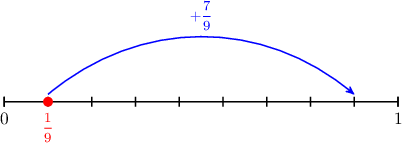
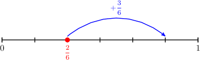
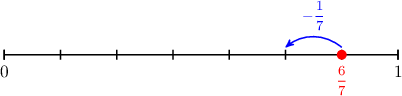

# Adding Fractions With Like Denominators Using Models

- **Activity task:** `10893769`
- **Activity URL:** [Math Academy activity](https://www.mathacademy.com/students/43609/activity?taskId=10893769)
- **Related lesson:** [Adding Fractions With Like Denominators Using Models](../../../elementary-school/lessons/grade-4/2370-adding-fractions-with-like-denominators-using-models.md)

> Raw task-page capture. It retains the page-visible prompts, mathematical expressions, instructional graphics, completion result, completion time, and elapsed time. The completed-attempt page did not expose a student response value for questions unless stated otherwise.

## KP 1. Adding Fractions Using Area Models

### Question 1.

**Prompt:** Use the model above to find the value of 2 7 + 2 7 . 2 7 + 2 7 = 4 7 .

**Question graphic:**

**Result:** Correct
**Completed:** Thu, Jun 18th @ 4:55 PM
**Elapsed time:** 0:21
**Visible response value:** Not displayed on the completed task page.

### Question 2.

**Prompt:** Use the model above to find a fraction that is equivalent to 1 6 + 2 6 .

**Question graphic:**

**Result:** Incorrect
**Completed:** Thu, Jun 18th @ 4:56 PM
**Elapsed time:** 1:24
**Visible response value:** Not displayed on the completed task page.

### Question 3.

**Prompt:** Using the model above, find the missing number in the following equality: 4 11 + 5 11 = 11 The missing number is 9 .

**Question graphic:**

**Result:** Correct
**Completed:** Thu, Jun 18th @ 4:57 PM
**Elapsed time:** 0:17
**Visible response value:** Not displayed on the completed task page.

### Question 4.

**Prompt:** Using the model above, find the missing number in the following equality: 5 12 + 2 12 = 12 The missing number is 7 .

**Question graphic:**

**Result:** Correct
**Completed:** Thu, Jun 18th @ 4:57 PM
**Elapsed time:** 0:09
**Visible response value:** Not displayed on the completed task page.

## KP 2. Subtracting Fractions Using Area Models

### Question 5.

**Prompt:** Use the model above to determine the number that is missing in the statement below. 8 10 − 3 10 = 10

**Question graphic:**

**Result:** Correct
**Completed:** Thu, Jun 18th @ 4:57 PM
**Elapsed time:** 0:08
**Visible response value:** Not displayed on the completed task page.

### Question 6.

**Prompt:** Use the model above to find a fraction that is equivalent to 3 4 − 1 4 .

**Question graphic:**

**Result:** Correct
**Completed:** Thu, Jun 18th @ 4:58 PM
**Elapsed time:** 0:31
**Visible response value:** Not displayed on the completed task page.

## KP 3. Adding and Subtracting Fractions Using Number Line Models

### Question 7.

**Prompt:** Use the number line above to solve the following addition problem. 1 9 + 7 9 = 8 9 .

**Question graphic:**

**Result:** Incorrect
**Completed:** Thu, Jun 18th @ 4:58 PM
**Elapsed time:** 0:19
**Visible response value:** Not displayed on the completed task page.

### Question 8.

**Prompt:** Given the number line above, find the value of 2 6 + 3 6 .

**Question graphic:**

**Result:** Correct
**Completed:** Thu, Jun 18th @ 4:59 PM
**Elapsed time:** 0:06
**Visible response value:** Not displayed on the completed task page.

### Question 9.

**Prompt:** Use the number line above to solve the following subtraction problem. 6 7 − 1 7 = 5 7

**Question graphic:**

**Result:** Correct
**Completed:** Thu, Jun 18th @ 4:59 PM
**Elapsed time:** 0:11
**Visible response value:** Not displayed on the completed task page.

