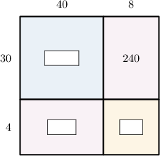
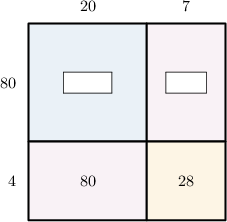
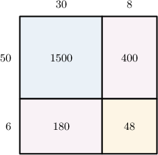
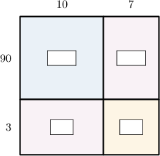
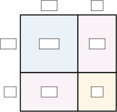
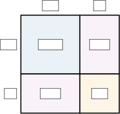

# Two-Digit by Two-Digit Multiplication Using Area Models

- **Activity task:** `11214722`
- **Activity URL:** [Math Academy activity](https://www.mathacademy.com/students/43609/activity?taskId=11214722)
- **Related lesson:** [Two-Digit by Two-Digit Multiplication Using Area Models](https://www.mathacademy.com/topics/2418)

> Raw task-page capture. It retains the page-visible prompts, mathematical expressions, instructional graphics, completion result, completion time, and elapsed time. The completed-attempt page did not expose a student response value for questions unless stated otherwise.

## KP 1. Completing an Area Model

### Question 1.

**Prompt:** Insert the missing numbers in the area model. 40 5 30 1200 150 9 360 45

**Result:** Incorrect
**Completed:** Tue, Jun 30th @ 7:24 PM
**Elapsed time:** 19:44
**Visible response value:** Not displayed on the completed task page.

### Question 2.

**Prompt:** From left to right and top to bottom, find the missing numbers in the area model above.

**Question graphic:**

**Result:** Correct
**Completed:** Tue, Jun 30th @ 7:36 PM
**Elapsed time:** 11:46
**Visible response value:** Not displayed on the completed task page.

### Question 3.

**Prompt:** From left to right, find the missing numbers in the area model above.

**Question graphic:**

**Result:** Correct
**Completed:** Tue, Jun 30th @ 7:40 PM
**Elapsed time:** 3:59
**Visible response value:** Not displayed on the completed task page.

## KP 2. Interpreting an Area Model

### Question 4.

**Prompt:** The area model above can be used to represent the following multiplication problem: 38 × 56 = . What is the missing number?

**Question graphic:**

**Result:** Correct
**Completed:** Tue, Jun 30th @ 7:44 PM
**Elapsed time:** 3:37
**Visible response value:** Not displayed on the completed task page.

### Question 5.

**Prompt:** The area model above can be used to represent the following multiplication problem: 93 × = 2 , 325. What is the missing number?

**Question graphic:**

**Result:** Correct
**Completed:** Tue, Jun 30th @ 7:47 PM
**Elapsed time:** 2:51
**Visible response value:** Not displayed on the completed task page.

## KP 3. Using an Area Model To Multiply Two-Digit Numbers: With Scaffolding

### Question 6.

**Prompt:** Using the area model above, find the value of 17 × 93.

**Question graphic:**

**Result:** Correct
**Completed:** Tue, Jun 30th @ 7:52 PM
**Elapsed time:** 2:57
**Visible response value:** Not displayed on the completed task page.

### Question 7.

**Prompt:** Using the area model above, find the value of 56 × 17.

**Question graphic:**

**Result:** Correct
**Completed:** Tue, Jun 30th @ 8:08 PM
**Elapsed time:** 6:59
**Visible response value:** Not displayed on the completed task page.

## KP 4. Using an Area Model To Multiply Two-Digit Numbers

### Question 8.

**Prompt:** Using the area model above, find the value of 16 × 11.

**Question graphic:**

**Result:** Correct
**Completed:** Tue, Jun 30th @ 8:10 PM
**Elapsed time:** 1:48
**Visible response value:** Not displayed on the completed task page.

### Question 9.

**Prompt:** Using the area model above, find the value of 73 × 64.

**Question graphic:**

**Result:** Correct
**Completed:** Tue, Jun 30th @ 8:15 PM
**Elapsed time:** 4:47
**Visible response value:** Not displayed on the completed task page.

