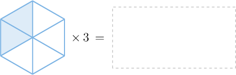
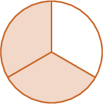

# Multiplying Fractions by Whole Numbers Using Models

- **Activity task:** `11290567`
- **Activity URL:** [Math Academy activity](https://www.mathacademy.com/students/43609/activity?taskId=11290567)
- **Related lesson:** [Multiplying Fractions by Whole Numbers Using Models](https://www.mathacademy.com/topics/3968)

> Raw task-page capture. It retains the page-visible prompts, mathematical expressions, instructional graphics, completion result, completion time, and elapsed time. The completed-attempt page did not expose a student response value for questions unless stated otherwise.

## KP 1. Representing a Product as a Repeated Addition

### Question 1.

**Prompt:** What picture is missing from the multiplication model above?

**Question graphic:**

**Result:** Correct
**Completed:** Sun, Jul 5th @ 9:59 AM
**Elapsed time:** 0:51
**Visible response value:** Not displayed on the completed task page.

### Question 2.

**Prompt:** What picture is missing from the multiplication model above?

**Question graphic:**

**Result:** Correct
**Completed:** Sun, Jul 5th @ 10:00 AM
**Elapsed time:** 0:14
**Visible response value:** Not displayed on the completed task page.

## KP 2. Multiplying a Fraction by a Whole Number Using Repeated Addition

### Question 3.

**Prompt:** Use the model above to calculate 3 × 2 8 .

**Question graphic:**

**Result:** Correct
**Completed:** Sun, Jul 5th @ 10:00 AM
**Elapsed time:** 0:29
**Visible response value:** Not displayed on the completed task page.

### Question 4.

**Prompt:** Using the model above, express the following multiplication problem as a fraction: 2 3 × 4 = 8 3

**Question graphic:**

**Result:** Correct
**Completed:** Sun, Jul 5th @ 10:01 AM
**Elapsed time:** 0:46
**Visible response value:** Not displayed on the completed task page.

## KP 3. Multiplying a Fraction by a Whole Number by Repeating the Shaded Parts

### Question 5.

**Prompt:** What number is missing from the multiplication problem above?

**Question graphic:**

**Result:** Correct
**Completed:** Sun, Jul 5th @ 10:02 AM
**Elapsed time:** 0:35
**Visible response value:** Not displayed on the completed task page.

### Question 6.

**Prompt:** The missing number in the multiplication problem above is 7 .

**Question graphic:**

**Result:** Correct
**Completed:** Sun, Jul 5th @ 10:05 AM
**Elapsed time:** 2:51
**Visible response value:** Not displayed on the completed task page.

