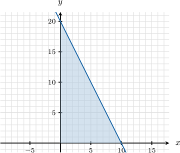
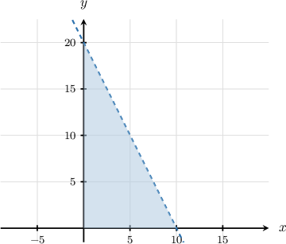
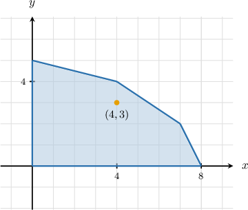

# Modeling With Two-Variable Linear Inequalities

Source: https://www.mathacademy.com/topics/1320?courseId=44
Topic ID: 1320

## Prerequisites

- [Systems of Linear Inequalities](./1535-systems-of-linear-inequalities.md)
- [Modeling With Two-Step Inequalities](./1603-modeling-with-two-step-inequalities.md)
- [Modeling Totals Using Two-Variable Linear Equations](./6086-modeling-totals-using-two-variable-linear-equations.md)

## Lesson

### Introduction

Many real-world problems involve two quantities that must satisfy certain limits at the same time, like staying under a budget while mixing two items. Two-variable inequalities help model these situations.

For example, suppose Marie wants to buy some gifts for her friends. Her budget is $90,$ and she has narrowed the gifts down to two possibilities:

- calendars, each costing $18,$ and

- battery packs, each costing $15.$

Can we form a mathematical statement describing all possible combinations of calendars and battery packs Marie can purchase?

Let $c$ be the number of calendars and $b$ the number of battery packs Marie purchases. Then, the total amount (in dollars) she will pay is given by the expression

$$

18c+15b.

$$

Marie's budget is $ 90.$ This means that the expression above can be no greater than $90.$ Therefore,

$$

18c+15b \leq 90.

$$

We can simplify this inequality by dividing both sides by $3.$ This gives

$$

6c+5b \leq 30.

$$

### Example: Representing Situations Using Two-Variable Inequalities

#### Question

One-fifth of a number ($x$) minus one-quarter of another number ($y$) is less than $1.$ Find an inequality that represents the relationship described.

#### Explanation

The expression "one-fifth of a number ($x$) minus one-quarter of another number ($y$)" can be written as

$$

\dfrac{1}{5}x-\dfrac{1}{4}y.

$$

We're told that this difference is ** $1.$ Therefore, we obtain

$$

\dfrac{1}{5}x-\dfrac{1}{4}y <1.

$$

We can simplify this inequality by multiplying it by $20,$ as follows:

$$

\begin{aligned}\frac{1}{5}𝑥−\frac{1}{4}𝑦 & <1 \\ 20⋅(\frac{1}{5}𝑥−\frac{1}{4}𝑦) & <20⋅1 \\ 4𝑥−5𝑦 & <20\end{aligned}

$$

### Determining a Feasible Region

A graph is often the best way to represent the solution to a system of two-variable linear inequalities. We'll illustrate with an example.

Suppose Mr. Cook is preparing cakes for a bake sale. He has a total budget of $120$ for all the ingredients. Each chocolate cake costs $12$ to make, and each sponge cake costs $6.$ Let's formulate this situation as a two-variable inequality, and plot its solution on a graph.

Let $x$ be the number of chocolate cakes he makes and let $y$ be the number of sponge cakes. Since he has a total budget of $120,$ we have the following inequality:

$$

12x + 6y \leq 120

$$

By dividing both sides of this inequality by $6,$ we get

$$

2x+y \leq 20.

$$

To plot this inequality, we will first convert the inequality into slope-intercept form. This gives

$$

\begin{aligned}𝑦≤−2𝑥+20.\end{aligned}

$$

Let's now draw the region.

- Since the inequality involves a 'less than or equal to' sign, the line $y = -2x + 20$ is part of the solution. Therefore, we draw a solid line.

- Then, we must decide whether to shade above or below the line. The inequality $y \leq -2x + 20$ refers to the $y$-values that are *less than* or equal to those on the line $y = -2x +20.$ So, we shade *below* the line.

- Lastly, because $x$ and $y$ cannot be negative (we cannot bake a negative number of cakes), we limit our shading to the first quadrant.

Therefore, we get the following graph:

### Interpreting a Feasible Region

When modeling situations in context, the solution (i.e., the shaded part of the graph) is called the **feasible region.** Any point inside the feasible region is a potential solution to our problem.

To understand this, let's go back to the feasible region for Mr. Cook's bake sale.

- If Mr. Cook wants to make $5$ chocolate and $5$ sponge cakes, then our solution tells us that this is a possibility since the point $(5,5)$ lies in the feasible region:

- However, if Mr. Cook wants to make $10$ chocolate and $5$ sponge cakes, our solution tells us that this is *not* a possibility since the point $(10,5)$ does *not* lie in the feasible region:

### Example: Representing a Situation in Context With a Graph

#### Question

An event planner rents tables and chairs. Each table costs $70$ and each chair costs $35.$ Let $x$ be the number of tables rented and $y$ be the number of chairs rented.

Which of the following shaded regions represents all possible combinations $(x,y)$ if the total rental cost must be **** $700?$

#### Explanation

The total cost of renting is $70x + 35y.$ Since the event planner's budget is less than $700,$ we have the following inequality:

$$

\begin{aligned}70𝑥+35𝑦 & <700\end{aligned}

$$

To plot this inequality, we will first convert the inequality into slope-intercept form:

$$

\begin{aligned}70𝑥+35𝑦 & <700 \\ 2𝑥+𝑦 & <20 \\ 𝑦 & <−2𝑥+20\end{aligned}

$$

Let's now draw the region.

- Since the inequality involves a 'less than' sign, the line $y = -2x + 20$ is not part of the solution. Therefore, we draw a dashed line.

- Then, we must decide whether to shade above or below the line. The inequality $y \lt -2x + 20$ refers to the $y$-values that are ** those on the line $y = -2x + 20.$ So, we shade ** the line.

- Lastly, because $x$ and $y$ cannot be negative, we limit our shading to the first quadrant.

### Example: Interpreting the Feasible Region

#### Question

An artist sells sculptures and paintings for $1\,600$ and $1\,200$ each, respectively. Let $x$ denote the number of sculptures and $y$ denote the number of paintings the artist can create in a month. The feasible region representing the constraints on $x$ and $y$ is shown below.

A local art gallery wishes to place an order for $4$ sculptures and $3$ paintings in a month. Can the artist fulfill this order? If so, how much revenue would he make?

#### Explanation

Let's answer the questions in turn.

- To determine whether the artist can fulfill the order, we need to test if the point $(4,3)$ belongs to the feasible region. The graph shows that $(4,3)$ belongs to the region. Therefore, the artist can fulfill the order.

- Selling $x=4$ sculptures and $y=3$ paintings, the artist obtains a revenue of
