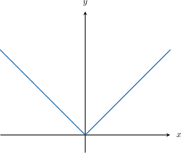
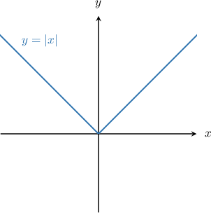
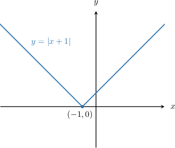
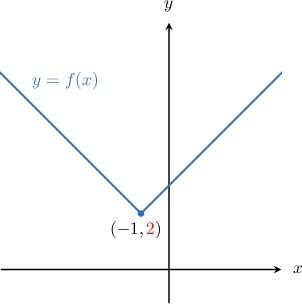
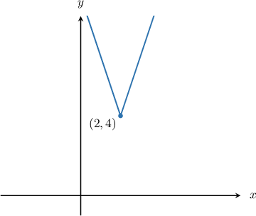
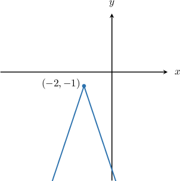

# Domain and Range of Absolute Value Functions

Source: https://www.mathacademy.com/topics/1884?courseId=44
Topic ID: 1884

## Prerequisites

- [Combining Transformations of Absolute Value Graphs](./3559-combining-transformations-of-absolute-value-graphs.md)
- [The Range of a Function: Advanced Cases](./3728-the-range-of-a-function-advanced-cases.md)
- [Further Solving Linear Inequalities](../prealgebra/4034-further-solving-linear-inequalities.md)

## Lesson

### Introduction

Let's consider the function $y=|x|,$ shown below.

Notice that this function is defined for all values of $x.$ Therefore, its domain is

$$

x \in (-\infty, \infty).

$$

The domain of an absolute value function does not change whenever we shift or stretch the function. For example, the domain of

$$

f(x) = 2|x-1| + 3

$$

is also $x \in (-\infty, \infty).$

### Example: Finding the Domain of a Transformed Absolute Value Function

#### Question

What is the domain of the function $f(x)=-|x|-5?$

#### Explanation

A shifted and reflected absolute value function is defined for all real numbers.

Therefore, the domain of $f(x)$ is $x\in(-\infty,\infty).$

### The Range of a Transformed Absolute Value Function

The range of an absolute value function can change depending on the types of transformations applied to the function.

As an example, let's determine the range of the following function:

$$

f(x) = |x+1|+2

$$

We'll plot $f(x)$ using graph transformations and then deduce its range from the graph.

Let's start with the function $y=|x|\mathbin{:}$

To plot $y=|x+1|,$ we shift the graph of $y=|x|$ by one unit to the left:

Finally, we plot $y = f(x) = |x+1| + 2$ by shifting the graph above *up* by two units:

From here, we see that $f(x)$ has a minimum value of ${\color{red}{2}},$ and there is no maximum value. Therefore, its range is $f(x) \in [2,\infty).$

### Deducing the Range By Manipulating Inequalities

Deducing the range of an absolute value function using graph transformations will get us the correct answer. However, there is a faster way.

Let's once again calculate the range of the function

$$

f(x) = |x+1| + 2.

$$

First, we recall that the range of $|x|$ is given by

$$

|x| \ge 0.

$$

We know that horizontal shifts do not affect the range. So,

$$

|x+1| \ge 0.

$$

Finally, adding $2$ to the above inequality, we get

$$

\begin{aligned}|𝑥+1| & ≥0 \\ |𝑥+1|+2 & ≥2 \\ 𝑓(𝑥) & ≥2.\end{aligned}

$$

Therefore, the range is $f(x) \in [2,\infty),$ as before.

### Example: Finding the Range of a Transformed Absolute Value Function

#### Question

What is the range of $f(x) = 3|x-2|+4?$

#### Explanation

The range of $|x|$ is given by

$$

|x| \ge 0.

$$

Horizontal shifts do not affect the range. So,

$$

|x-2| \ge 0.

$$

Multiplying the above inequality by $3,$ we get

$$

\begin{aligned}3⋅|𝑥−2|≥3⋅0 \\ 3|𝑥−2|≥0.\end{aligned}

$$

Finally, by adding $4$ to the above inequality, we get

$$

\begin{aligned}3|𝑥−2| & ≥0 \\ 3|𝑥−2|+4 & ≥4 \\ 𝑓(𝑥) & ≥4.\end{aligned}

$$

Therefore, the range of the given function is $f(x) \in [4,\infty).$

We can also see this is true from the graph of the function. The graph of $y=f(x)$ is shown below.

### Example: Finding the Range of a Transformed Absolute Value Function: Negative Multiple Case

#### Question

What is the range of $f(x) = -3|x+2|-1?$

#### Explanation

The range of $-|x|$ is

$$

-|x| \le 0.

$$

Horizontal shifts do not affect the range. So, we have

$$

-|x+2| \le 0.

$$

Multiplying the above inequality by $3,$ we get

$$

-3|x+2| \le 0.

$$

Finally, subtracting $1$ from the above inequality, we get

$$

\begin{aligned}−3|𝑥+2|−1 & ≤−1 \\ 𝑓(𝑥) & ≤−1.\end{aligned}

$$

Therefore, the range of the given function is $f(x) \in (-\infty,-1].$

We can also see that this is true from the graph of the function. The graph of $y=f(x)$ is shown below.

