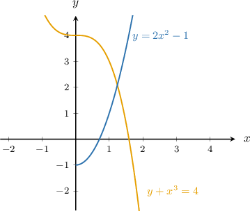
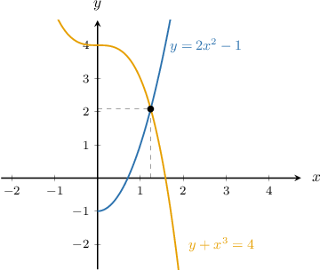
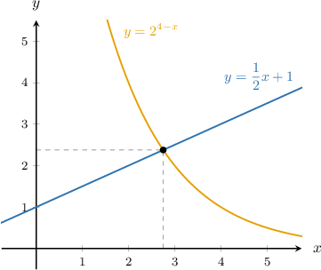
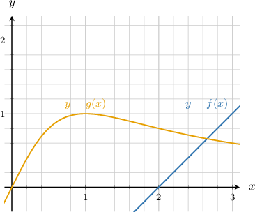
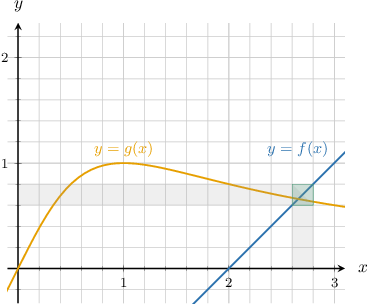

# Approximating Solutions to Systems of Nonlinear Equations

Source: https://www.mathacademy.com/topics/2224?courseId=44
Topic ID: 2224

## Prerequisites

- [Solving Systems of Nonlinear Equations Using Graphs](./101-solving-systems-of-nonlinear-equations-using-graphs.md)
- [Approximating Solutions to Systems of Linear Equations](./136-approximating-solutions-to-systems-of-linear-equations.md)
- [Evaluating Algebraic Radical Expressions](./2184-evaluating-algebraic-radical-expressions.md)
- [Degrees of Accuracy](./2234-degrees-of-accuracy.md)

## Lesson

### Introduction

When seeking an approximate solution to a nonlinear system of equations, the first thing we should do is sketch a graph of the system and get a visual approximation for the intersection point.

For example, suppose we wish to seek an approximate solution to the following system of equations:

$$

\begin{aligned}𝑦=\frac{1}{2}𝑥+1 \\ 𝑦=2^{4−𝑥}\end{aligned}

$$

The solution of this system corresponds to the point of intersection of the two curves shown below.

The diagram suggests that $x\approx 2.7$ and $y\approx 2.4$ is an approximate solution.

At this stage, we're simply making a visual estimate based on the graph. We don't know if $x$ is closer to $2.7$ or $2.8,$ for example. We'll learn how to improve our estimate later in this lesson.

### Example: Approximating the Solution to a System of Nonlinear Equations Using a Graph

#### Question

Using the graph, find an approximate solution to the system of equations below.

$$

\begin{aligned}𝑦+𝑥^{3}=4 \\ 𝑦=2𝑥^{2}−1\end{aligned}

$$

#### Explanation

The solution to the system of equations corresponds to the point of intersection of the two curves.

From the graph, we see that $x \approx 1.2$ and $y \approx 2.1$ is an approximate solution.

### Improving an Approximate Solution

Let's return to the following system of equations:

$$

\begin{aligned}𝑦=\frac{1}{2}𝑥+1 \\ 𝑦=2^{4−𝑥}\end{aligned}

$$

As we saw, the solution of this system corresponds to the intersection of the two curves shown below.

Earlier, we gave $x\approx 2.7$ as an approximate solution, but this was a rough guess. We now wish to improve on this solution.

If we look again, the diagram suggests that the $x$-value at the intersection point lies somewhere between $2.5$ and $3.$ So, some good candidates for our approximate solution (to one decimal place) are

$$

2.6, \qquad 2.7, \qquad 2.8, \qquad 2.9, \qquad 3.0.

$$

To see which of these give the best solution, we define the functions $f(x)$ and $g(x)$ as

$$

f(x)=\dfrac12x + 1, \qquad g(x)=2^{4-x}.

$$

The $x$-coordinate of the intersection point corresponds to the solution of

$$

f(x)=g(x)

$$

which is equivalent to

$$

f(x) - g(x) = 0.

$$

Next, we create a table of values, as follows:

To determine which of our candidates gives the best approximation to our system, we compute the **error** for each candidate, given by $|f(x)-g(x)|.$ Since our system is equivalent to $f(x) - g(x) = 0,$ the error should be small near the intersection point.

Filling in our table of values, we get the following:

The smallest error is $0.10,$ given by the value $x=2.8.$

Therefore, among the given options, the best approximation to the system is $x=2.8.$

### Example: Approximating the Intersection of Two Functions Using a Table of Values

#### Question

Consider the following functions:

$$

f(x)=8-x, \qquad g(x)=\sqrt[3]{50x}

$$

By filling the empty cells in the table below, find an approximate solution to $f(x)=g(x).$

#### Explanation

We fill in the table and get the following result:

The expression $|f(x)-g(x)|$ gives the error. The smallest error is $0.01,$ given by the value $x=2.8.$

Therefore, among the given options, the best approximation to the solution is $x=2.8.$

### Using Upper and Lower Bounds

Many simple-looking equations cannot be solved using algebra. In such cases, we can only approximate the solution. Therefore, we need a test to determine whether a given solution is correct to an appropriate degree of accuracy. What test can we use for this?

For example, suppose we wish to solve $f(x) = g(x),$ where the functions $f(x)$ and $g(x)$ are defined as

$$

f(x) = x^3, \qquad g(x) = 3^{-x}.

$$

Rounded to one decimal place, the solution is $x\approx 0.8.$ To test this claim, we first consider the lower and upper bounds of $0.8\mathbin{:}$

- the lower bound of $0.8$ is $0.8 - 0.05 = 0.75,$ and

- the upper bound of $0.8$ is $0.8 + 0.05 = 0.85.$

Remember that $f(x) = g(x)$ is equivalent to $f(x) - g(x) = 0.$ So, to test that $x\approx 0.8$ rounded to one decimal place, we compute $f(x) - g(x)$ for both the upper and lower bound and look for a change in sign:

Computing $f(x) - g(x)$ at the lower bound, we get

$$

\begin{aligned}𝑓(0.75)−𝑔(0.75) & =0.75^{3}−3^{−0.75} \\ ≈−0.02 & \end{aligned}

$$

which is *negative*.

Then, we compute $f(x) - g(x)$ at the upper bound. We get

$$

\begin{aligned}𝑓(0.85)−𝑔(0.85) & =0.85^{3}−3^{−0.85} \\ ≈0.22 & \end{aligned}

$$

which is *positive*.

Since there is a change in sign, this confirms that the solution to the equation $f(x) = g(x)$ is $x\approx 0.8,$ rounded to one decimal place.

Finally, it can be shown that the "exact" solution to the equation is

$$

x =0.757\,696\,978\,830\,077\,\ldots\,.

$$

### Example: Approximating the Intersection of Two Functions to One Decimal Place

#### Question

Consider the diagram above, where the functions $f(x)$ and $g(x)$ are defined as

$$

f(x) = x-2, \qquad g(x) = \dfrac{2x}{x^2 + 1}.

$$

By creating a table of values, find, to one decimal place, a solution to the equation $f(x) = g(x).$

#### Explanation

From the graph, we identify that the point of intersection lies between $x=2.6$ and $x=2.8.$ So, we create a table of values as follows:

It appears from the table that the solution to $f(x) = g(x)$ is $x \approx 2.7,$ rounded to one decimal place.

We can verify that this the case by computing $f(x) - g(x)$ for the upper and lower bounds of $x\approx 2.7$ and checking for a change in sign:

$$

\begin{aligned}𝑓(2.65)−𝑔(2.65) & =(2.65−2)−\frac{2(2.65)}{(2.65)^{2}+1} \\ & ≈−0.01<0 \\ 𝑓(2.75)−𝑔(2.75) & =(2.75−2)−\frac{2(2.75)}{(2.75)^{2}+1} \\ & ≈0.11>0\end{aligned}

$$

Since there is a change in sign, we can conclude that $x \approx 2.7,$ rounded to one decimal place.
