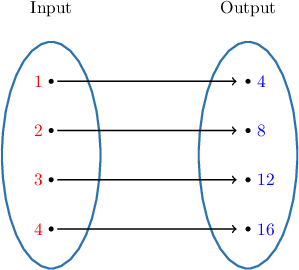

# Introduction to Sequences

Source: https://www.mathacademy.com/topics/2271?courseId=44
Topic ID: 2271

## Prerequisites

- [The Domain of a Function](./802-the-domain-of-a-function.md)

## Lesson

### Introduction

A **sequence** is a list of numbers.

For example, the following list of numbers is a sequence:

$$

{\color{blue}{4}},\qquad {\color{blue}{8}},\qquad {\color{blue}{12}},\qquad {\color{blue}{16}}

$$

The numbers in a sequence are called **terms**. For this sequence:

- the **first term** is ${\color{blue}{4}}$

- the **second term** is ${\color{blue}{8}}$

- the **third term** is ${\color{blue}{12}}$

- the **fourth term** is ${\color{blue}{16}}.$ This is also called the **last term** of the sequence.

### Example: Identifying the Terms of a Sequence Given as a List

#### Question

What is the sum of the first and last terms of the following sequence?

$$

3,\quad-5,\quad7,\quad-9,\quad11,\quad-13,\quad15

$$

#### Explanation

The first term is $3$ and the last term is $15.$ Their sum is $3+15 = 18.$

### Sequences as Functions

Let's return to the following sequence:

$$

{\color{blue}{4}},\qquad {\color{blue}{8}},\qquad {\color{blue}{12}},\qquad {\color{blue}{16}}

$$

For this sequence:

- the ${\color{red}{1}}$st term is ${\color{blue}{4}}$

- the ${\color{red}{2}}$nd term is ${\color{blue}{8}}$

- the ${\color{red}{3}}$rd term is ${\color{blue}{12}}$

- the ${\color{red}{4}}$th term is ${\color{blue}{16}}$

We can represent our sequence using a mapping diagram, as shown below.

The input values refer to the position of each term in the sequence.

Notice that each input value is mapped to one (and only one) output value. Therefore, this sequence is also a *function*, which we can call $f({\color{red}{n}}).$ For sequences, we usually use the letter $n$ instead of $x$ for the input variable.

So, for this function, we have the following input and output values:

$$

\begin{aligned}𝑓(1) & =4 \\ 𝑓(2) & =8 \\ 𝑓(3) & =12 \\ 𝑓(4) & =16\end{aligned}

$$

### Sequences With No Last Term

Let's find the sequence generated by the following function:

$$

f({\color{red}{n}}) = {\color{red}{n}} + 1

$$

We can find the first five terms of this sequence by substituting ${\color{red}{n}} = {\color{red}{1}},{\color{red}{2}}, {\color{red}{3}},{\color{red}{4}},{\color{red}{5}}$ into the function.

$$

\begin{aligned}𝑓(1) & =1+1=2 \\ 𝑓(2) & =2+1=3 \\ 𝑓(3) & =3+1=4 \\ 𝑓(4) & =4+1=5 \\ 𝑓(5) & =5+1=6\end{aligned}

$$

Therefore, this function generates the following sequence:

$$

{\color{blue}{2}},\qquad {\color{blue}{3}},\qquad {\color{blue}{4}},\qquad {\color{blue}{5}}, \qquad {\color{blue}{6}}, \qquad \ldots

$$

The "$\ldots$" at the end tells us this sequence continues forever. In other words, this sequence has no last term!

If we want to find, say, the ${\color{red}{100}}$th term of the sequence, we simply substitute ${\color{red}{n}}= {\color{red}{100}}$ into our function:

$$

f({\color{red}{100}}) = {\color{red}{100}} + 1 = {\color{blue}{101}}

$$

Therefore, the ${\color{red}{100}}$th term of the sequence is ${\color{blue}{101}}.$

We usually need to specify which values of ${\color{red}{n}}$ are allowed to be used in our function. To do this, we can write our function as follows:

$$

f({\color{red}{n}}) = {\color{red}{n}} + 1, \qquad {\color{red}{n}} \geq 1

$$

The statement ${\color{red}{n}} \geq 1$ specifies the function's *domain*. It tells us we can input integer values greater than or equal to $1$ into our function.

Finally, since every term of the sequence can be generated using our function, we say that $f({\color{red}{n}})$ *generates the ${\color{red}{n}}$th term of the sequence*.

### Example: Computing the Terms of a Sequence Using Function Notation

#### Question

Which of the following statements is true regarding the sequence $f(n) =5-2n$ for $n\geq 1?$

1. Its second term is larger than the first term

2. Its third term is $-1$

3. Its last term is $-5$

#### Explanation

Let's look at each statement in turn:

- The first and second terms of the sequence are represented by $f(1)$ and $f(2),$ respectively. We can compute these values using the rule $f(n) = 5-2n,$ as follows; We see that the second term $f(2)=1$ is smaller than the first term $f(1)=3.$ Therefore, statement I is false.

- We compute the third term as follows: Therefore, statement II is true.

- The sequence is defined for $n\geq 1,$ which means that there is no limit to how large $n$ can be. There is no last term, because the sequence keeps going on forever. Therefore, statement III is false.

In conclusion, only statement II is true.

### Sequence Notation

Let's consider the following sequence once more:

$$

{\color{blue}{2}},\qquad {\color{blue}{3}},\qquad {\color{blue}{4}},\qquad {\color{blue}{5}}, \qquad {\color{blue}{6}}, \qquad \ldots

$$

Mathematicians sometimes prefer not to use function notation when describing sequences. The alternative is to use **sequence notation**. With sequence notation, we refer to the ${\color{red}{n}}$th term of the sequence as $a_{\color{red}{n}}.$

So for the sequence listed above, we have:

$$

\begin{aligned}𝑎_{1} & =2 \\ 𝑎_{2} & =3 \\ 𝑎_{3} & =4 \\ 𝑎_{4} & =5 \\ 𝑎_{5} & =6\end{aligned}

$$

Recall that we were able to express this sequence using function notation as follows:

$$

f({\color{red}{n}}) = {\color{red}{n}}+1, \qquad n\geq 1

$$

In sequence notation, the formula looks similar:

$$

a_{\color{red}{n}} = {\color{red}{n}}+1, \qquad n\geq 1

$$

We can calculate the ${\color{red}{99}}$th term of our sequence by substituting ${\color{red}{n}}=99$ into the expression $a_{\color{red}{n}}{:}$

$$

a_{\color{red}{99}} = {\color{red}{99}}+1 = {\color{blue}{100}}

$$

Therefore, the ${\color{red}{99}}$th term of our sequence is ${\color{blue}{100}}.$

### Example: Computing the Terms of a Sequence Using Sequence Notation

#### Question

A sequence is defined as $a_n =n^2$ for $n\geq 1.$ What is the sum of its second and third terms?

#### Explanation

Using $a_n$ notation, the second and third terms are $a_2$ and $a_3,$ respectively.

We can compute these values using the rule $a_n=n^2,$ as follows:

$$

\begin{aligned}𝑎_{2} & =2^{2}=4 \\ 𝑎_{3} & =3^{2}=9\end{aligned}

$$

So, the sum of the second and third terms is

$$

a_2+a_3=4+9=13.

$$
