# Compound AND Inequalities

Source: https://www.mathacademy.com/topics/350?courseId=44
Topic ID: 350

## Prerequisites

- [Intersections of Intervals](./347-intersections-of-intervals.md)
- [Solving Compound Inequalities](./388-solving-compound-inequalities.md)

## Lesson

### Introduction

Suppose we want to find all of the values of $x$ that satisfy *both* $3x+9 \geq 0$ *and* $2x \leq -2$ simultaneously.

To do this, we solve each inequality individually and then compute the intersection of the two solutions.

- We start by solving $3x + 9 \geq 0\mathbin{:}$ The solution to this inequality is shown on the number line below.

- Then, we solve $2x \leq -2\mathbin{:}$ The solution to this inequality is shown on the number line below.

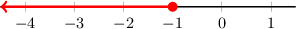

To find the values of $x$ that satisfy both inequalities, we find where the two solutions overlap:

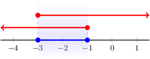

Thus, the final solution is $\color{blue}-3 \leq x \leq -1.$

### Example: Finding the Intersection of Two Inequalities

#### Question

Find the values of $x$ that satisfy $2x - 5 \leq 1$ and $7x +11 < -3.$

#### Explanation

To solve compound "and" inequalities, we solve each inequality separately and then find their intersection.

- We start by solving $2x - 5 \leq 1$:

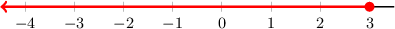

- Then, we solve $7x +11 < -3$:

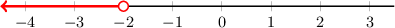

To find the values of $x$ that satisfy both inequalities, we find where the two solutions overlap:

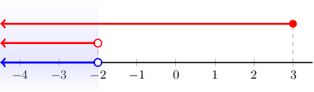

Thus, the final solution is $x < -2.$

### Example: Solving Systems of Inequalities

#### Question

What is the solution to the following system of inequalities?

$$

\begin{aligned}5𝑥−35≥0 \\ 7𝑥>21\end{aligned}

$$

#### Explanation

To solve the system, we need to find the values of $x$ that satisfy both $5x-35 \geq 0$ and $7x > 21$ simultaneously.

- First, we solve $5x-35 \geq 0\mathbin{:}$

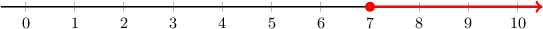

- Then, we solve $7x > 21\mathbin{:}$

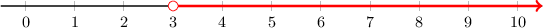

To find the values of $x$ that satisfy both inequalities, we find where the two solutions overlap:

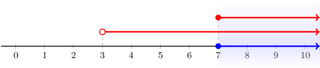

Thus, the final solution is $x \geq 7.$

### Example: Flipping the Sign of an Inequality in a System

#### Question

What is the solution to the following system of inequalities?

$$

\begin{aligned}2−7𝑥≥2 \\ 10𝑥−3≥7\end{aligned}

$$

#### Explanation

To solve the system, we need to find the values of $x$ that satisfy both $2-7x \geq 2$ and $10x-3 \geq 7$ simultaneously.

- First, we solve $2-7x \geq 2\mathbin{:}$

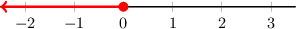

- Then, we solve $10x-3 \geq 7\mathbin{:}$

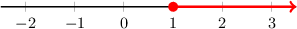

To find the values of $x$ that satisfy both inequalities, we find where the two solutions overlap:

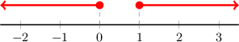

It turns out that the solutions do not overlap at all. Therefore, no values of $x$ satisfy both inequalities simultaneously. So, there is no solution.

### Example: Systems Containing Compound Inequalities

#### Question

Find the set of values of $x$ that satisfy $1 \lt 3x-2 \leq 7$ and $2-3x \leq -4.$

#### Explanation

To solve compound "and" inequalities, we solve each inequality separately and then find their intersection.

- First, we solve $1 \lt 3x-2 \leq 7 \,\mathbin{:}$

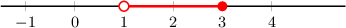

- Then, we solve $2-3x \leq -4 \,\mathbin{:}$

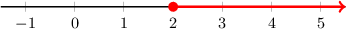

To find the values of $x$ that satisfy both inequalities, we find where the two solutions overlap:

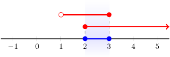

Thus, the final solution is $x \in [2,3].$
