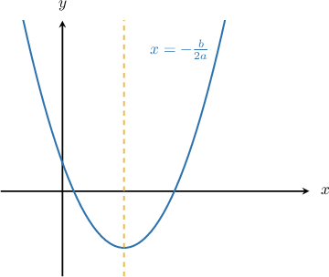

# Writing the Equation of a Parabola in Vertex Form

Source: https://www.mathacademy.com/topics/3546?courseId=44
Topic ID: 3546

## Prerequisites

- [The Vertex Form of a Parabola](./814-the-vertex-form-of-a-parabola.md)
- [Completing the Square With Leading Coefficients](./3824-completing-the-square-with-leading-coefficients.md)

## Lesson

### Introduction

Recall that the vertex form of a parabola is

$$

y=a(x-h)^2 + k,

$$

where $(h,k)$ are the coordinates of the parabola's vertex.

If we are given the equation of a parabola in standard form, we can obtain its vertex form by completing the square.

For example, consider the parabola

$$

y= x^2+6x+16.

$$

To express the equation of this parabola in vertex form, we complete the square, as follows:

$$

\begin{aligned}𝑦 & =𝑥^{2}+6𝑥+16 \\ & =𝑥^{2}+2⋅3⋅𝑥+16 \\ & =𝑥^{2}+2⋅3⋅𝑥+3^{2}−3^{2}+16 \\ & =(𝑥^{2}+2⋅3⋅𝑥+3^{2})−3^{2}+16 \\ & =(𝑥+3)^{2}−3^{2}+16 \\ & =(𝑥+3)^{2}−9+16 \\ & =(𝑥+3)^{2}+7\end{aligned}

$$

Expressed in vertex form, the equation of the parabola is

$$

\begin{aligned}𝑦 & =(𝑥−(−3))^{2}+7.\end{aligned}

$$

Therefore, the vertex of the parabola is at the point $({\color{blue}-3},{\color{red}7}).$

### Example: Writing the Equation of a Parabola in Vertex Form

#### Question

Write the parabola $y=x^2-20x+20$ in vertex form.

#### Explanation

To express the equation of the parabola in vertex form, we need to complete the square, as follows:

$$

\begin{aligned}𝑦 & =𝑥^{2}−20𝑥+20 \\ & =𝑥^{2}−2⋅10⋅𝑥+20 \\ & =𝑥^{2}−2⋅10⋅𝑥+10^{2}−10^{2}+20 \\ & =(𝑥^{2}−2⋅10⋅𝑥+10^{2})−10^{2}+20 \\ & =(𝑥−10)^{2}−10^{2}+20 \\ & =(𝑥−10)^{2}−100+20 \\ & =(𝑥−10)^{2}−80\end{aligned}

$$

Therefore, expressed in vertex form, the equation of the parabola is $y=(x-10)^2 - 80.$

### Example: Writing the Equation of a Parabola With Leading Coefficients in Vertex Form

#### Question

Write the equation of the parabola $y=2x^2 - 12x + 2$ in vertex form.

#### Explanation

To express the equation of the parabola in vertex form, we need to complete the square.

First, we take out a factor of $2$ from the entire expression:

$$

2x^2 - 12x + 2 = 2(x^2 - 6x + 1)

$$

Now, we complete the square for the expression inside the parentheses:

$$

\begin{aligned}𝑥^{2}−6𝑥+1 & =𝑥^{2}−2⋅3⋅𝑥+1 & \\ & =𝑥^{2}−2⋅3⋅𝑥+3^{2}−3^{2}+1 & \\ & =(𝑥^{2}−2⋅3⋅𝑥+3^{2})−3^{2}+1 & \\ & =(𝑥−3)^{2}−3^{2}+1 & \\ & =(𝑥−3)^{2}−9+1 & \\ & =(𝑥−3)^{2}−8 & \end{aligned}

$$

Finally, we substitute this result back into our original expression:

$$

\begin{aligned}2(𝑥^{2}−6𝑥+1) & =2((𝑥−3)^{2}−8) \\ & =2(𝑥−3)^{2}−16\end{aligned}

$$

Therefore, expressed in vertex form, the equation of the parabola is $y=2(x-3)^2 - 16.$

### Example: Finding the Equation of a Parabola Given Its Vertex and Leading Coefficient

#### Question

Find the equation of the parabola whose vertex is $(1, 2)$ and whose leading coefficient is $5.$

#### Explanation

Remember that the vertex form of a parabola is

$$

y = a(x-h)^2 + k,

$$

where $(h,k)$ are the coordinates of the vertex of the parabola, and $a$ is the leading coefficient.

Substituting $(h,k) = (1,2)$ and $a=5$ into the above and then expanding and simplifying, we get

$$

\begin{aligned}𝑦 & =5(𝑥−1)^{2}+2 \\ & =5(𝑥^{2}−2𝑥+1)+2 \\ & =5𝑥^{2}−10𝑥+5+2 \\ & =5𝑥^{2}−10𝑥+7.\end{aligned}

$$

Therefore, the equation of the parabola is $y = 5x^2-10x+7.$

### Derivation of the Axis of Symmetry Formula

**Note**: You may find the algebra in this section a little tricky. It's a good idea to go through it, but you will not be quizzed on it. You may skip this section if you wish.

You may have seen already that for the parabola $y=ax^2+bx+c$ with $a\neq 0,$ the **axis of symmetry** of this parabola is given by the following formula:

$$

x=-\dfrac{b}{2a}

$$

We're now in a position to derive this formula.

Since $a \neq 0,$ we can take out a factor of $a$ from the right-hand side in the parabola formula:

$$

y = a\left(x^2 + \dfrac{b}{a}x + \dfrac{c}{a} \right)

$$

Let's now complete the square for the expression inside the parentheses:

$$

x^2 + \dfrac{b}{a}x + {\color{purple}\dfrac{c}{a}}

$$

First, we rewrite the coefficient of the linear term as a product with ${\color{red}{2}}$ as a factor:

$$

x^2 + {\color{red}{2}}\cdot {\color{blue}\dfrac{b}{2a}}x + {\color{purple}\dfrac{c}{a}}

$$

Then, we *add* and *then subtract* $\left({\color{blue}\dfrac{b}{2a}}\right)^2{:}$

$$

\underbrace{x^2+{\color{red}{2}}\cdot {\color{blue}\dfrac{b}{2a}}x + \left({\color{blue}\dfrac{b}{2a}}\right)^2}_{\textrm{perfect square}} - \left({\color{blue}\dfrac{b}{2a}}\right)^2+ {\color{purple}\dfrac{c}{a}}

$$

The first three terms form a perfect square, which we factor as follows:

$$

\left(x + \dfrac{b}{2a} \right)^2 - \left({\color{blue}\dfrac{b}{2a}}\right)^2 + {\color{purple}\dfrac{c}{a}}

$$

Simplifying the last two terms, we get

$$

\left(x + \dfrac{b}{2a} \right)^2 - \dfrac{b^2-4ac}{4a^2} = \left(x + \dfrac{b}{2a} \right)^2 + \dfrac{4ac-b^2}{4a^2}.

$$

Next, we substitute this result back into our original expression:

$$

\begin{aligned}𝑎((𝑥+\frac{𝑏}{2𝑎})^{2}+\frac{4𝑎𝑐−𝑏^{2}}{4𝑎^{2}}) & =𝑎(𝑥+\frac{𝑏}{2𝑎})^{2}+𝑎⋅\frac{4𝑎𝑐−𝑏^{2}}{4𝑎^{2}} \\ & =𝑎(𝑥+\frac{𝑏}{2𝑎})^{2}+\frac{4𝑎𝑐−𝑏^{2}}{4𝑎} \\ & =𝑎(𝑥−\underset{ℎ}{\underset{}{(−\frac{𝑏}{2𝑎})}})^{2}+\underset{𝑘}{\underset{}{\frac{4𝑎𝑐−𝑏^{2}}{4𝑎}}}\end{aligned}

$$

By denoting

$$

h=-\dfrac{b}{2a}, \qquad k=\dfrac{4ac-b^2}{4a}

$$

we get the equation of the parabola in vertex form:

$$

y = a(x-h)^2 + k,

$$

where the vertex is given by

$$

(h,k) = \left( -\dfrac{b}{2a}, \dfrac{4ac-b^2}{4a} \right).

$$

Finally, since the parabola's axis of symmetry is the vertical line passing through the vertex, the equation of the axis must be

$$

x = -\dfrac{b}{2a}.

$$
