# Making Predictions Using Trend Lines

Source: https://www.mathacademy.com/topics/3753?courseId=44
Topic ID: 3753

## Prerequisites

- [Trend Lines](./2609-trend-lines.md)

## Lesson

### Introduction

We can use trend lines to predict values for data that follows a linear trend.

Consider the scatter plot below that gives the correspondence between the variables $x$ and $y.$ Let's predict the value of $y$ when $x = 5.$

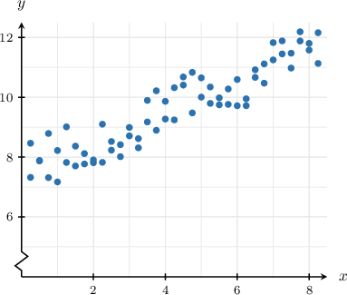

First, we sketch the trend line. If we don't know the trend line's equation, then we simply approximate it.

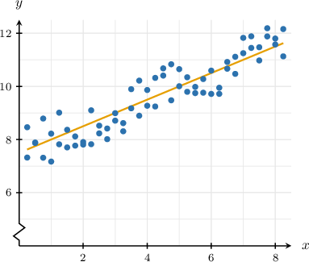

To make our prediction, we proceed as follows:

- First, we start at $x = 5$ on the $x$-axis.

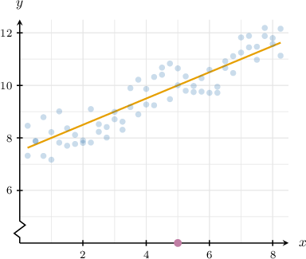

- Then, we move up until we intersect the trend line.

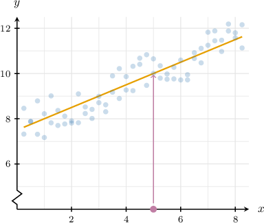

- Finally, we move left until we intersect the $y$-axis.

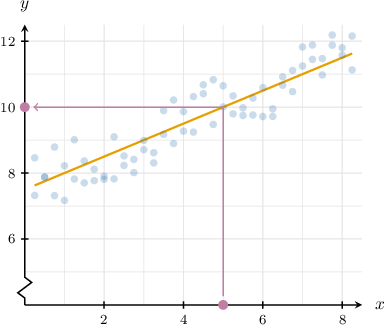

Therefore, when $x = 5,$ we obtain $y \approx 10.$

### Example: Using Trend Lines to Make Predictions

#### Question

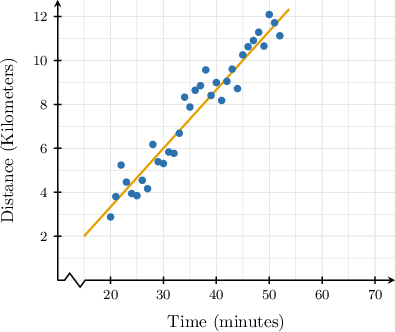

The scatter plot above shows the distances some athletes in a sports club cover during a training session, and the time (in minutes) it takes. Use the trend line to estimate how long it takes a club athlete to run $10$ km.

#### Explanation

To make our estimation, we proceed as follows:

- We start at $y=10$ on the vertical axis.

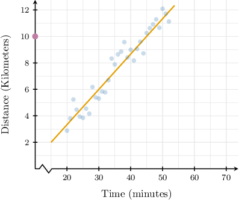

- Then, we move right until we intersect the trend line.

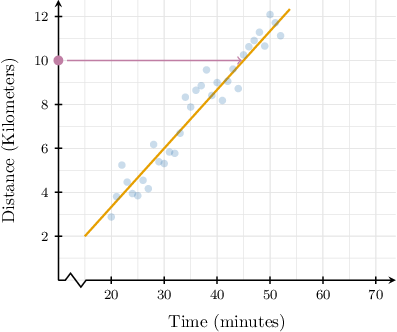

- Finally, we move down until we intersect the horizontal axis.

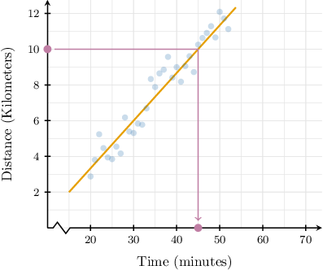

Therefore, a club athlete can run $10$ kilometers in approximately $45$ minutes.

### Make Predictions Using the Trend Line Equation

If we know the equation of a trend line, we can make more accurate predictions about a given data set. Let's consider an example.

The pediatric unit of a hospital wants to know the relationship between the age $x$ (in years) and weight $y$ (in kilograms) of their patients. They collected data over several weeks and plotted the diagram given below.

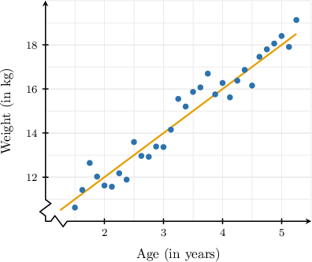

The hospital finds that the trend line equation is $y = 2x+8.$

Now, suppose the hospital wants to estimate the weight of a $3$-year-old child. To do this, we substitute $x=3$ into the equation of the trend line:

$$

\begin{aligned}𝑦 & =2𝑥+8 \\ & =2(3)+8 \\ & =6+8 \\ & =14.\end{aligned}

$$

Therefore, our model predicts that a typical $3$-year-old patient weighs approximately $14\,\textrm{kg}.$

Note the following:

- There is a point on our trend line where $x=3.$ Therefore, the result $y=14$ should be reliable since we can see from the graph that the data follows a linear trend for values of $x$ close to $3.$

- Making predictions inside the range of values from which the data was collected is known as **interpolation**.

### Extrapolation

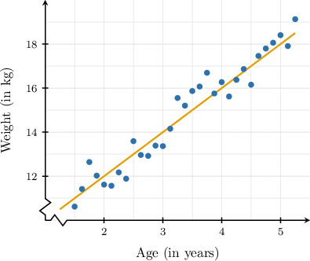

Now suppose that the hospital wants to estimate the weight of a $7$-year-old child. They have no data for this age. However, if they assume that the trend continues, they can find the corresponding weight by substituting $x=7$ into the trend line equation. This gives

$$

\begin{aligned}𝑦 & =2𝑥+8 \\ & =2(7)+8 \\ & =14+8 \\ & =22.\end{aligned}

$$

Therefore, our model predicts that a typical $7$-year-old child weighs approximately $22 \, \textrm{kg}.$

**Warning:** The point where $x=7$ is not shown on our trend line. Therefore, the result $y=22$ *may be unreliable* since we don't know whether values of $x$ close to $7$ follow the same linear trend. The diagram below shows some trends the data *might* follow beyond our initial data range.

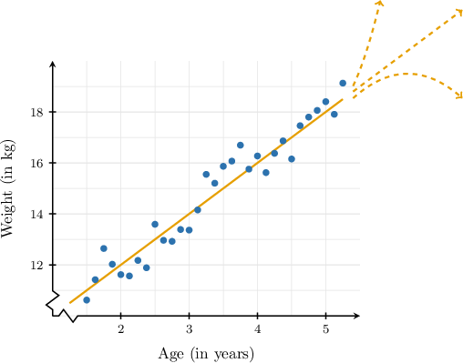

Making predictions outside the range of values from which the data was collected is known as **extrapolation**.

We must be very cautious when extrapolating in real-world situations.

### Example: Using Trend Line Equations to Make a Prediction

#### Question

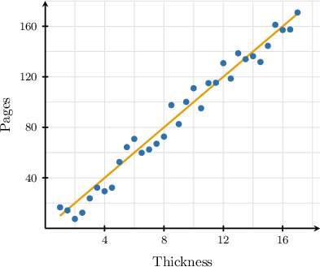

The scatter plot above shows the relationship between a book’s spine thickness (in millimetres) and the total number of pages for a random sample of children's books. The equation of the trend line is $y = 10x.$ Assuming this trend continues, estimate the thickness of a book with $200$ pages.

#### Explanation

To predict the thickness in a book with $200$ pages, we need to substitute $y = 200$ into the equation of the trend line and solve for $x\mathbin{:}$

$$

\begin{aligned}𝑦 & =10𝑥 \\ 200 & =10𝑥 \\ \frac{200}{10} & =𝑥 \\ 20 & =𝑥 \\ 𝑥 & =20\end{aligned}

$$

Therefore, according to this model, a book with $200$ pages should have approximately a thickness of $20\text{mm}.$

**** The point where $y=200$ is not shown on our trend line. Therefore, our result ** be unreliable.

### Example: Making a Prediction by Estimating a Trend Line

#### Question

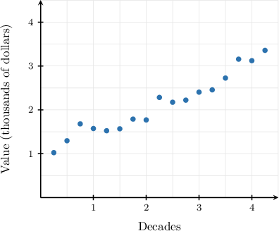

The scatter plot shows the value of an artwork, in thousands of dollars, several decades after it was created. Assuming this trend continues, estimate the time it takes for the work of art to be worth $5\,000.$

**

#### Explanation

First, using the hint, let's draw an approximate trend line for our scatter plot.

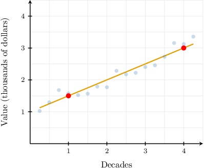

The trend line passes through $(x_1,y_1) = (1,1.5)$ and $(x_2,y_2) = (4,3).$

We will write the equation of the line in the slope-intercept form

$$

y = mx + b.

$$

First, we find the slope $m$ of the line as follows:

$$

\begin{aligned}𝑚 & =\frac{𝑦_{2}−𝑦_{1}}{𝑥_{2}−𝑥_{1}} \\ & =\frac{3−1.5}{4−1} \\ & =\frac{1.5}{3} \\ & =0.5\end{aligned}

$$

Substituting $m = 0.5$ into the slope-intercept form above, we get

$$

y = 0.5x + b.

$$

We now need to calculate the $y$-intercept $b.$ We can do this by substituting the coordinates of a point on the line. Any point will do, so let's substitute $(4,3)\mathbin{:}$

$$

\begin{aligned}𝑦 & =0.5𝑥+𝑏 \\ 3 & =0.5(4)+𝑏 \\ 3 & =2+𝑏 \\ 𝑏 & =1\end{aligned}

$$

Therefore, the equation of the line is

$$

y = 0.5x + 1.

$$

Finally, we substitute $y = 5$ into the equation above and solve for $x{:}$

$$

\begin{aligned}𝑦 & =0.5𝑥+1 \\ 5 & =0.5𝑥+1 \\ 0.5𝑥 & =4 \\ 𝑥 & =8\end{aligned}

$$

Therefore, according to this model, the artwork will be worth $5\,000$ approximately $8$ decades after it was created.

**** The point where $y=5$ is not shown on our trend line. Therefore, our result ** be unreliable.
