# Graphing Non-Strict Two-Variable Linear Inequalities

Source: https://www.mathacademy.com/topics/3827?courseId=44
Topic ID: 3827

## Prerequisites

- [Verifying Solutions of Linear Inequalities](../prealgebra/387-verifying-solutions-of-linear-inequalities.md)
- [Equations of Lines in Slope-Intercept Form](./1240-equations-of-lines-in-slope-intercept-form.md)

## Lesson

### Introduction

Let's think about how to graph the solutions to the following two-variable inequality:

$$

y \geq x

$$

Since this is a two-variable inequality, we must represent its solutions in the $xy$-plane.

We start by replacing the inequality symbol $(\geq)$ with an equals sign $(=)$ and plot the resulting line. In this case, we get the line $y=x.$

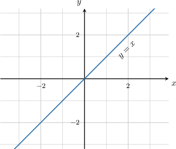

Notice that we have a "greater than *or equal to*" inequality $(\geq).$ Therefore, we draw a *solid* line (as opposed to a dotted or dashed line). The solid line indicates that points on the line are solutions to our inequality.

Now, since we're solving $y \geq x,$ we need to shade all points whose $y$-value is *greater than or equal to* its $x$-value. This is given by all of the points that lie *above* our solid line or *on* the line. So, let's shade these in.

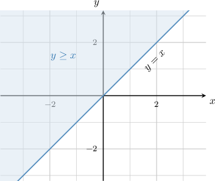

And we're done! All of the points in the shaded region satisfy the inequality $y \geq x.$

### Testing the Solution

When solving two-variable inequalities, it's often helpful to test and ensure that we've shaded the correct region.

To demonstrate, let's go back to the following inequality:

$$

y \geq x

$$

The solution to this inequality is indicated by the shaded region below.

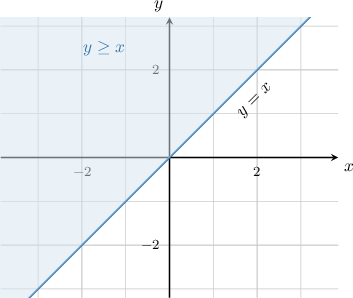

To check that we've shaded the correct region, we pick a point inside the shaded region and verify that it satisfies the original inequality. Let's pick the point $(0,1).$

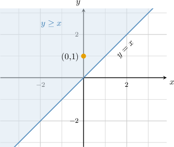

When we substitute the coordinates $(0,1)$ into our inequality, we get a true statement:

$$

\begin{aligned}𝑦 & ≥𝑥 \\ 1 & ≥0\,✓\end{aligned}

$$

This indicates that we have shaded the correct region.

### Example: Sketching the Solution to a “Greater Than or Equal To” Inequality

#### Question

Sketch the solution to the inequality $y \geq -x+3.$

#### Explanation

First, we draw the corresponding straight line $y=-x+3.$ Since the inequality involves a 'greater than **' sign, the line $y=-x+3$ is part of the solution. Therefore, we draw a ****.

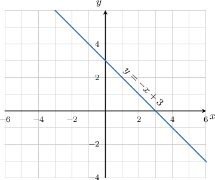

Then, we must decide whether to shade above or below the line. The inequality $y \geq -x+3$ refers to the $y$-values that are ** or equal to those on the line $y=-x+3,$ so we shade ** the line.

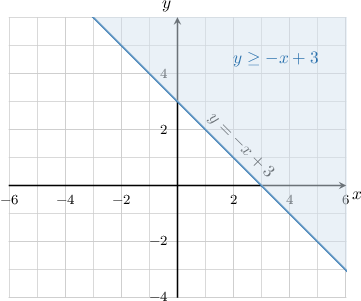

Let's check that we've shaded the correct part. First, we consider a point in the shaded region, say $(0,4)\mathbin{:}$

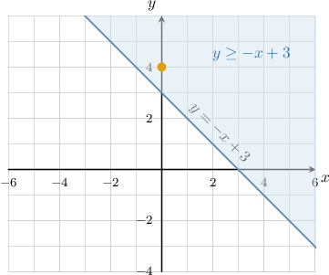

When we substitute the coordinates of this point into our inequality, we get a true statement:

$$

\begin{aligned}𝑦 & ≥−𝑥+3 \\ (4) & ≥−(0)+3 \\ 4 & ≥3\,✓\end{aligned}

$$

This indicates that we have shaded the correct region.

### Solving "Less Than or Equal To" Inequalities

Let's now think about how to graph the solutions to the inequality

$$

y \leq x.

$$

As before, we start by replacing the inequality symbol $(\leq)$ with an equals sign $(=)$ and plot the resulting line $y=x.$

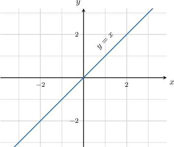

Notice that we have a "less than *or equal to*" inequality $(\leq).$ Therefore, we draw a *solid* line.

Now, since we're solving $y \leq x,$ we need to shade all points whose $y$-value is *smaller than or equal to* its $x$-value. This is given by all of the points that lie *below* our solid line or *on* the line.

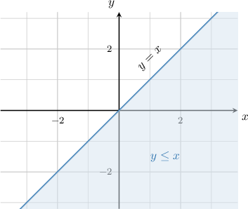

And we're done! All of the points in the shaded region satisfy the inequality $y \leq x.$

To check that we've shaded the correct region, we pick a point inside the shaded region and check that it satisfies the original inequality. Let's pick the point $(1,0).$

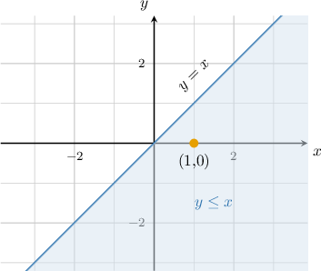

When we substitute the coordinates $(1,0)$ into our inequality, we get a true statement:

$$

\begin{aligned}𝑦 & ≤𝑥 \\ 0 & ≤1\,✓\end{aligned}

$$

This indicates that we have shaded the correct region.

### Example: Sketching the Solution to a “Less Than or Equal To” Inequality

#### Question

Sketch the solution to the inequality $y \leq x-2.$

#### Explanation

First, we draw the corresponding straight line $y=x-2.$ Since the inequality involves a 'less than **' sign, the line $y=x-2$ itself is part of the solution. Therefore, we draw a ****.

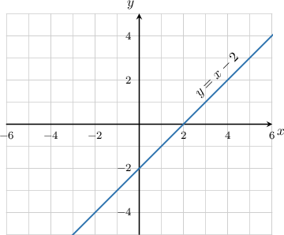

Then, we must decide whether to shade above or below the line. The inequality $y \leq x-2$ refers to the $y$-values that are ** or equal to those on the line $y=x-2,$ so we shade ** the line.

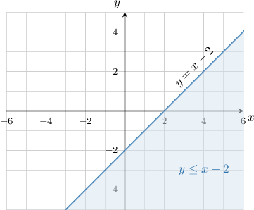

Let's check that we've shaded the correct part. First, we consider a point in the shaded region, say $(0,-3)\mathbin{:}$

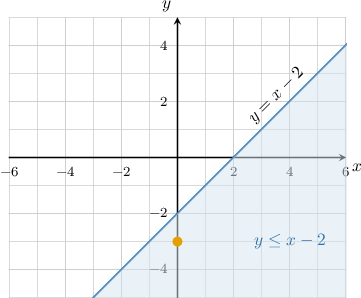

When we substitute the coordinates of this point into our inequality, we get a true statement:

$$

\begin{aligned}𝑦 & ≤𝑥−2 \\ (−3) & ≤(0)−2 \\ −3 & ≤−2\,✓\end{aligned}

$$

This indicates that we have shaded the correct region.

### Example: Finding an Inequality Corresponding to a Given Graph

#### Question

What is the inequality that describes the shaded region shown below?

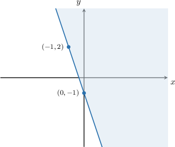

#### Explanation

First, we find the equation of the corresponding line in the slope-intercept form $y=mx+b.$

- The line intersects the $y$-axis at $(0,-1)$, so the $y$-intercept is $b=-1.$

- The line passes through the points $(0,-1)$ and $(-1,2)$, so its slope is

Therefore, the equation of the line is $y=-3x-1.$

Finally, we need to decide which inequality symbol to use. Since the line is solid, we will use an "or equal to" inequality. Since the shaded region is ** the line, the inequality refers to the $y$-values that are ** or equal to those on the line.

So, the corresponding inequality is

$$

y \geq -3x-1.

$$
