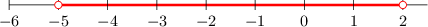

# Solving Compound Inequalities

Source: https://www.mathacademy.com/topics/388?courseId=44
Topic ID: 388

## Prerequisites

- [Further Solving Linear Inequalities](../prealgebra/4034-further-solving-linear-inequalities.md)

## Lesson

### Introduction

Suppose that we wish to solve the compound inequality

$$

4 \le x + 2 \le 8.

$$

To solve the compound inequality, we apply the usual operations to the middle of the inequality to isolate $x.$ Keep in mind that whatever we do to the middle, we also need to do to *both* the left-hand *and* right-hand sides.

Here, we can isolate $x$ by subtracting $2\mathbin{:}$

$$

\begin{aligned} 4 & \le x + 2 \le 8 \\\[5pt] 4 \,{\color{red}-}\, {\color{red}{2}} &\le x + 2 \,{\color{red}-}\, {\color{red}{2}} \le 8 \,{\color{red}-}\, {\color{red}{2}} \\\[5pt] 2 &\le x \le 6 \end{aligned}

$$

Therefore, the solution is $2 \le x \le 6.$

### Example: Solving Compound Inequalities

#### Question

Solve the inequality $0 \leq 3x+6 < 15.$

#### Explanation

We isolate $x$ by applying the addition and multiplication principles, as usual:

$$

\begin{aligned} 0 &\leq 3x+6 < 15 \\\[5pt] 0 - 6 &\leq 3x + 6 -6 < 15-6 \\\[5pt] -6 &\leq 3x < 9 \\\[5pt] \dfrac{-6}{3} &\leq \dfrac{3x}{3} < \dfrac{9}{3} \\\[5pt] -2 &\leq x < 3 \end{aligned}

$$

Therefore, the solution is $-2 \leq x < 3.$

### Example: Compound Inequalities That Require Flipping the Inequality Sign

#### Question

Solve the inequality $-1 < -2x + 1 \leq 7.$

#### Explanation

We isolate $x$ by applying the addition and multiplication principles, as usual:

$$

\begin{aligned}−1 & <−2𝑥+1≤7 \\ −1−1 & <−2𝑥+1−1≤7−1 \\ −2 & <−2𝑥≤6\end{aligned}

$$

At this point, we need to divide by $-2$. However, because we are dividing by a negative, we also need to flip the inequality signs.

$$

\begin{aligned}−2 & <−2𝑥≤6 \\ \frac{−2}{−2} & \,>\,\frac{−2𝑥}{−2}\,≥\,\frac{6}{−2} \\ 1 & >𝑥≥−3\end{aligned}

$$

The solution can be written as $1 > x \geq - 3,$ but this is somewhat difficult to read because the larger number is on the left rather than the right. So, we will rewrite the solution by reversing the order of the numbers:

$$

-3 \leq x < 1

$$

### Example: Representing Solutions of Compound Inequalities on Number Lines

#### Question

Represent the solution to the inequality $-3 < 1-2x < 11$ using a number line.

#### Explanation

We isolate $x$ by applying the addition and multiplication principles, as usual.

First, we apply the addition principle:

$$

\begin{aligned}−3 & <1−2𝑥<11 \\ −3−1 & <1−2𝑥−1<11−1 \\ −4 & <−2𝑥<10\end{aligned}

$$

Then, we divide by $-2.$ Note that since we are dividing by a negative number, we need to flip the inequality signs.

$$

\begin{aligned}−4 & <−2𝑥<10 \\ \frac{−4}{−2} & >\frac{−2𝑥}{−2}>\frac{10}{−2} \\ 2 & >𝑥>−5\end{aligned}

$$

The solution can be written as $2 > x > -5$, but this is somewhat difficult to read because the larger number is on the left rather than the right. So, we will rewrite the solution by reversing the order of the numbers:

$$

-5 < x < 2

$$

We can represent this solution using a number line, as follows.

