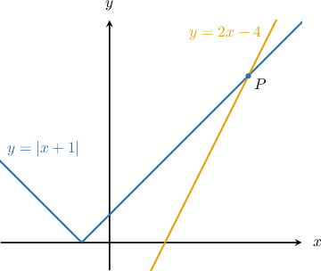
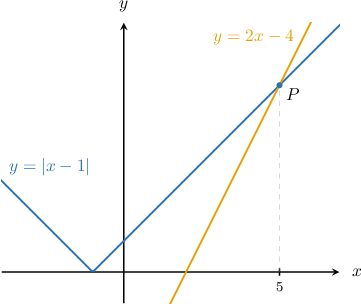
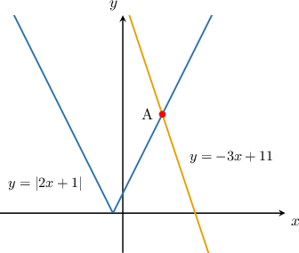
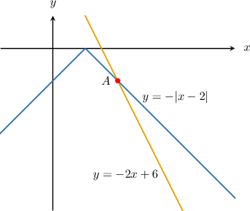

# Absolute Value Equations With Extraneous Solutions

Source: https://www.mathacademy.com/topics/3992?courseId=44
Topic ID: 3992

## Prerequisites

- [Equations Connecting Absolute Value and Linear Functions](./385-equations-connecting-absolute-value-and-linear-functions.md)
- [Vertical Reflections of Absolute Value Graphs](./452-vertical-reflections-of-absolute-value-graphs.md)
- [Linear Equations With Infinitely Many Solutions](../prealgebra/1414-linear-equations-with-infinitely-many-solutions.md)
- [Linear Equations With No Solutions](../prealgebra/5572-linear-equations-with-no-solutions.md)

## Lesson

### Introduction

Let's now consider the following equation:

$$

\vert x + 1 \vert = 2x - 4

$$

Geometrically, solving this equation gives us the $x$-coordinate of the point of intersection $P$ of the curves $y = |x+1|$ and $y=2x-4.$

Let's now discuss how to find the intersection point algebraically.

### A Worked Example

We wish to find the solution to the equation

$$

\vert x + 1 \vert = 2x - 4.

$$

For this equation to be true, either the positive or negative of the expression inside the absolute value must be equal to the right-hand side of the equation.

Therefore, we have the following two cases:

$$

|x+1| = x+1 \qquad \textrm{and}\qquad |x+1| = -(x+1)

$$

We now consider these two cases separately:

- If $|x + 1|=x + 1,$ we obtain the following equation: We now solve this equation using the usual methods: This *potential* solution is valid only if it solves the original equation. So, let's plug it back in: Since $x=5$ satisfies the original equation, it's a valid solution.

- If $|x + 1|=-(x + 1),$ we obtain This *potential* solution is valid only if it solves the original equation. So, let's plug it back in: Since $x=1$ does *not* satisfy the original equation, it's *not* a valid solution. It's called an **extraneous** solution.

Therefore, the *only* solution of our equation is $x = 5.$ This solution corresponds to the point $P,$ shown below.

**Watch out!** Whenever we want to solve an absolute value equation where the variable is on both sides, we must *always* check that the solutions satisfy the original equation.

Some absolute value equations have no solutions at all! Let's see an example.

### Example: Solving Absolute Value Equations With Extraneous Solutions

#### Question

Solve the equation $\vert 2x-3 \vert = -x+1.$

#### Explanation

We have the following two cases:

- If $|2x-3|=2x-3,$ we obtain This ** solution is valid only if it solves the original equation. So, let's plug it back in: Since $x=-\dfrac 43$ does ** satisfy the original equation, it's ** a valid solution.

- If $|2x-3|=-(2x-3),$ we obtain This ** solution is valid only if it solves the original equation. So, let's plug it back in: Since $x=2$ does ** satisfy the original equation, it's ** a valid solution.

Therefore, our equation has no solutions.

### Example: Isolating an Absolute Value

#### Question

Solve the equation $|2x +5| - 4x = 1.$

#### Explanation

We start by isolating the absolute value on the left-hand side:

$$

\begin{aligned}|2𝑥+5|−4𝑥 & =1 \\ |2𝑥+5| & =4𝑥+1\end{aligned}

$$

Now, we have two cases:

- If $|2x + 5|=2x+ 5,$ we obtain This ** solution is valid only if it solves the original equation. So, let's plug it back in: Since $x=2$ satisfies the original equation, it's a valid solution.

- If $|2x+5|=-(2x+5),$ we obtain This ** solution is valid only if it solves the original equation. So, let's plug it back in: Since $x=-1$ does ** satisfy the original equation, it's ** a valid solution.

Therefore, the solution of our equation is $x = 2.$

### Example: Finding Points of Intersection

#### Question

Find the points of intersection of $y = \vert 2x+1 \vert$ and $y = -3x+11.$

#### Explanation

The $x$-coordinates of the intersection points correspond to solutions of the equation

$$

|2x+1| = -3x+11.

$$

Now, we have the following two cases:

- For the branch with a negative slope, where $|2x+1| = -(2x+1)$, we obtain This ** solution is valid only if it solves the original equation. So, let's plug it back in: Since $x=12$ does ** satisfy the original equation, it is not the $x$-coordinate of a point of intersection.

- For the branch with a positive slope, where $|2x+1| = 2x+1$, we obtain This ** solution is valid only if it solves the original equation. So, let's plug it back in: Since $x=2$ satisfies the original equation, it is an $x$-coordinate of a point of intersection.

So, the $x$-coordinate of the point of intersection is $x=2.$

Finally, we can find the $y$-coordinate of the intersection point by substituting our solution back into either of the curves. Let's use the line $y=-3x+11 \mathbin{:}$

$$

\begin{aligned}𝑦 & =−3𝑥+11 \\ & =−3(2)+11 \\ & =−6+11 \\ & =5\end{aligned}

$$

Therefore, the point of intersection has coordinates $(2,5).$

### Example: Finding Points of Intersection With Negative Absolute Value Curves

#### Question

Determine the $x$-coordinate of point $A$ shown in the graph above.

#### Explanation

The $x$-coordinate of $A$ corresponds to a solution of the equation

$$

-|x-2| = -2x+6.

$$

The absolute value graph $y=-|x-2|$ has two branches:

- where $-|x-2| = -(x-2),$ which has a negative slope, and

- where $-|x-2|=x-2,$ which has a positive slope.

Now, let's consider each branch in turn:

- No points of intersection lie on the branch with a positive slope, so we can ignore this branch.

- The point $A$ lies on the branch with a negative slope. So, if $-|x-2| = -(x-2),$ we obtain This ** solution is valid only if it solves the original equation. So, let's plug it back in: Since $x=4$ satisfies the original equation, the $x$-coordinate of $A$ is $x=4.$

Therefore, the $x$-coordinate of $A$ is $4.$
