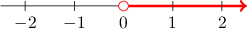
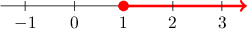
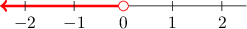
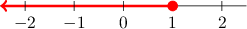

# Unbounded Intervals

Source: https://www.mathacademy.com/topics/4028?courseId=44
Topic ID: 4028

## Prerequisites

- [Interval Notation](./239-interval-notation.md)

## Lesson

### Introduction

Consider the following inequality:

$$

x > 0

$$

We can represent this inequality using a number line as follows:

How do we represent this inequality using interval notation?

Note the following:

- The left endpoint $x=0$ is *not* included. Therefore, we use a parenthesis $($ for this endpoint.

- The interval continues forever in the positive direction. To denote this, we must introduce the **infinity** symbol $\infty.$ Infinity is not a number but a concept that means *larger than any number*.

- We use a right parenthesis $)$ in conjunction with the $\infty$ symbol.

Therefore, we can express the inequality $x > 0$ in interval notation as follows:

$$

x \in (0, \infty)

$$

**Watch Out!** Whenever $\infty$ appears in an interval, it is *always* associated with a right parenthesis. Infinity is *never* associated with a bracket, even if the other endpoint is.

### Example: Converting Inequalities to Left-Bounded Intervals

#### Question

Express the inequality $x \geq 1$ in interval notation.

#### Explanation

The inequality $x \geq 1$ corresponds to all numbers greater than or equal to $1.$ A number line for this inequality is shown below:

From the segment on the number line, we have the following:

- The left endpoint $1$ ** included in the interval.

- There is no right endpoint - it continues forever. So, we write the interval with infinity as the right endpoint, not included.

Therefore, using interval notation, we represent $x \geq 1$ as

$$

x \in [1,\infty).

$$

### Example: Converting Left-Bounded Intervals to Inequalities

#### Question

What inequality corresponds the interval $x\in\left[5, \infty\right)?$

#### Explanation

The statement $x\in\left[5, \infty\right)$ means that $x$ lies between $5$ and $\infty,$ where

- the left endpoint $5$ ** included, and

- the right endpoint $\infty$ is ** included.

Therefore, the inequality represented by this interval is

$$

5 \leq x < \infty.

$$

However, since all numbers are smaller than infinity, it suffices to write

$$

5 \leq x

$$

or, equivalently,

$$

x \geq 5.

$$

### Right-Bounded Intervals

Now, consider the following inequality:

$$

x \lt 0

$$

We can represent this inequality using a number line as follows:

To represent this inequality using interval notation, we note the following:

- The right endpoint $x=0$ is *not* included. Therefore, we use a parenthesis $)$ for this endpoint.

- The interval continues forever in the negative direction. To denote this, we use the **negative infinity** symbol $-\infty.$ We use a left parenthesis $($ in conjunction with the negative infinity symbol.

Therefore, we can express the inequality $x < 0$ in interval notation as follows:

$$

x \in (-\infty, 0)

$$

### Example: Converting Inequalities to Right-Bounded Intervals

#### Question

Express the inequality $x \le 1$ in interval notation.

#### Explanation

The inequality $x \leq 1$ corresponds to all numbers less than or equal to $1.$ A number line for this interval is shown below:

From the segment on the number line, we have the following:

- There is no left endpoint - it continues forever. So, we write the interval with negative infinity as the left endpoint, not included.

- The right endpoint $1$ ** included in the interval.

Therefore, using interval notation, we represent $x \leq 1$ as

$$

x\in(-\infty, 1].

$$

### Example: Converting Right-Bounded Intervals to Inequalities

#### Question

What inequality corresponds to the interval $x\in\left(-\infty, 9\right)?$

#### Explanation

The statement $x \in \left(-\infty, 9\right)$ means that $x$ lies between $-\infty$ and $9,$ where

- the left endpoint $-\infty$ is ** included, and

- the right endpoint $9$ is ** included.

Therefore, the inequality represented by this interval is

$$

-\infty < x < 9.

$$

However, since all numbers are greater than negative infinity, it suffices to write

$$

x < 9.

$$
