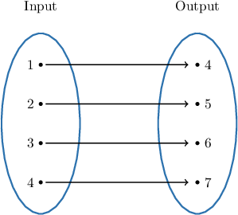
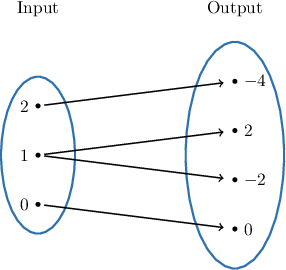
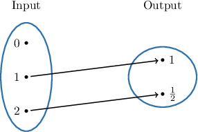
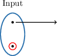
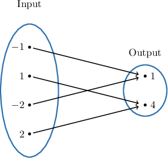
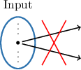

# Visual Representations of Functions

Source: https://www.mathacademy.com/topics/631?courseId=44
Topic ID: 631

## Prerequisites

- [Introduction to Functions](./470-introduction-to-functions.md)
- [Equations of Lines in Slope-Intercept Form](./1240-equations-of-lines-in-slope-intercept-form.md)

## Lesson

### Introduction

A **function** is a rule where *every* input value is assigned *precisely one* output value.

As an example, let's consider the rule defined by

$$

f(x) = x+3

$$

where $x$ can be any number from the **set** $\{1,2,3,4\}.$ A set is a collection of numbers we can use in our rule.

Let's calculate the possible values of $f(x)\mathbin{:}$

$$

\begin{aligned}𝑓(1) & =1+3=4 \\ 𝑓(2) & =2+3=5 \\ 𝑓(3) & =3+3=6 \\ 𝑓(4) & =4+3=7\end{aligned}

$$

We can represent this rule using a **mapping diagram**, like the one shown below.

This rule *is* a function because *every* input is mapped to *precisely one* output.

### Examples of Rules That Are Not Functions

Now let's consider the rule given by the following mapping diagram:

This rule is *not* a function because *at least one* input is assigned to *more than one* output. In this case, the input $x=1$ is mapped to *both* $2$ and $-2.$

Finally, let's consider the rule given by the following mapping diagram:

This rule is *not* a function because *at least one* input is not assigned to an output. In this case, the input $0$ is not assigned an output.

### A Summary

So, we must remember that a rule is a function if and only if *every* input is mapped to *precisely one* output.

In particular, a rule is *not* a function in the following cases:

- An input value is not assigned an output value. For example, the following situation is *not allowed* for functions (an input value with no arrow from it):

- An input value is assigned to more than one output value. For example, the following situation is *not allowed* for functions (an input value with more than one arrow from it):

### Example: Determining if a Rule Given by a Mapping Diagram Is a Function

#### Question

Is the following rule a function?

#### Explanation

A rule is a function if and only if ** input is mapped to ** output.

In particular, a rule is ** a function in the following cases:

- An input value is not assigned to an output value. For example, the following situation is ** for functions (an input value with no arrow from it):

- An input value is assigned to more than one output value. For example, the following situation is ** for functions (an input value with more than one arrow from it):

### Rules Represented Using Tables

When a rule is represented as a table, we have a function if and only if all values in the *first row* are *distinct* (i.e., different).

Let's consider some examples.

The rule defined by the following table is a function. Notice that all values in the first row are distinct. Every input value is assigned to exactly one output value.

On the other hand, the rule defined by the following table is *not* a function. Notice that the first row contains the value $\color{red}3$ twice. The input value $3$ is assigned to two output values ($0$ and $-1$).

### Example: Determining if a Rule Given by a Table Is a Function

#### Question

Which missing $xy$-pair would make the following rule a function?

1. $(1,2)$

2. $(7,3)$

3. $(-1,5)$

#### Explanation

A rule is a function if and only if every input is mapped to ** output.

- If we substitute the $xy$-pair $(1,2)$ into our table, we get a function. **** $-3$ $-1$ $\color{blue}1$ $3$ $5$ $7$ $9$ $y$ $0$ $4$ $2$ $0$ $2$ $1$ $7$ Notice that all values in the first row are ** (i.e., different). Every input value is assigned to ** output value.

- None of the other $xy$-pairs gives rules that are functions. So, for example, substituting the $xy$-pair $(-1,5)$ gives a rule that is ** a function. **** $-3$ $\color{red}-1$ $\color{red}-1$ $3$ $5$ $7$ $9$ $y$ $0$ $4$ $5$ $0$ $2$ $1$ $7$ Notice that the first row contains the value $\color{red}x=-1$ twice. The input value $-1$ is assigned to ** output value ($4$ and $5$).
